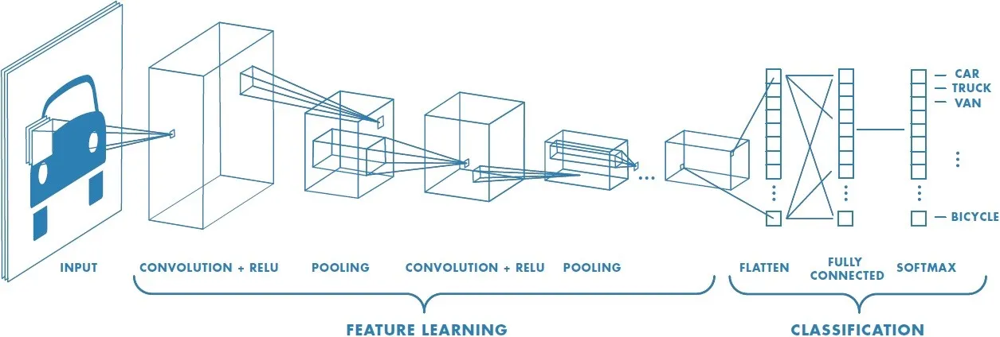
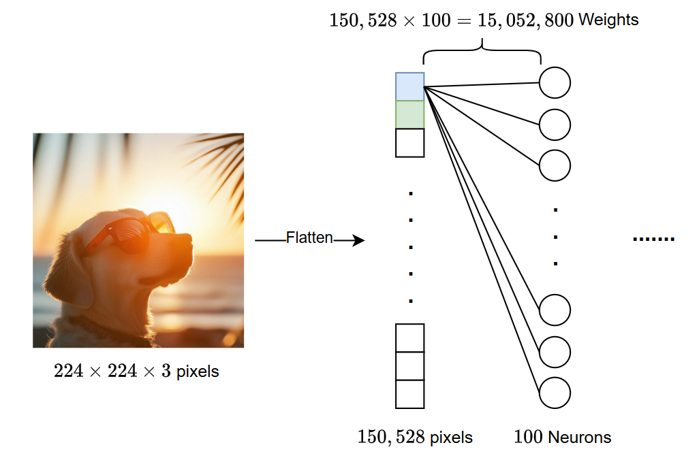
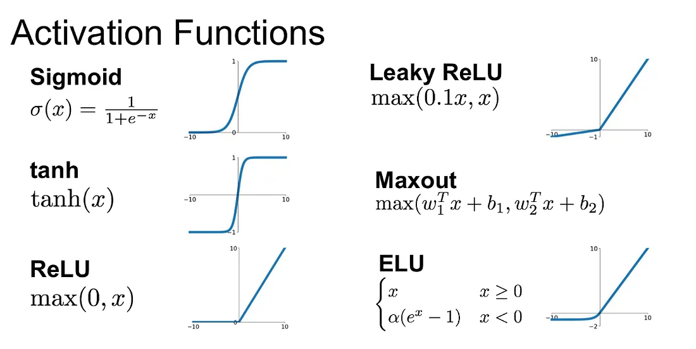
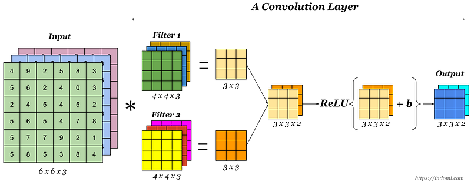

# I. Introduction
## 1. CNN
- Convolution Neural Network - mạng tích chập là một lớp đặc biệt của mạng Neural được thiết kế để chủ yếu xử lí dữ liệu dạng lưới (hình ảnh).
- Lấy cảm hứng từ cách hệ thống thị giác của động vật xử lý thông tin, CNN sử dụng các phép toán đặc biệt gọi là *"tích chập"* để tự động và thích ứng học các đặc trưng phân cấp từ dữ liệu đầu vào.



## 2. Tại sao CNN quan trọng trong việc xử lí hình ảnh
- Hình ảnh là dữ liệu phức tạp, chứa thông tin không gian phong phú.
- CNN vượt trội trong việc nhận dạng các mẫu hình (patterns) trong ảnh, từ các cạnh, góc đơn giản đến các cấu trúc phức tạp như khuôn mặt, đối tượng. Khả năng này làm cho CNN trở thành công cụ hàng đầu trong các nhiệm vụ thị giác máy tính như:
	- Nhận dạng và phân loại hình ảnh (Image Recognition/Classification);
	- Phát hiện đối tượng (Object Detection);
	- Phân đoạn ảnh (Image Segmentation);
	- Nhận dạng khuôn mặt (Facial Recognition);
	- Phân tích ảnh y tế.

## 3. Hạn chế của mạng Neural truyền thống (FCN)
- Mạng nơ-ron kết nối đầy đủ (**Fully Connected Network - FCN**), hay còn gọi là **Multi-Layer Perceptron** (MLP), gặp phải hai vấn đề lớn khi áp dụng trực tiếp lên ảnh:
    
	1. **Số lượng tham số**: Mỗi neuron trong một lớp FCN kết nối với tất cả các neuron ở lớp trước.
		- Với ảnh có kích thước lớn (ví dụ: $224\times 224$ pixel màu), việc làm phẳng ảnh thành vector đầu vào ($224 \times 224 \times 3 = 150,528$ chiều) và kết nối với một lớp ẩn, dù chỉ có vài trăm neuron, sẽ tạo ra hàng triệu tham số (trọng số và độ lệch).
		- Làm mô hình cực kỳ cồng kềnh, khó huấn luyện, dễ bị overfitting và đòi hỏi tài nguyên tính toán khổng lồ.
	2. **Mất thông tin không gian**: Việc làm phẳng ảnh thành vector 1D phá vỡ cấu trúc không gian 2D của ảnh.
		- Các pixel gần nhau trong ảnh gốc có mối liên hệ mật thiết (tính cục bộ - locality), nhưng thông tin này bị mất đi khi chúng trở thành các phần tử cách xa nhau trong vector đầu vào.
		- FCN xử lý mỗi đầu vào một cách độc lập mà không tận dụng được mối quan hệ không gian này.

# II. Các thành phần cấu thành ANN/NN
## 1. Neuron và Layer
- Neuron là đơn vị tính toán cơ bản, nhận các tín hiệu đầu vào, xử lý chúng và tạo ra tín hiệu đầu ra.
- Các neuron được tổ chức thành các lớp:
	- Lớp đầu vào (Input Layer) nhận dữ liệu thô;
	- Các lớp ẩn (Hidden Layers) thực hiện các phép biến đổi trung gian;
	- Lớp đầu ra (Output Layer) tạo ra kết quả cuối cùng.

## 2. Weights và Biases
- Mỗi kết nối giữa hai neuron có một trọng số, thể hiện tầm quan trọng của tín hiệu từ neuron trước đó.
- Mỗi neuron (thường trừ lớp input) có một độ lệch (bias), hoạt động như một ngưỡng kích hoạt.
- Trọng số và độ lệch là các tham số mà mạng nơ-ron học được trong quá trình huấn luyện.

## 3. Hàm kích hoạt
- Sau khi tính tổng trọng số của các đầu vào cộng với độ lệch (weighted sum + bias), *kết quả được đưa qua một hàm phi tuyến gọi là hàm kích hoạt*.
- Hàm này quyết định neuron có được "kích hoạt" hay không và mức độ kích hoạt.

- Các hàm phổ biến:
    - **Sigmoid**:
	    - $\sigma(z) = \dfrac{1}{1+e^{-z}}$;
	    - Nén giá trị vào khoảng $(0, 1)$.
	    - Thường dùng ở lớp output cho bài toán phân loại nhị phân hoặc trong các Neural Networks cũ.
	    - Gặp vấn đề vanishing gradient.
    - **Tanh (Hyperbolic Tangent)**:
	    - Nén giá trị vào khoảng $(-1, 1)$.
	    - Thường tốt hơn Sigmoid trong các lớp ẩn nhưng vẫn bị vanishing gradient.
    - **ReLU (Rectified Linear Unit)**:
	    - $f(z) = \max(0, z)$;
	    - Rất phổ biến trong các lớp ẩn của CNN hiện đại vì hiệu quả tính toán và giảm thiểu vấn đề vanishing gradient.
    - **Softmax**:
	    - Thường dùng ở lớp output cho bài toán phân loại đa lớp.
	    - Biến đổi vector số thực thành vector xác suất có tổng bằng 1.



## 4. Lan truyền tiến (Forward Propagation)
- Dữ liệu đi từ lớp đầu vào, qua các lớp ẩn, đến lớp đầu ra.
- Tại mỗi neuron, giá trị kích hoạt được tính dựa trên:
	- Giá trị kích hoạt của các neuron lớp trước;
	- Trọng số kết nối và độ lệch;
	- Sau đó đưa qua hàm kích hoạt.

## 5. Hàm mất mát
- Đo lường sự khác biệt giữa kết quả dự đoán của mạng và giá trị thực tế (nhãn).
- Mục tiêu của quá trình huấn luyện là *tối thiểu hóa hàm mất mát*.

- Các hàm mất mát phổ biến:
    - **Cross-Entropy**:
	    - Thường dùng cho các bài toán phân loại.
	    - $L = -\left[y\log(\hat{y}) + (1-y)\log(1-\hat{y})\right]$.
    - **Mean Squared Error (MSE)**:
	    - Thường dùng cho các bài toán hồi quy.

## 6. Tối ưu hóa
- Tối ưu hóa tham số:
    - **Gradient Descent**:
	    - Thuật toán tối ưu hóa lặp đi lặp lại để tìm giá trị tham số (weights, biases) giúp tối thiểu hàm mất mát.
	    - Tính đạo hàm (gradient) của hàm mất mát theo từng tham số và cập nhật tham số theo hướng ngược lại.
    - **Backpropagation**:
	    - Thuật toán hiệu quả để tính toán gradient của hàm mất mát theo tất cả các tham số trong mạng bằng cách lan truyền lỗi ngược từ lớp output về các lớp trước đó, sử dụng quy tắc chuỗi (chain rule) trong giải tích.

# III. Kiến trúc cơ bản CNN
CNN sử dụng các loại lớp mới để khai thác triệt để thông tin từ hình ảnh.

## 1. Lớp tích chập (Convolution layer)



- Đây là thành phần quan trọng nhất, thực hiện phần trích xuất và học đặc trưng.
- Áp dụng các bộ lọc (**kernel**) lên hình ảnh đầu vào $\to$ bản đồ đặc trưng (**feature map**) - phát hiện các mẫu hình cục bộ như cạnh, góc, kết cấu.
	- **Bộ lọc / Kernel / Feature Detector**:
		- Là một ma trận nhỏ các trọng số (ví dụ: 3x3, 5x5).
		- *Kernel có cùng độ sâu (số kênh) với dữ liệu đầu vào*.
		- Các trọng số trong kernel được học trong quá trình huấn luyện.
	- **Phép Tích chập (Convolution Operation)**:
		- Kernel trượt (slide) trên toàn bộ ảnh đầu vào.
		- Tại mỗi vị trí,
			- Thực hiện phép nhân theo từng phần tử (element-wise multiplication) giữa kernel và vùng ảnh nó che phủ;
			- Tính tổng tất cả các kết quả này (và cộng thêm bias) để tạo ra một giá trị duy nhất trong bản đồ đặc trưng.
		- Với input đa kênh, phép nhân và tổng được thực hiện trên cả chiều sâu.
	- **Bản đồ Đặc trưng (Feature Map / Activation Map)**:
		- Là kết quả đầu ra 2D sau khi áp dụng một bộ lọc trên toàn bộ ảnh đầu vào.
		- Nó cho thấy các vùng trên ảnh đầu vào kích hoạt mạnh bộ lọc đó (ví dụ: vùng có cạnh ngang nếu kernel được thiết kế để dò cạnh ngang).
	- **Chia sẻ Trọng số (Weight Sharing)**:
		- Điểm cốt lõi giúp CNN hiệu quả.
		- Cùng một bộ lọc (với cùng bộ trọng số) được áp dụng lặp lại trên các vị trí khác nhau của ảnh đầu vào.
		- Điều này dựa trên giả định rằng nếu một đặc trưng hữu ích ở một vị trí, nó cũng có thể hữu ích ở vị trí khác.
		- Weight sharing:
			- Làm giảm đáng kể số lượng tham số cần học;
			- Giúp mô hình có khả năng bất biến với sự dịch chuyển (translation invariance).
	- **Padding (Đệm)**:
		- Thêm các pixel (thường là giá trị $0$) xung quanh biên của ảnh đầu vào trước khi thực hiện tích chập.
		- Mục đích:
		    - Giữ kích thước không gian;
		    - Xử lý vùng biên, giúp kernel có thể xử lý tốt hơn các pixel ở rìa ảnh.
	- **Stride (Bước nhảy)**:
		- Khoảng cách mà kernel dịch chuyển sau mỗi lần tính tích chập
		- $\text{Stride} = 1$ (phổ biến nhất) nghĩa là kernel dịch chuyển 1 pixel mỗi lần.
		- $\text{Stride} > 1$ làm giảm kích thước của feature map, có thể được dùng thay cho pooling trong một số trường hợp.
	- **Hàm Kích hoạt sau Tích chập**: sau khi tính toán các giá trị trong feature map (tổng trọng số + bias), chúng thường được đưa qua hàm kích hoạt phi tuyến. Phổ biến nhất là ReLU (Rectified Linear Unit):
		- $f(z) = \max(0, z)$.
		- Phổ biến trong CNN vì hiệu quả tính toán và giúp giảm vấn đề tiêu biến đạo hàm (vanishing gradient).
	- Công thức tính kích thước đầu ra:
		- $W_\text{out} = \text{floor}\left(\dfrac{W_\text{in} - F + 2P}{S}\right) + 1$.
		- $H_\text{out} = \text{floor}\left(\dfrac{H_\text{in} - F + 2P}{S}\right) + 1$.
		- Trong đó: $W_\text{in}, H_\text{in}$ là kích thước đầu vào, $F$ là kích thước kernel, $P$ là padding, $S$ là stride.
	- **Sử dụng nhiều bộ lọc**:
		- Một lớp tích chập thường sử dụng nhiều bộ lọc ($K$ kernels) khác nhau;
		- Mỗi bộ lọc học để phát hiện một loại đặc trưng khác nhau.
		- Lớp tích chập tạo ra một volume đầu ra có $K$ kênh (feature maps), với kích thước: $H_\text{out} \times W_\text{out} \times K$.

## 2. Lớp gộp (Pooling layer / Subsampling)
- Thường được đặt sau lớp tích chập (và hàm kích hoạt).
- **Mục đích**:
    - Giảm kích thước không gian (width, height) của feature map:
	    - Làm giảm số lượng tham số và chi phí tính toán ở các lớp sau.
    - Tăng tính bất biến với biến dạng nhỏ và dịch chuyển:
	    - Làm cho mạng robust hơn với những thay đổi nhỏ về vị trí của đặc trưng trong ảnh.
    - Kiểm soát overfitting.
- **Các loại Pooling**:
    - Max Pooling:
	    - Chia feature map thành các vùng nhỏ không chồng lấp (hoặc có chồng lấp), và lấy giá trị lớn nhất mỗi vùng.
	    - Đây là loại phổ biến nhất vì nó giữ lại thông tin nổi bật nhất.
    - Average Pooling:
	    - Lấy giá trị trung bình trong mỗi vùng.
	    - Ít phổ biến hơn Max Pooling.
- **Hoạt động và Tác động**:
	- Pooling hoạt động độc lập trên từng kênh (feature map) của đầu vào.
	- Nó không có tham số nào để học (không có weights).
	- Phổ biến là $2\times 2$ với $\text{Stride} = 2$, làm giảm width và height đi một nửa, trong khi giữ nguyên số kênh (depth).

## 3. Lớp Kết nối đầy đủ (Fully Connected Layer / Dense Layer)
- Thường nằm ở cuối mạng CNN, sau một chuỗi các lớp Conv và Pool.
- **Flattening (Làm phẳng)**:
	- Volume đặc trưng 3D từ lớp Conv/Pool cuối cùng được chuyển đổi (làm phẳng) thành một vector 1D.
	- Quá trình này chuẩn bị dữ liệu để đưa vào lớp FCN.

- **Vai trò và Hoạt động**:
	- Các lớp FCN này hoạt động giống như trong mạng nơ-ron truyền thống.
	- Chúng nhận vector đặc trưng đã được làm phẳng và thực hiện việc phân loại dựa trên các đặc trưng cấp cao đã được học bởi các lớp trước đó.
	- Mỗi neuron trong lớp FCN kết nối với tất cả các neuron (phần tử trong vector) của lớp trước.

- **Lớp Output**:
	- Lớp FCN cuối cùng là lớp output, số neuron thường bằng số lớp cần phân loại.
	- Hàm kích hoạt thường là:    
	    - Softmax: phân loại đa lớp.
	    - Sigmoid: phân loại nhị phân.

# IV. Kiến trúc CNN tiêu biểu
## 1. Kiến trúc
- Một kiến trúc CNN phổ biến thường tuân theo một mẫu lặp đi lặp lại:
	- Các lớp Convolutional để trích xuất đặc trưng;
	- Sau đó là các lớp Pooling để giảm kích thước và tăng tính bất biến.
- Quá trình này có thể lặp lại nhiều lần, với số lượng bộ lọc (filters) thường tăng lên ở các lớp sâu hơn để nắm bắt các đặc trưng phức tạp hơn.
- Cuối cùng, các đặc trưng được làm phẳng (flatten) và đưa vào 1 / nhiều lớp Fully Connected để thực hiện phân loại.

- **Luồng kiến trúc tổng quát**:
```plaintext
INPUT -> [[CONV -> RELU] * N -> POOL?] * M -> [FLATTEN -> DENSE -> RELU -> DROPOUT?] -> DENSE (SOFTMAX) -> OUTPUT
```
- Trong đó:
	- INPUT: ảnh đầu vào;
	- CONV: Lớp tích chập (Convolution) với các Filter;
	- RELU: hàm kích hoạt;
	- POOL: Lớp Pooling (thường là Max Pooling) để giảm kích thước;
	- $N$: số lần lặp lại lớp tích chập trước khi Pooling (thường là $1, 2$);
	- $M$: số lần lặp lại quá trình \[CONV -> RELU\] -> POOL;
	- FLATTEN: Lớp làm phẳng tensor đặc trưng thành vector 1D;
	- DENSE: Lớp kết nối đầy đủ (Fully Connected Layer);
	- DROPOUT: Lớp Dropout để chống overfitting (tùy chọn);
	- SOFTMAX: Hàm kích hoạt Softmax ở lớp cuối cho phân loại đa lớp.

## 2. Minh hoạ đơn giản với MNIST
```python
import torch
import torch.nn as nn
import torch.optim as optim
import torch.nn.functional as F
from torchvision import datasets, transforms
from torch.utils.data import DataLoader

import matplotlib.pyplot as plt
import numpy as np

# Device
device = torch.device("cuda" if torch.cuda.is_available() else "cpu")
print(f"Using device: {device}")

# Hyper-parameters
input_size = 1     #Gray-scale images
classes    = 10
lr         = 0.001
batch_size = 128
epochs     = 5
```
- Data Preprocessing:
```python
transform = transforms.Compose([
	transforms.ToTensor(),
	transforms.Normalize((0.1307, ), (0.3081, )) #Mean and Std of MNIST 
])

train_dataset = datasets.MNIST(roots = "./data", train = True, download = True, transform = transform)
test_dataset  = datasets.MNIST(roots = "./data", train = False, download = True, transform = transform)

train_loader = DataLoader(dataset = train_dataset, batch_size = batch_size, shuffle = True)
test_loader  = DataLoader(dataset = test_dataset, batch_size = batch_size, shuffle = False)
```
- Kiến trúc CNN đơn giản cho bài toán:
```python
class SimpleCNN(nn.Module):
	def __init__(self, inplanes = 1, num_classes = 10):
		super(SimpleCNN, self).__init__()
		# Input 1 x 28 x 28
		# CONV1:
		self.conv1 = nn.Conv2d(in_channels = inplanes, out_channels = 32, kernel_size = 3, stride = 1, padding = 1)
		self.pool1 = nn.MaxPool2d(kernel_size = 2, stride = 2)
			#Output: 32 x 14 x 14
		# CONV2:
		self.conv2 = nn.Conv2d(in_channels = 32, out_channels = 64, kernel_size = 3, stride = 1, padding = 1)
		self.pool2 = nn.MaxPool2d(kernel_size = 2, stride = 2)
			#Output: 64 x 7 x 7
		#Flatten & Dense
		self.fc1 = nn.Linear(64 * 7 * 7, 128)
		self.fc2 = nn.Linear(128, num_classes)
		
	def forward(self, x):
		#Conv1
		x = self.conv1(x)
		x = F.relu(x)
		x = self.pool1(x)
		#Conv2
		x = self.pool2(F.relu(self.conv2(x)))
		#Flatten
		x = x.view(x.size(0), -1)
		#Dense
		x = self.fc1(x)
		x = F.relu(x)
		x = self.fc2(x)
		
		return x
```
- Huấn luyện:
```python
# Init
model = SimpleCNN(inplanes = input_size, num_classes = num_classes).to(device)
print(model)

# Loss function and Optimizer
criterion = nn.CrossEntropyLoss() # Softmax Included
optimizer = optim.Adam(model.parameters(), lr = lr)

# Training
for epoch in range(epochs):
    #Training mode
    model.train()
    running_loss = 0.0
    for batch_idx, (data, targets) in enumerate(train_loader):
        data    = data.to(device)
        targets = targets.to(device)
        
        # Forward pass
        outputs = model(data)
        loss = criterion(outputs, targets)
        running_loss += loss.item()
		
        # Backward pass and Criterion
        optimizer.zero_grad()
        loss.backward()       #Gradient
        optimizer.step()      #Update weights
		
        if (batch_idx + 1) % 100 == 0:
            print(f'Epoch [{epoch+1}/{epochs}], Step [{batch_idx+1}/{len(train_loader)}], Loss: {loss.item():.4f}')
		
    print(f'--- Epoch {epoch+1} Finished, Average Loss: {running_loss/len(train_loader):.4f} ---')
```
- Đánh giá:
```python
# Evaluation mode
model.eval()
test_loss = 0
correct   = 0
total     = 0

with torch.no_grad():
    for data, targets in test_loader:
        data    = data.to(device)
        targets = targets.to(device)
        outputs = model(data)
		
        loss = criterion(outputs, targets)
        test_loss += loss.item()
		
        _, predicted = torch.max(outputs.data, 1)
        total   += targets.size(0)
        correct += (predicted == targets).sum().item()

test_loss /= len(test_loader)
accuracy   = correct / total * 100.0
print(f'Test Loss: {test_loss:.4f}')
print(f'Test Accuracy: {accuracy:.2f}%')
```
- Thử nghiệm:
```python
model.eval()
with torch.no_grad():
    data, targets = next(iter(test_loader))
    data = data.to(device)
    outputs = model(data)
    _, predicted_labels = torch.max(outputs.data, 1)
	
    # CPU
    data_cpu = data.cpu()
    targets_cpu = targets.cpu()
    predicted_labels_cpu = predicted_labels.cpu()
	
    # Visualization function
    def imshow(img):
        img   = img * 0.3081 + 0.1307 # Un-normalize: img * std + mean
        npimg = img.numpy()
        plt.imshow(np.transpose(npimg, (1, 2, 0)).squeeze(), cmap='gray') # Bỏ chiều kênh nếu là ảnh xám
        plt.axis('off')
		
    # Visulize
    num_images_to_show = 5
    plt.figure(figsize=(10, 3))
    for i in range(num_images_to_show):
        plt.subplot(1, num_images_to_show, i+1)
        imshow(data_cpu[i])
        plt.title(f"Pred: {predicted_labels_cpu[i].item()}\nTrue: {targets_cpu[i].item()}")
    plt.tight_layout()
    plt.show()
```
- **Kiến trúc**:
	1. **Input**: Ảnh grayscale 28x28x1.
	2. **Conv Block 1**:
	    - Conv2d: 32 kênh đầu ra, kernel 3x3, ReLU, padding = 1.
	    - MaxPool2d: Kernel 2x2, stride 2.
	3. **Conv Block 2**:
	    - Conv2d: 64 kênh đầu ra, kernel 3x3, ReLU, padding = 1.
	    - MaxPool2d: Kernel 2x2, stride = 2.
	4. **Flatten**: Làm phẳng tensor.
	5. **Dense Block**:
	    - Linear: 128 nơ-ron đầu ra, ReLU.
	6. **Output Layer**:
	    - Linear: 10 nơ-ron đầu ra (không cần Softmax ở đây vì CrossEntropyLoss của PyTorch đã bao gồm).

## 3. Quy trình xây dựng và huấn luyện mô hình
1. **Chuẩn Bị Dữ Liệu**:
    - Thu thập và tải dữ liệu;
    - Tiền xử lý:
	    - Đọc ảnh;
	    - Thay đổi kích thước (resize) về cùng một kích thước cố định (ví dụ: 64x64);
	    - Chuẩn hóa giá trị pixel (thường chia cho 255 để đưa về khoảng $[0, 1]$).
    - Gán nhãn (labeling) và mã hóa nhãn (ví dụ: one-hot encoding cho Softmax).
    - Chia dữ liệu thành tập huấn luyện (train), tập kiểm định (validation), và tập kiểm tra (test).
2. **Định Nghĩa Kiến Trúc Mô Hình**:
    - Sử dụng các thư viện Deep Learning (Keras, TensorFlow, PyTorch).
    - Xếp chồng các lớp Conv, Activation (ReLU), Pooling, Dropout (để chống overfitting), Flatten, và FC theo một trình tự hợp lý.
    - Thiết kế số lượng bộ lọc, kích thước bộ lọc, stride, padding cho từng lớp Conv/Pool.
    - Chọn hàm kích hoạt phù hợp cho các lớp ẩn và lớp output.
3. **Biên Dịch Mô Hình (Compilation)**:
    - **Hàm mất mát (Loss function)**:
	    - Đo lường sự khác biệt giữa dự đoán của mô hình và nhãn thực tế;
	    - Ví dụ: categorical_crossentropy cho multi-class, binary_crossentropy cho binary.
    - **Thuật toán Tối ưu (Optimizer)**:
	    - Cách cập nhật trọng số để giảm thiểu hàm mất mát;
	    - Ví dụ: Adam, SGD, RMSprop.
    - **Chỉ số đánh giá (Metrics)**:
	    - Đo lường hiệu năng mô hình (ví dụ: accuracy).
4. **Huấn Luyện Mô Hình (Training)**:
    - Cung cấp dữ liệu huấn luyện (X_train, y_train) và dữ liệu kiểm định (X_val, y_val).
    - Thiết lập:
	    - **Epochs** - số lần duyệt qua toàn bộ tập huấn luyện;
	    - **Batch size** - số mẫu dữ liệu được đưa vào mô hình trong một lần cập nhật trọng số.
    - Quá trình này bao gồm:
	    - Lan truyền tiến (forward propagation) để tính toán dự đoán và loss;
	    - Lan truyền ngược (backpropagation) và tối ưu hóa (gradient descent) để cập nhật trọng số và bias.
5. **Đánh Giá Mô Hình (Evaluation)**:
    - Đánh giá hiệu năng cuối cùng của mô hình trên dữ liệu chưa từng thấy.
6. **Dự Đoán (Prediction)**:
    - Sử dụng phương thức predict để đưa ra dự đoán cho các ảnh mới.

## 4. Một số kiến trúc tiêu biểu
- **LeNet-5 (1998)**:
	- Một trong những CNN đầu tiên;
	- Thành công trong nhận dạng chữ số viết tay.
- **AlexNet (2012)**:
	- Tạo ra bước đột phá lớn khi chiến thắng cuộc thi ImageNet;
	- Sử dụng ReLU, Dropout, và huấn luyện trên GPU.
- **VGGNet (2014)**:
	- Nổi bật với kiến trúc rất sâu, sử dụng các bộ lọc 3x3 xếp chồng lên nhau một cách đồng nhất;
	- Đơn giản và hiệu quả.
- **GoogLeNet (Inception) (2014)**:
	- Sử dụng "Inception modules" cho phép tính toán tích chập với nhiều kích thước bộ lọc khác nhau song song tại cùng một lớp, tăng hiệu quả tính toán.
- **ResNet (Residual Network) (2015)**:
	- Giới thiệu "residual connections" (kết nối tắt);
	- Cho phép huấn luyện các mạng cực kỳ sâu (hàng trăm lớp) mà không bị vấn đề tiêu biến đạo hàm.

# V. Đánh giá
## 1. Ưu điểm
- Học đặc trưng tự động:
	- CNN có khả năng tự động học các đặc trưng liên quan từ dữ liệu thô;
	- Loại bỏ nhu cầu trích xuất đặc trưng thủ công tốn kém và phụ thuộc vào chuyên môn.
- Chia sẻ tham số:
	- Giảm đáng kể số lượng tham số so với FCN,;
	- Làm cho mô hình nhẹ hơn, dễ huấn luyện hơn và ít bị overfitting hơn.
- Tính bất biến với dịch chuyển:
	- Khả năng nhận dạng đối tượng/đặc trưng bất kể vị trí của chúng trong ảnh.
- Học đặc trưng phân cấp:
	- Mô hình hóa hiệu quả cấu trúc phức tạp của dữ liệu hình ảnh từ cấp thấp đến cấp cao.
- Hiệu quả cao:
	- Đạt được hiệu năng vượt trội trên nhiều nhiệm vụ thị giác máy tính.

## 2. Kết luận
- Mạng Nơ-ron Tích Chập (CNN) đã chứng minh là một công cụ cực kỳ mạnh mẽ và linh hoạt, đặc biệt trong việc xử lý và hiểu dữ liệu hình ảnh.
- Bằng cách mô phỏng một số khía cạnh của hệ thống thị giác con người thông qua các khái niệm như:
	- Trường tiếp nhận cục bộ;
	- Chia sẻ tham số;
	- Học đặc trưng phân cấp.
- CNN đã vượt qua những hạn chế của các mạng nơ-ron truyền thống và đạt được hiệu suất tiên tiến trong vô số ứng dụng.
- Mặc dù các framework hiện đại giúp việc triển khai CNN trở nên dễ dàng hơn, việc hiểu rõ các nguyên tắc cơ bản và kiến trúc của chúng vẫn là điều cần thiết để có thể tùy chỉnh, cải tiến và áp dụng hiệu quả công nghệ này vào giải quyết các bài toán thực tế phức tạp.

# Tham khảo
[1] https://www.3blue1brown.com/lessons/neural-networks

[2] [Convolutional Neural Network, ntttuan8.com](https://nttuan8.com/bai-6-convolutional-neural-network/)

[3] [Viblo](https://viblo.asia/p/tim-hieu-ve-convolutional-neural-network-va-lam-mot-vi-du-nho-ve-phan-loai-anh-aWj53WXo56m)