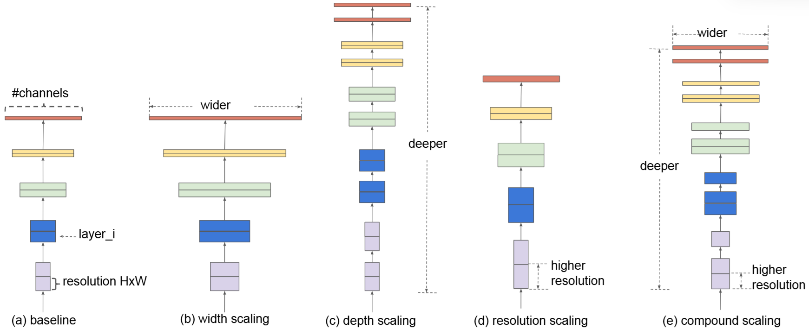
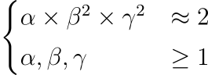
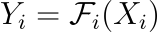
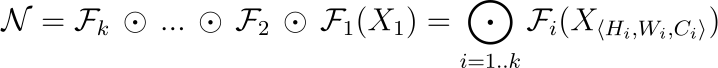
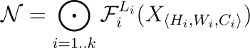
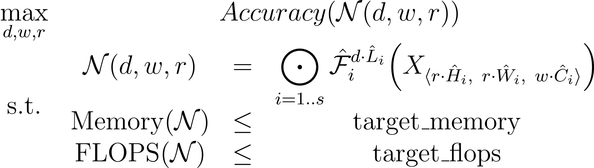

# I. Introduction
## 1. EfficientNet
- Sau chiến thắng của AlexNet tại ImageNet 2012, Convolutional Neural Networks (CNNs) đã trở thành một trong những thuật toán cốt lõi cho nhiều bài toán trong lĩnh vực học sâu - đặc biệt là thị giác máy tính.
- Các kiến trúc CNNs liên tục được nghiên cứu và phát triển với mục đích chính là tăng cường độ chính xác của mô hình.
- Một trong nhưng cách tiếp cận là tăng độ sâu của mô hình - từ đó dẫn đến một *vấn đề đó là sự phức tạp tính toán (FLOPs), số lượng tham số* và dẫn đến khó khăn trong việc khiển khai các mô hình này trên nhiều thiết bị.

- Một giải pháp được đưa ra đó là EfficientNet, **tập trung cả vào việc nâng cao độ chính xác và chú trọng đến hiệu quả sử dụng tài nguyên**.
- Cụ thể, nó tập trung vào việc *cân bằng một cách hợp lý các chiều của mạng CNN* (độ sâu, độ rộng và độ phân giải) để đạt được hiệu suất tối ưu.
## 2. Vấn đề mở rộng các mạng CNN truyền thống
- Trong quá trình phát triển CNN, việc mở rộng (Model scaling) là một trong phương pháp phổ biến để cải thiện độ chính xác của mô hình.
- Các phương pháp này tập trung vào 1 trong 3 hướng:
  1. **Depth Scaling** (mở rộng chiều sâu): Tăng số lượng lớp.
    - Ví dụ như ResNet với các biến thể ResNet-18 đến ResNet-200.
  2. **Width Scaling** (mở rộng chiều rộng): Tăng số lượng kênh (channels) trong mỗi lớp tích chập.
    - Giúp mô hình nắm bắt các đặc trưng chi tiết hơn;
    - Việc mở rộng chiều rộng quá mức có thể làm giảm khả năng học các đặc trưng phức tạp.
  3. **Resolution Scaling** (tăng độ phân giải): Tăng kích thước ảnh đầu vào
    - Các mô hình hiện đại thường sử dụng độ phân giải ảnh đầu vào lớn hơn so với các mô hình ban đầu;
    - Việc tăng độ phân giải không phải lúc nào cũng tốt, và hiệu quả tăng độ chính xác thường giảm dần khi độ phân giải tăng cao.

- Các phương pháp mở rộng đơn chiều này, dù có cải thiện độ chính xác, nhưng thường không đạt được hiệu quả tối ưu về mặt sử dụng tài nguyên và có thể dẫn đến tình trạng "diminishing returns" khi mô hình trở nên quá lớn.
## 3. Ý tưởng: Compound Scaling
- Nhóm phát triển EfficientNet thấy rằng việc mở rộng mô hình một cách hiệu quả đòi hỏi sự cân bằng giữa cả ba chiều: độ sâu, độ rộng và độ phân giải.
- Đề xuất phương pháp **Compound Scaling**:
  - Một phương pháp mở rộng hỗn hợp;
  - Sử dụng một hệ số duy nhất (*compound coefficient* - $\varphi$) để đồng nhất chia tỷ lệ cả ba chiều.
- Ý tưởng:
  - Khi tăng độ phân giải ảnh đầu vào, ta cũng cần tăng độ sâu mạng để *tăng vùng tiếp nhận* (receptive field) $\to$ nắm đặc trưng bao quát trên hình ảnh lớn.
  - Tăng độ rộng cũng giúp nắm bắt đặc trưng chi tiết hơn.
  - Việc cân bằng giúp mô hình tận dụng tối đa tài nguyên tính toán và đạt hiệu suất tốt hơn.
# II. Lý thuyết
## 1. Model Scaling: Depth, Width, Resolution
### 1.1 Depth Scaling
- Mở rộng theo chiều sâu.
- Là phương pháp mở rộng bằng cách *tăng số lượng lớp* (layers) trong mạng.
- Độ sâu của mạng tương ứng với số lớp Convolution và Tuyến tính.
- Đánh giá:
  - **Ưu điểm**:
    - Tăng khả năng học các đặc trưng phức tạp và trừu tượng hơn.
    - Tăng Receptive field, giúp mô hình nhận ngữ cảnh rộng hơn trong ảnh.
  - **Nhược điểm**:
    - Vấn đề Vanishing gradient.
    - Ảnh hưởng tích cực đến độ chính xác giảm dần.
### 1.2 Width Scaling
- Mở rộng theo chiều rộng.
- Là phương pháp mở rộng mô hình bằng cách tăng số lượng kênh (channels) trong mỗi lớp convolution.
- Độ rộng của mạng thường được đo bằng số kênh trong các lớp convolution.
- Đánh giá:
  - **Ưu điểm**:
    - Nắm bắt các đặc trưng chi tiết và đa dạng hơn;
    - Dễ huấn luyện hơn so với mô hình sâu.
  - **Nhược điểm**:
    - Mạng quá rộng nhưng nông (shallow) gặp khó khăn trong việc học các đặc trưng phức tạp;
    - Độ chính xác bão hòa khi độ rộng tăng lên.
- Ví dụ: Wide ResNet là một biến thể của ResNet được mở rộng theo chiều rộng.
### 1.3 Resolution Scaling
- Mở rộng độ phân giải.
- Là phương pháp mở rộng mô hình bằng cách tăng kích thước ảnh đầu vào.
- Độ phân giải ảnh đầu vào quyết định lượng thông tin chi tiết mà mô hình có thể tiếp nhận.
- Đánh giá:
  - **Ưu điểm**:
    - Cung cấp nhiều thông tin chi tiết hơn;
    - Nhận diện các đối tượng nhỏ và trích xuất các đặc trưng mịn hơn.
  - **Nhược điểm**:
    - Ảnh hưởng tích cực đến độ chính xác giảm dần khi độ phân giải tăng cao (diminishing returns);
    - Tăng đáng kể chi phí tính toán (FLOPS).
## 2. Compound Scaling
- Thay vì tập trung vào một chiều duy nhất, Compound Scaling sử dụng một hệ số duy nhất (**compound coefficient - $\varphi$**) để đồng nhất chia tỷ lệ cả ba chiều: độ sâu ($d$), độ rộng ($w$) và độ phân giải ($r$) của mạng. Công thức:
  - Depth: $d = \alpha^\varphi$;
  - Width: $w = \beta^\varphi$;
  - Resolution: $r = \gamma^\varphi$.
- Trong đó,
  - $\varphi$ (phi):
    - Hệ số compound coefficient do người dùng xác định;
    - Kiểm soát lượng tài nguyên tính toán bổ sung, giá trị càng lớn, mô hình càng lớn và mạnh mẽ hơn.
  - $\alpha, \beta, \gamma$:
    - Hệ số hằng số xác định tỷ lệ phân bổ tài nguyên cho độ sâu, độ rộng và độ phân giải, được xác định thông qua grid search trên một mô hình nhỏ ban đầu (EfficientNet-B0)
    - Các hệ số này phải đảm bảo rằng khi tăng $\varphi$ lên $1$ đơn vị, tổng FLOPS của mô hình sẽ tăng lên khoảng $2$ lần, do đó phải thỏa mãn điều kiện:

    

    - Ngược lại, khi muốn tăng $2^\varphi$ lần sức mạng tính toán (FLOPS) thì chỉ cần tăng các chiều tương ứng với hệ số $\varphi$.

- **Ý nghĩa trực quan**:
  - Cân bằng các chiều:
    - Compound Scaling nhận ra rằng các chiều mở rộng không độc lập với nhau.
    - Khi tăng độ phân giải ảnh đầu vào, cần đồng thời tăng độ sâu và độ rộng của mạng để tận dụng tối đa thông tin từ ảnh có độ phân giải cao.
  - Phương pháp này giúp mô hình đạt được sự cân bằng tốt hơn giữa độ chính xác và hiệu quả sử dụng tài nguyên, tránh tình trạng "diminishing returns" của các phương pháp mở rộng đơn chiều.
## 3. Bài toán Tối ưu hóa
### 3.1 Biễu diễn mạng
- Một lớp $i$ của một mạng tích chập có thể xác định dưới dạng: 
  
  

  trong đó:
  - $\mathcal{F}_i$ khối tính toán thứ $i$;
  - $Y_i$ là tensor đầu ra;
  - $X_i$ là tensor đầu vào với kích thước $\langle H_i, W_i, C_i \rangle$.
- Một mạng tích chập $\mathcal{N}$ có thể biểu diễn bằng chuỗi $k$ lớp:
  
  

- Trên thức tế, các lớp ConvNet thường chia thành nhiều giai đoạn, mỗi giai đoạn gồm nhiều lớp có cùng kiến trúc, do đó ta có thể ghi thành:
  
  

  với $\mathcal{F}_{i}^{L_i}$ biểu diễn lớp $\mathcal{F}_i$ được lặp lại $L_i$ lần ở giai đoạn $i$.
### 3.2 Bài toán mở rộng CNN
- Không giống như các thiết kế ConvNet thông thường chủ yếu tập trung vào việc tìm kiến ​​trúc lớp $F_i$ tốt nhất, việc mở rộng mô hình cố gắng mở rộng chiều dài mạng ($L_i$), chiều rộng ($C_i$) và/hoặc độ phân giải ($H_i, W_i$) mà không thay đổi $F_i$ được xác định trước trong mạng cơ sở.
- Bài toán Mở rộng CNN được công thức hóa dưới dạng bài toán tối ưu hóa sau:

  

  
- Trong đó:
  - $\mathcal{N}(d, w, r)$: mô hình CNN được mở rộng với các *hệ số coefficient* $d, w, r$.
  - $\mathcal{F}_i, L_i, H_i, W_i, C_i$: các tham số kiến trúc cơ bản của mô hình (xác định trước từ mô hình cơ sở EfficientNet-B0).
  - $\text{Memory}(\mathcal{N})$: lượng bộ nhớ cần thiết để lưu trữ mô hình.
  - $\text{FLOPS}(\mathcal{N})$: số phép tính toán cần thiết để thực hiện forward pass trên mô hình $\mathcal{N}$.
  - `target_memory`, `target_flops`: giới hạn về bộ nhớ và FLOPS cho mô hình.
- Bài toán tối ưu này thể hiện rõ ràng mục tiêu của Compound Scaling: tìm ra các hệ số $d, w, r$ tối ưu để đạt được độ chính xác cao nhất trong giới hạn tài nguyên cho phép.
# III. Kiến trúc EfficientNet
## 1. Neural Architecture Search (NAS) cho EfficientNet
- Để xây dựng mô hình cơ sở EfficientNet-B0, nhóm nghiên cứu đã sử dụng **Neural Architecture Search (NAS)**, một kỹ thuật tự động tìm kiếm kiến trúc mạng nơ-ron tối ưu.
- Thay vì thiết kế kiến trúc mạng thủ công, NAS cho phép máy tính *tự động khám phá không gian kiến trúc và tìm ra kiến trúc tốt nhất* dựa trên một mục tiêu cụ thể.
- Trong trường hợp EfficientNet, mục tiêu của NAS là *tối ưu hóa đồng thời cả độ chính xác và hiệu quả tính toán* (FLOPS). 
  - Nhóm tác giả đã sử dụng không gian tìm kiếm tương tự như MnasNet;
  - Điều chỉnh mục tiêu tối ưu hóa để tập trung vào FLOPS thay vì latency (độ trễ).
- Kết quả của quá trình NAS là kiến trúc mạng EfficientNet-B0, đóng vai trò là mô hình cơ sở để mở rộng quy mô bằng Compound Scaling.
## 2. Kiến trúc mạng cơ sở EfficientNetB0
- **Mobile Inverted Bottleneck Convolution (MBConv)**:
  - EfficientNet-B0 sử dụng MBConv block làm khối chính;
  - MBConv là một loại Convolution block hiệu quả, được giới thiệu trong MobileNetV2
  - MBConv sử dụng depthwise separable convolutions để giảm chi phí tính toán và inverted residual structure để cải thiện hiệu quả học đặc trưng.
- **Squeeze-and-Excitation Optimization (SE)**:
  - EfficientNet-B0 tích hợp SE block vào MBConv block;
  - SE block giúp mạng học cách tự động điều chỉnh độ quan trọng của các kênh đặc trưng, cải thiện khả năng biểu diễn của mạng.
- **Các Stage**:
  - Kiến trúc EfficientNet-B0 được chia thành 9 stage, với số lượng layer, số kênh và độ phân giải thay đổi qua các stage
  - Độ phân giải giảm dần và số kênh tăng dần qua các stage, theo mô hình thiết kế CNN truyền thống.

- Về chi tiết, kiến trúc của EfficientNetB0 bao gồm 3 phần chính:
### 2.1 Stem
- Phần đầu của mạng, chịu trách nhiệm **chuẩn bị dữ liệu đầu vào**, stage 1.
- **Cấu hình**:
  - Lớp Convolution:
    - Kiến trúc $32$ filter, kích thước kernel $3\times 3$, `stride = 2`.
    - Mục đích: Giảm kích thước không gian của Feature map, đồng thời tăng số lượng kênh đặc trưng ban đầu.
  - Batch Normalization: chuẩn hóa Feature map để tăng tốc huấn luyện và cải thiện độ ổn định.
  - ReLU6: phiên bản cải thiện hiệu quả tính toán (phù hợp cho mobile) để chuẩn hóa và thêm vào tính phi tuyến.
- **Mục đích**: Rút trích các đặc trưng cơ bản từ ảnh đầu vào.
### 2.2 Body
- Phần chính của mạng, thực hiện việc **trích xuất đặc trưng phức tạp** từ hình ảnh.
- Kiến trúc:
  - Được xây dựng từ các khối *MBConv* (Mobile Inverted Bottleneck Convolution);

- MBConv:
  - **Inverted Residual Block**: MBConv dựa trên Inverted Residual Block, một thiết kế hiệu quả được giới thiệu trong MobileNetV2 với cấu trúc đặc biệt:
      - Giai đoạn mở rộng (Expansion):
        - Sử dụng Convolution $1\times 1$ để mở rộng số lượng kênh đặc trưng từ input.
        - Mục đích là tăng chiều sâu biểu diễn và tạo ra một không gian đặc trưng phong phú hơn.
      - Convolution chiều sâu (Depthwise Convolution):
        - Áp dụng Depthwise Convolution với kernel size $3\times 3$ hoặc $5\times 5$ trên feature map đã được mở rộng.
        - Depthwise Convolution giúp giảm đáng kể số lượng tham số và FLOPS so với Convolution thông thường.
      - Giai đoạn thu hẹp (Projection):
        - Sử dụng Convolution $1\times 1$ để thu hẹp số lượng kênh đặc trưng về kích thước ban đầu của input.
        - Mục đích là giảm chiều sâu biểu diễn và tạo ra bottleneck, giúp giảm chi phí tính toán.
      - Skip Connection:
        - Kết nối residual được thêm vào giữa input và output của khối Inverted Residual Block (nếu `stride=1` và kích thước input/output bằng nhau).
        - Skip Connection giúp giải quyết vấn đề vanishing gradients và cải thiện khả năng huấn luyện mạng sâu.
  - **Squeeze-and-Excitation (SE) Optimization**: Khối MBConv tích hợp thêm SE block có chức năng:
      - Global Average Pooling:
        - Tính trung bình toàn cục trên Feature map để thu được vector đại diện cho thông tin toàn cục của kênh.
      - Fully Connected Layers:
        - Sử dụng hai lớp Fully Connected để học trọng số cho từng kênh dựa trên thông tin toàn cục.
      - Sigmoid Activation:
        - Hàm kích hoạt Sigmoid để đưa trọng số về khoảng $[0, 1]$.
      - Channel-wise Multiplication:
        - Nhân trọng số học được với từng kênh của Feature map ban đầu.
        - Mục đích là tăng cường các kênh quan trọng và giảm độ quan trọng của các kênh ít quan trọng hơn, giúp mạng tập trung vào các đặc trưng hữu ích nhất.

  <table>
    <thead>
      <tr>
        <th>Giai đoạn</th>
        <th>Operator</th>
        <th>Độ phân giải</th>
        <th>Số kênh</th>
        <th>Số lớp</th>
      </tr>
    </thead>
    <tbody>
      <tr>
        <td>1</td>
        <td>Conv3x3</td>
        <td>224x224</td>
        <td>32</td>
        <td>1</td>
      </tr>
      <tr>
        <td><strong>2</strong></td>
        <td>MBConv1, k3x3</td>
        <td>112x112</td>
        <td>16</td>
        <td>1</td>
      </tr>
      <tr>
        <td><strong>3</strong></td>
        <td>MBConv6, k3x3</td>
        <td>112x112</td>
        <td>24</td>
        <td>2</td>
      </tr>
      <tr>
        <td><strong>4</strong></td>
        <td>MBConv6, k5x5</td>
        <td>56x56</td>
        <td>40</td>
        <td>2</td>
      </tr>
      <tr>
        <td><strong>5</strong></td>
        <td>MBConv6, k3x3</td>
        <td>28x28</td>
        <td>80</td>
        <td>3</td>
      </tr>
      <tr>
        <td><strong>6</strong></td>
        <td>MBConv6, k5x5</td>
        <td>14x14</td>
        <td>112</td>
        <td>3</td>
      </tr>
      <tr>
        <td><strong>7</strong></td>
        <td>MBConv6, k5x5</td>
        <td>14x14</td>
        <td>192</td>
        <td>4</td>
      </tr>
      <tr>
        <td><strong>8</strong></td>
        <td>MBConv6, k3x3</td>
        <td>7x7</td>
        <td>320</td>
        <td>1</td>
      </tr>
    </tbody>
  </table>

### 2.3 Head
- Phần cuối của mạng, **thực hiện phân loại**.
- **Cấu hình**:
    - Convolution:
      - Kích thước $1\times 1$;
      - Tăng số kênh đặc trưng lên $1280$.
    - Global Average Pooling (GAP):
      - Tính trung bình toàn cục trên Feature map để thu được vector đặc trưng cố định kích thước, không phụ thuộc vào kích thước ảnh đầu vào.
      - GAP giúp giảm số lượng tham số và tránh overfitting so với Fully Connected Layers truyền thống.
    - Lớp Fully Connected:
      - Số lượng output bằng số lượng Class cần phân loại.
  - Softmax Activation:
    - Chuyển đổi output của Fully Connected Layer thành xác suất phân loại cho từng Class.
- **Mục đích**:
  - Tạo đầu ra là xác suất phân loại.
## 3. Scaling EfficientNet: B0 - B7
- Từ mô hình cơ sở EfficientNet-B0, áp dụng phương pháp Compound Scaling để tạo ra biến thể các mô hình EfficientNet với kích thước và hiệu suất khác nhau, từ EfficientNet-B1 đến EfficientNet-B7
- **Quy trình Scaling**:
  1. **Xác định $\alpha, \beta, \gamma$ cho EfficientNet-B0**:
    - Cố định $\varphi = 1$, thực hiện grid search để tìm ra các giá trị $\alpha, \beta, \gamma$ tối ưu sao cho $\alpha \times \beta^2 \times \gamma^2 \approx 2$.
    - Trên thực tế, giá trị tối ưu được tìm thấy là $\alpha = 1.2, \beta = 1.1, \gamma = 1.15$.
  2. **Scaling EfficientNet-B0**:
    - Cố định $\alpha, \beta, \gamma$ và thay đổi giá trị $\varphi$ để tạo ra các mô hình EfficientNet-B1, B2, B3, B4, B5, B6, B7;
    - $\varphi$ càng lớn, mô hình càng lớn và mạnh mẽ hơn.
- Kết quả là tạo ra các biến thể EfficientNet với độ chính xác và hiệu quả tính toán khác nhau, phù hợp với các yêu cầu về tài nguyên khác nhau.
# IV. Hạn chế của EfficientNetv1
## 1. Tốc độ huấn luyện chậm với ảnh kích thước lớn
- EfficientNetV1, đặc biệt là các biến thể lớn, có xu hướng huấn luyện chậm khi sử dụng ảnh đầu vào có kích thước lớn.
- Điều này là do việc tăng kích thước ảnh làm tăng đáng kể lượng bộ nhớ sử dụng trên GPU/TPU, buộc phải giảm batch size để có thể huấn luyện mô hình.
## 2. Depthwise Convolutions trong các lớp đầu
- EfficientNetV1 sử dụng depthwise convolutions trong kiến trúc, đặc biệt là trong các lớp đầu.
- Depthwise convolutions có ưu điểm là giảm số lượng tham số và FLOPS, nhưng lại không tận dụng được tối đa khả năng song song hóa trên các accelerator hiện đại như GPU/TPU, làm giảm hiệu quả huấn luyện trên các accelerator.
## 3. Mở rộng đồng đều trên tất cả các stage là không tối ưu
- EfficientNetV1 áp dụng Compound Scaling một cách đồng đều trên tất cả các stage của mạng.
- Tuy nhiên, các stage khác nhau có đóng góp khác nhau vào hiệu suất và tốc độ huấn luyện. Việc mở rộng đồng đều có thể không phải là cách tối ưu nhất để cân bằng giữa hiệu suất và tốc độ.
# V. EfficientNetv2
- EfficientNetV2 được thiết kế để giải quyết các hạn chế của EfficientNetV1 và cải thiện cả tốc độ huấn luyện và hiệu quả tham số.
- Các cải tiến bao gồm: ... (Continued)
