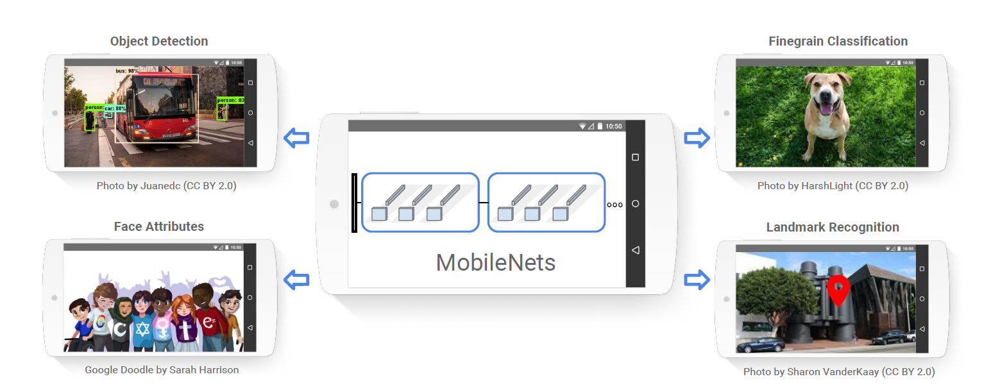
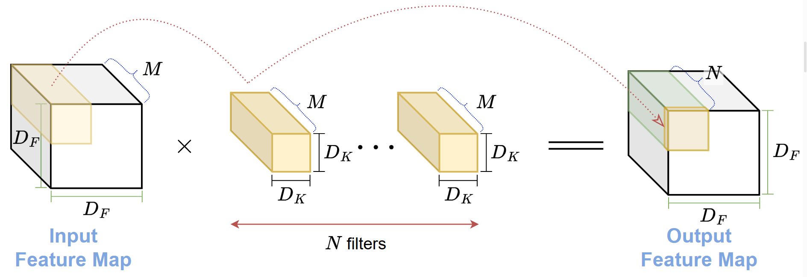
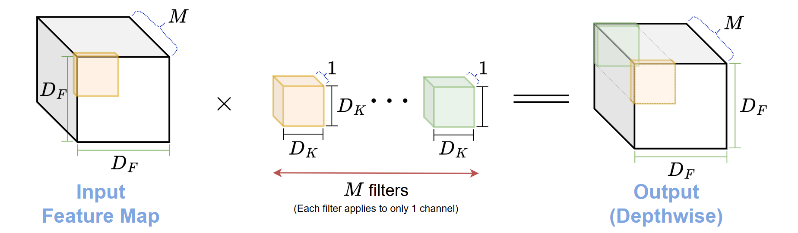
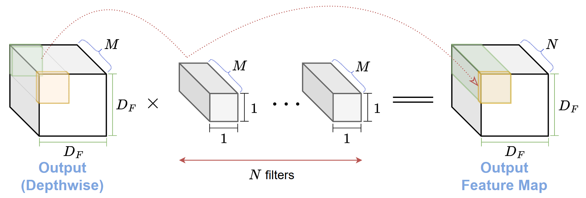
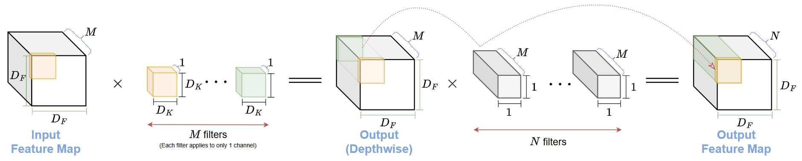

# I. Introduction
## 1. Bối cảnh và vai trò CNN
- Trong lĩnh vực thị giác máy tính, Mạng Nơ-ron Tích chập (Convolutional Neural Networks - CNNs) đã trở thành một công cụ không thể thiếu và đạt được những thành công vang dội.
- Kể từ cột mốc AlexNet chiến thắng cuộc thi ImageNet ILSVRC 2012, *CNNs đã chứng minh khả năng vượt trội trong nhiều tác vụ phức tạp* như phân loại ảnh, phát hiện đối tượng, phân đoạn ảnh, và nhiều ứng dụng khác.
- Xu hướng phát triển của CNNs *tập trung vào việc xây dựng các mô hình ngày càng sâu và phức tạp* hơn để đạt được độ chính xác cao hơn.
	- Các kiến trúc như **VGG**, **Inception**, **ResNet**, và các biến thể sau này đã liên tục thiết lập những tiêu chuẩn mới về hiệu suất trong các bài toán thị giác.
## 2. Vấn đề
- Sự gia tăng về độ sâu mạng cũng như độ phức tạp của CNNs ngày càng yêu cầu nhiều tài nguyên tính toán và phần cứng mạnh mẽ hơn.
- Từ đó, vấn đề xảy ra khi triển khai các mô hình CNNs phức tạp trên các thiết bị hạn chế về tài nguyên (xe tự lái, robot, IoT).
## 3. Ý tưởng của MobileNet
- Nhóm nghiên cứu của Google đã giới thiệu kiến trúc MobileNet, một lớp mô hình CNN hiệu quả và được *thiết kế đặc biệt cho việc triển khai trên các thiết bị di động và thiết bị nhúng*.
- **Ý tưởng cốt lõi**: sử dụng kĩ thuật tích chập mới gọi là *Tích chập tách biệt chiều sâu (Depthwise Separable Convolution)*.
	- Giúp giảm đáng kể số lượng tham số và chi phí tính toán;
	- Duy trì được độ chính xác chấp nhận được cho nhiều tác vụ thị giác máy tính;

- MobileNet được xây dựng trên kiến trúc tinh gọn và sử dụng hai hyperparameters (siêu tham số) đơn giản:
	- Width Multiplier;
	- Resolution Multiplier;
- Hai siêu tham số điều chỉnh kích thước mô hình, cho phép linh hoạt lựa chọn mô hình phù hợp với yêu cầu về độ chính xác, hiệu suất.



# II. Lý thuyết MobileNet
## 1. Tích chập tiêu chuẩn - Standard Convolution
### 1.1 Khái niệm và Cơ chế hoạt động
- Đây là phép toán cốt lõi trong CNNs.
- Trong đó, *bộ lọc (filter/kernel) trượt trên toàn bộ chiều rộng và chiều cao của bản đồ đặc trưng đầu vào* (input feature map) và đồng thời *áp dụng lên toàn bộ các kênh* đầu vào.
- Mỗi bộ lọc tạo ra một kênh đầu ra duy nhất, nhiều bộ lọc ứng với nhiều kênh đầu ra.



### 1.2 Chi phí tính toán
- Xét lớp tích chập tiêu chuẩn:
	- Kích thước bản đồ đặc trưng đầu vào: $D_F \times D_F \times M$ (với $M$ là số kênh đầu vào);
	- Kích thước bộ lọc (kernel): $D_K \times D_K$; với số lượng kernel ứng với số kênh đầu ra $N$;
	- Kích thước bản đồ đặc trưng đầu ra: $D_F \times D_F \times N$;
- Khi đó, chi phí được xác định:
  $$\text{Cost}_{\text{standard}} = D_K \cdot D_K \cdot M \cdot N \cdot D_F \cdot D_F$$
  cho thấy chi phí phụ thuộc cấp số nhân với $M, N$ và $D_K^2, D_F^2$.
- Chi phí này có thể trở nên rất lớn, đặc biệt khi phát triển các mạng CNNs sâu và rộng.
## 2. Tích chập tách biệt chiều sâu - Depthwise Separable Convolution
### 1.1 Khái niệm và Cơ chế 2 lớp
- Là một dạng tích chập phân tách (Factorized Convolution).
- Phân tách tích chập tiêu chuẩn thành 2 lớp riêng biệt:
	- **Tích chập theo chiều sâu** (Depthwise);
	- **Tích chập điểm** (Pointwise);

### 1.2 Tích chập theo chiều sâu (Depthwise)
- Trong tích chập theo chiều sâu, mỗi bộ lọc được áp dụng riêng biệt cho từng kênh đầu vào.
	- Không áp dụng bộ lọc trên tất cả kênh đầu vào như tích chập tiêu chuẩn;
	- Với $M$ bộ lọc, **mỗi bộ lọc $D_K \times D_K \times 1 \to$ cho chỉ 1 kênh đầu vào tương ứng** - không chia sẻ tham số;
	- Tách biệt quá trình lọc đặc trưng theo từng kênh.



- Chi phí tính toán:
  $$\text{Cost}_\text{Depthwise} = D_K \cdot D_K \cdot M \cdot D_F \cdot D_F$$
  với đầu vào và đầu ra đều có cùng $M$ kênh và có $M$ bộ lọc riêng cho từng kênh.

### 1.3 Tích chập điểm (Pointwise)
- Sau tích chập theo chiều sâu, bản đồ đặc trưng vẫn có $M$ kênh như đầu vào.
- Để kết hợp đặc trưng đã lọc ở Depthwise và tạo ra kênh đầu ra mới - sử dụng Tích chập điểm (Pointwise).
- Thực chất:
	- Tích chập tiêu chuẩn kích thước kernel $1\times 1$ với $N$ bộ lọc kích thước $1\times 1 \times M$.
	- Chiếu $D_F \times D_F \times M \longrightarrow D_F \times D_F \times N$.



- Chi phí tính toán:
  $$\text{Cost}_\text{Pointwise} = 1 \cdot 1 \cdot M \cdot N \cdot D_F \cdot D_F = M \cdot N \cdot D_F \cdot D_F$$

### 1.4 Đánh giá


- Chi phí tính toán tổng thể của Depthwise Separable Convolution:
  $$\text{Cost}_\text{DepthwiseSeparable} = D_K \cdot D_K \cdot M \cdot D_F \cdot D_F \hspace{4pt}+\hspace{4pt} M \cdot N \cdot D_F \cdot D_F$$
  khi đó, ta thử tính:
  $$\dfrac{\text{Cost}_\text{DepthwiseSeparable}}{\text{Cost}_{\text{standard}}} = \dfrac{D_K \cdot D_K \cdot M \cdot D_F \cdot D_F \hspace{4pt}+\hspace{4pt} M \cdot N \cdot D_F \cdot D_F}{D_K \cdot D_K \cdot M \cdot N \cdot D_F \cdot D_F} =  \dfrac{1}{N} + \dfrac{1}{D_K^2}$$
  với bài toán tích chập trong kiến trúc CNNs:
	- Số kênh đầu ra $N$ thường lớn hơn $1$;
	- Kích thước kernel $D_K$ thường là $3$ ($3 \times 3$);
	- Khi đó tỉ lệ chi phí tương ứng là $\left( \dfrac{1}{N} + \dfrac{1}{9} \right)$:
		- Với $N$ đủ lớn thì tỉ lệ xấp xỉ $\frac{1}{9}$ ứng với chi phí có thể giảm từ $8$ đến $9$ lần so với tích chập tiêu chuẩn.
## 3. Hyperparameters
- Để tạo ra các mô hình MobileNet nhỏ hơn và nhanh hơn, nhóm nghiên cứu giới thiệu thêm hai hyperparameter toàn cục:
	- **Bộ nhân chiều rộng (Width Multiplier)**;
	- **Bộ nhân độ phân giải (Resolution Multiplier)**;
### 3.1 Width Multiplier
- Bộ nhân chiều rộng, kí hiệu là $\alpha$ - hệ số nhân được áp dụng cho số kênh đầu vào/đầu ra mỗi lớp:
	- Số kênh đầu vào: $M \to \alpha M$;
	- Số kênh đầu ra   : $N \to \alpha N$;
	- Trong đó, $\alpha \in (0, 1]$:
		- $\alpha = 1$ ứng với mô hình MobileNet gốc;
		- $\alpha < 1$ ứng với mô hình MobileNet nhỏ (thinner) hơn.
- Khi đó, chi phí tính toán:
  $$\text{Cost}_\text{DepthwiseSeparable}^\alpha = D_K \cdot D_K \cdot (\alpha M) \cdot D_F \cdot D_F \hspace{4pt}+\hspace{4pt} (\alpha M) \cdot (\alpha N) \cdot D_F \cdot D_F$$
- Khi đó, Width Multiplier giúp giảm chi phí tính toán và số lượng tham số xấp xỉ bằng $\alpha^2$.
### 3.2 Resolution Multiplier
- Bộ nhân phân giải, kí hiệu là $\rho$ - hệ số giúp giảm độ phân giải của ảnh đầu vào/các bản đồ đặc trưng bên trong.
	- Kích thước bản đồ đặc trưng: $D_F \to \rho D_F$.
	- Trong đó, $\rho \in (0, 1]$:
		- $\rho = 1$ ứng với độ phân giải gốc;
		- $\rho < 1$ ứng với việc giảm độ phân giải - giảm chi phí tính toán.
- Khi đó, chi phí tính toán:
  $$\text{Cost}_\text{DepthwiseSeparable}^{\alpha,\hspace{3pt} \rho} = D_K \cdot D_K \cdot (\alpha M) \cdot (\rho D_F) \cdot (\rho D_F) \hspace{4pt}+\hspace{4pt} (\alpha M) \cdot (\alpha N) \cdot (\rho D_F) \cdot (\rho D_F)$$
- Khi đó, Resolution Multiplier giúp giảm chi phí tính toán và số lượng tham số xấp xỉ bằng $\rho^2$.
# III. Kiến trúc MobileNetv1
## 1. Tổng quan
- Tổng quan Kiến trúc MobileNet v1:
	- Lớp tích chập đầu tiên là lớp tích chập tiêu chuẩn;
	- Còn lại, chủ yếu từ các lớp tích chập tách biệt chiều sâu (Depthwise Separate Convolution);
	- Mỗi lớp tích chập (cả tiêu chuẩn và tách biệt chiều sâu): theo sau bởi 1 lớp Batch Normalization (BN) và hàm ReLU.
	- Lớp cuối cùng trước fully connected (FC): Average Pooling - giảm kích thước không gian xuống còn $1\times 1$.
- MobileNet v1 có tổng cộng 28 lớp nếu tính cả lớp tích chập chiều sâu và tích chập điểm là các lớp riêng biệt.
## 2. Các khối cơ bản
- MobileNet v1 sử dụng hai loại khối xây dựng cơ bản:
	- **Khối tích chập tiêu chuẩn**:
		- Lớp tích chập $3\times 3$ tiêu chuẩn;
		- Lớp Batch Normalization (BN);
		- Hàm kích hoạt ReLU.
		- Thường được sử dụng ở lớp đầu tiên của mạng.
	- **Khối tích chập tách biệt chiều sâu**:
		- Lớp tích chập chiều sâu (Depthwise) $3\times 3$;
		- Lớp Batch Normalization (BN);
		- Hàm kích hoạt ReLU;
		- Lớp tích chập điểm (Pointwise) $1\times 1$
		- Lớp Batch Normalization (BN);
		- Hàm kích hoạt ReLU;
		- Được sử dụng cho hầu hết các lớp còn lại của mạng.
## 3. Bảng kiến trúc
| Type / Stride | Filter Shape        | Input Size     |
| ------------- | ------------------- | -------------- |
| Conv/s2       | 3×3×3×32            | 224 x 224 × 3  |
| Conv dw/s1    | 3 x 3 x 32 dw       | 112 x 112 x 32 |
| Conv/s1       | 1 x 1 x 32 × 64     | 112 x 112 x 32 |
| Conv dw/s2    | 3 × 3 × 64 dw       | 112 x 112 x 64 |
| Conv/s1       | 1 x 1 x 64 x 128    | 56 x 56 x 64   |
| Conv dw/s1    | 3 × 3 × 128 dw      | 56 x 56 x 128  |
| Conv/s1       | 1 x 1 x 128 × 128   | 56 x 56 x 128  |
| Conv dw/s2    | 3 × 3 × 128 dw      | 56 x 56 x 128  |
| Conv/s1       | 1 x 1 x 128 × 256   | 28 x 28 x 128  |
| Conv dw/s1    | 3 × 3 × 256 dw      | 28 x 28 x 256  |
| Conv/s1       | 1 x 1 x 256 × 256   | 28 x 28 x 256  |
| Conv dw/s2    | 3 x 3 x 256 dw      | 28 x 28 x 256  |
| Conv/s1       | 1 x 1 x 256 × 512   | 14 x 14 x 256  |
| Conv dw/s1    | 3×3× 512 dw         | 14 x 14 x 512  |
| 5x Conv/s1    | 1 x 1 x 512 × 512   | 14 x 14 x 512  |
| Conv dw/s2    | 3 x 3 x 512 dw      | 14 x 14 x 512  |
| Conv/s1       | 1 x 1 x 512 × 1024  | 7 x 7 x 512    |
| Conv dw/s2    | 3 x 3 x 1024 dw     | 7 x 7 x 1024   |
| Conv/s1       | 1 x 1 x 1024 × 1024 | 7 × 7 × 1024   |
| Avg Pool / s1 | Pool 7 x 7          | 7 x 7 x 1024   |
| FC/s1         | 1024 × 1000         | 1 x 1 x 1024   |
| Softmax/s1    | Classifier          | 1 x 1 x 1000   |
## 4. Batch Normalization và ReLU
- MobileNet v1 sử dụng Batch Normalization (BN) và ReLU sau mỗi lớp tích chập (trừ lớp fully connected cuối cùng).
	- Batch Normalization (BN): ổn định huấn luyện, tăng tốc độ hội tụ và cho phép sử dụng $\text{learning rate}$ cao hơn.
	- Hàm ReLU: hàm kích hoạt phi tuyến phổ biến, giúp mạng có thể học được các đặc trưng phức tạp.
# IV. Cài đặt
```python
import torch
import torch.nn as nn

class DepthwiseSeparableConv(nn.Module):
    def __init__(self, inplane, outplane):
        super(DepthwiseSeparableConv, self).__init__()
        self.depthwise = nn.Conv2d(inplane, inplane , kernel_size = 3, padding = 1, groups = inplane)
        self.pointwise = nn.Conv2d(inplane, outplane, kernel_size = 1)
		
    def forward(self, x):
        out = self.depthwise(x)
        out = self.pointwise(out)
        return out

# Ví dụ sử dụng
input_channels  = 20
output_channels = 50
batch_size = 10
width  = 15
height = 15

x = torch.randn(batch_size, input_channels, width, height)

depthwise_separable_conv = DepthwiseSeparableConv(nin=input_channels, nout=output_channels)
y = depthwise_separable_conv(x)
print(y.shape) # Output: torch.Size([10, 50, 15, 15])
```
- Trong PyTorch, **Depthwise Separable** được thực hiện một cách hiệu quả bằng cách sử dụng tham số `groups`:
	- Thiết lập `groups` bằng với số kênh đầu vào (input channels);
	- Mỗi bộ lọc sẽ chỉ được áp dụng cho một kênh đầu vào, tương ứng với tích chập chiều sâu (Depthwise);
	- Sử dụng lớp `nn.Conv2d` khác với `kernel_size=1` để thực hiện tích chập điểm (Pointwise).
# V. Kết luận
## 1. Ứng dụng
- MobileNet v1 được thiết kế để ứng dụng rộng rãi trong các bài toán thị giác máy tính trên thiết bị di động/nhúng:
	- Phân loại ảnh (Image Classification);
	- Phát hiện đối tượng (Object Detection)
		- Làm backbone (mạng nền) cho các mô hình phát hiện đối tượng như SSD (Single Shot Detector).
	- Nhận dạng thuộc tính khuôn mặt (Face Attributes);
	- Nhận dạng địa danh (Landmark Recognition)
	- Fine-grained Classification.
## 2. Đánh giá ảnh hưởng của siêu tham số
- Việc sử dụng Width Multiplier và Resolution Multiplier cho phép điều chỉnh kích thước mô hình và hiệu suất tính toán một cách linh hoạt, với sự đánh đổi nhỏ về độ chính xác.
- Cần lựa chọn mô hình MobileNet phù hợp với các yêu cầu khác nhau về tài nguyên và hiệu suất.

# Tham khảo
```bibtex
@article{howard2017mobilenets,
	title   = {Mobilenets: Efficient convolutional neural networks for mobile vision applications},
	author  = {Howard, Andrew G and Zhu, Menglong and Chen, Bo and Kalenichenko, Dmitry and Wang,
			   Weijun and Weyand, Tobias and Andreetto, Marco and Adam, Hartwig},
	journal = {arXiv preprint arXiv:1704.04861},
	year    = {2017}
}
```
- [An Overview on MobileNet: An Efficient Mobile Vision CNN](https://medium.com/@godeep48/an-overview-on-mobilenet-an-efficient-mobile-vision-cnn-f301141db94d)
- Mobilenet model: https://phamdinhkhanh.github.io/2020/09/19/MobileNet.html