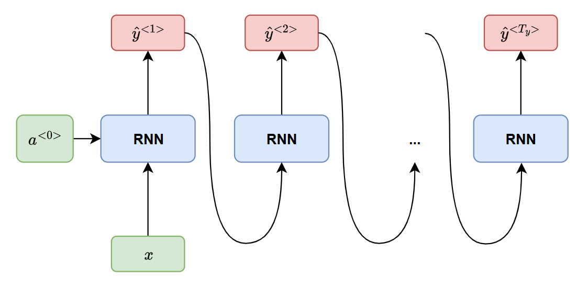

# **Recurrent Neural Network (RNN)**

# I. Introduction
## 1. Feedforward & Convolution Neural networks
- Các mạng nơ-ron truyền thống như FNN và CNN đã đạt được những thành tựu đáng kể trong việc xử lý dữ liệu có kích thước đầu vào và đầu ra cố định (ví dụ như phân loại hình ảnh):
	- Xử lí dữ liệu theo một chiều từ Input $\to$ Output;
	- Không có các khái niệm vễ chuỗi hay bộ nhớ;
	- Các phần dữ liệu đối với mạng này là độc lập với nhau.
- **Hạn chế**: gặp vấn đề khi phải xử lý dữ liệu tuần tự (sequential data) hoặc dữ liệu có độ dài đầu vào/đầu ra thay đổi.

## 2. Dữ liệu tuần tự (Sequential data)
- Trong nhiều bài toán thực tế, chẳng hạn như: ngôn ngữ tự nhiên (văn bản, giọng nói), chuỗi thời gian (dự báo thời tiết, thị trường chứng khoán), âm nhạc, video.
- Đặc điểm cốt lõi của dữ liệu này là *thứ tự của các phần tử mang thông tin quan trọng*.
	- Ví dụ để hiểu hoặc tạo ra một câu có nghĩa, phải hiểu trình tự, ngữ cảnh của các từ, không chỉ là tập các từ riêng lẻ.
- Các mạng FNN, CNN giả định rằng mọi đầu vào (và đầu ra) là *dữ liệu độc lập với nhau*, thiếu đi "bộ nhớ" để lưu trữ thông tin từ các bước trước đó.

## 3. Recurrent Neural networks (RNNs)
- **Thiết kế đặc biệt để xử lý dữ liệu tuần tự**.
- Ý tưởng chính là cho phép thông tin tồn tại lâu dài, hay nói cách khác là chúng có *"bộ nhớ" (memory)* để nắm bắt thông tin về những gì đã được tính toán cho đến thời điểm hiện tại.
- Bộ nhớ cho phép RNN sử dụng các đầu vào trước đó để *xác định ảnh hưởng đến đầu ra hiện tại*, làm cho chúng phù hợp với các tác vụ mà ngữ cảnh hoặc trình tự là yếu tố then chốt.

## 4. Các thách thức ban đầu
- Dù RNNs rất mạnh mẽ, nó vẫn đi kèm với những thách thức riêng, chủ yếu là *Vanishing gradient* hoặc *Exploding gradient*, những vấn đề này do độ lớn của Gradient (độ dốc):
	- Gradient quá nhỏ $\to$ tiếp tục nhỏ hơn $\to$ cập nhật các trọng số cho đến khi chúng trở nên không đáng kể — tức là xấp xỉ $0$.
		- Khi điều đó xảy ra, thuật toán không còn học nữa.
	- Gradient quá lớn, tạo ra một mô hình không ổn định.
		- Trong trường hợp này, trọng số của mô hình sẽ tăng quá lớn và cuối cùng sẽ thành dạng $\text{NaN}$.
- Giải pháp cho những vấn đề này là *giảm số lượng lớp ẩn* trong mạng nơ-ron, *loại bỏ bớt sự phức tạp* trong mô hình RNN.
 
# II. Kiến trúc và hoạt động RNN
- Phần này tập trung mô tả kiến trúc của mạng RNN đơn giản nhất - Vanilla RNN.

## 1. Động lực. So sánh với FNN
- **Hạn chế của FNN**:
	- Xử lí thông tin theo 1 luồng duy nhất: Input $\to$ Output;
	- Giả định rằng đầu vào (và đầu ra tương ứng) là độc lập với nhau;
	- Không có cơ chế nội tại để ghi nhớ thông tin từ các bước trước đó để xử lí đầu vào hiện tại;
	- Ví dụ, trong một câu, việc đưa ra từ tiếp theo với FNN sẽ không liên quan tới các từ nó đưa ra trước đó.
- **Nhu cầu về bộ nhớ**:
	- Dữ liệu tuần tự (văn bản, giọng nói, chuỗi thời gian, ...) có *đặc tính quan trọng là thứ tự và ngữ cảnh*;
	- Thông tin trước đó thường rất cần thiết để dự đoán dữ liệu hiện tại;
	- RNN giới thiệu một khái niệm về "bộ nhớ"/"trạng thái" (state) có thể lưu trữ và cập nhập thông tin qua các bước thời gian.

## 2. Ý tưởng: Sự hồi quy (Recurrent)
- **Vòng lặp thông tin**:
	- Đặc điểm kiến trúc định nghĩa của RNN là *sự tồn tại của các vòng lặp* (loops);
	- Thay vì chỉ truyền thông tin về phía trước, RNN cho phép thông tin đầu ra quay lại làm đầu vào cho bước tiếp theo;
	- Vòng lặp chính là cơ chế tạo nên sự hồi quy.
- **Xử lí tuần tự**:
	- RNN xử lí chuỗi đầu vào $(x_1, x_2, \dots, x_T)$ từng phần tử một (từng bước thời gian $t$).
	- Tại mỗi bước $t$, nó không chỉ nhận $x_t$ mà còn nhận thông tin "tóm tắt" từ các bước trước đó (từ $1 \to t-1$)

## 3. Kiến trúc cơ bản của RNN

- Kiến trúc đặc biệt của RNN cho phép nó sử dụng đầu ra trước đó làm đầu vào ở bước tiếp theo.

## 4. Thành phần chính tại mỗi bước thời gian

Tại mỗi bước thời gian $t$ trong chuỗi, một đơn vị RNN cơ bản bao gồm các thành phần chính:
- **Đầu vào (Input)**:
    - Vector đầu vào $x^{<t>}$, biểu diễn phần tử thứ $t$ trong chuỗi đầu vào;
    - Trong xử lí ngôn ngữ, có thể là vector one-hot, vector nhúng (embedding vector) của từ thứ $t$, kích thước $d$.
- **Trạng thái ẩn (Hidden State Vector)**:
    - Vector $a^{<t-1>}$, *là thành phần quan trọng đóng vai trò bộ nhớ* của mạng;
    - Tóm tắt thông tin: đầu vào $x^{<t>}$ hiện tại và thông tin đã xử lí ở bước trước đó $a^{<t-1>}$;
    - Nắm bắt ngữ cảnh tuần tự đến thời gian $t$, kích thước $D^a$;
    - Trạng thái ban đầu $a^{<0>}$ thường khởi tạo là vector không hoặc một "trainable" vector.
- **Đầu ra (Output)**:
    - Vector đầu ra $y^{<t>}$;
    - Tính toán dựa trên trạng thái ẩn $a^{<t>}$;
    - Đầu ra này có thể là dự đoán cho bước tiếp theo (ví dự như xác suất của từ tiếp theo trong mô hình ngôn ngữ) hoặc một biểu diễn trung gian;
    - Kích thước $D^y$ (ví dụ kích thước từ vựng $|V|$ trong mô hình ngôn ngữ).

## 5. Tính toán và Công thức (Vanilla RNN)

### 5.1 Tính toán trạng thái ẩn $a^{<t>}$
- Trạng thái ẩn được tính *dựa trên 2 nguồn* thông tin:
	- Trạng thái ẩn bước trước $a^{<t-1>}$;
	- Vector đầu vào hiện tại $x^{<t>}$.
- Các phép tính:
	- Biến đổi tuyến tính $a^{<t-1>}$ bằng ma trận trọng số hồi quy $W_{aa}$;
	- Biến đổi tuyến tính $x^{<t>}$ bằng ma trận trọng số đầu vào $W_{ax}$.
	- Hai kết quả trên được cộng lại cùng với vector độ chệch (bias) ẩn $b_a$.
	- Hàm kích hoạt phi tuyến (thường là $\tanh$ hoặc $\text{ReLU}$) được áp dụng lên kết quả trên, ta được $a^{<t>}$.

- **Công thức cập nhập**:
  $$a^{<t>} = f(W_{aa}\cdot a^{<t-1>} \textcolor{red}{+} W_{ax}\cdot x^{<t>} \textcolor{red}{+} b_a)$$
  trong đó:
	- $a^{<t>} \in \mathbb{R}^{D^{\hspace{1pt}a}}$ : trạng thái ẩn tại $t$, tương tự, $a^{<t-1>}$ là trạng thái ẩn bước $t-1$;
	- $W_{aa} \in \mathbb{R}^{D^{\hspace{1pt}a} \times D^{\hspace{1pt}a}}$ : ma trận trọng số hồi quy, kết nối trạng thái ẩn trước đó với trạng thái ẩn hiện tại;
	- $x^{<t>} \in \mathbb{R}^d$ : vector đầu vào tại bước thời gian $t$;
	- $W_{ax} \in \mathbb{R}^{D^{\hspace{1pt}a}\times d}$ : ma trận trọng số đầu vào, kết nối đầu vào hiện tại với trạng thái ẩn;
	- $b_a \in \mathbb{R}^{D^{\hspace{1pt}a}}$ : vector bias;
	- $f$ : hàm kích hoạt phi tuyến ($\tanh$ hoặc $\text{ReLU}$); hàm $\tanh$ thường được ưa chuộng cho trạng thái ẩn vì nó ánh xạ giá trị vào khoảng $[-1, 1]$, giúp kiểm soát giá trị trạng thái.

### 5.2 Tính toán đầu ra $y^{<t>}$
- Đầu ra được tính toán dựa trên trạng thái ẩn $a^{<t>}$ vừa được cập nhập.
- Các phép tính:
	- Biến đổi tuyến tính đầu ra bằng ma trận trọng số đầu ra $W_{ya}$.
	- Cộng kết quả ở bước trước với vector độ chệch (bias) $b_y$.
	- Sử dụng hàm kích hoạt phi tuyến $g$ (có thể khác với hàm kích hoạt $f$ ở trên).
		- Đối với các bài toán phân loại (như dự đoán từ tiếp theo), hàm $\text{softmax}$ thường được sử dụng để tạo ra một phân phối xác suất trên các lớp đầu ra.

- **Công thức tính toán đầu ra**:
  $$y^{<t>} = g(W_{ya}\cdot a^{<t>} + b_y)$$
  trong đó:
	- $y^{<t>} \in \mathbb{R}^{D^{\hspace{1pt}y}}$ : vector đầu ra tại bước thời gian $t$;
	- $a^{<t>} \in \mathbb{R}^{D^{\hspace{1pt}a}}$ : vector trạng thái ẩn tại bước thời gian $t$;
	- $W_{ya} \in \mathbb{R}^{D^{\hspace{1pt}y}\times D^{\hspace{1pt}a}}$ : ma trận trọng số ẩn cho đầu ra hiện tại;
	- $b_y \in \mathbb{R}^{D^{\hspace{1pt}y}}$ : vector bias của đầu ra;
	- $g$ : hàm kích hoạt đầu ra (thường là $\text{softmax}$).

## 6. Chia sẻ trọng số
- **Nguyên tắc**: đây là đặc điểm quan trọng và mạnh mẽ của RNN, các ma trận trọng số $W_{aa}, W_{ax}, W_{ya}$ và các vector bias $b_a, b_y$ là *hoàn toàn giống và sử dụng ở mọi bước thời gian* $t$ trong chuỗi.
- **Lợi ích**:
	- Số lượng tham số không tăng lên theo độ dài chuỗi;
	- Khái quát hóa: áp dụng cùng cùng trọng số tại mỗi bước cho phép mô hình học các mẫu (patterns) lặp lại trong dữ liệu tuần tự và khái quát hóa kiến thức đã học được ở một phần của chuỗi sang các phần khác.
	- Xử lí chuỗi có độ dài thay đổi.

## 7. Hai cách biểu diễn kiến trúc: Rolled và Unrolled

	

- **Dạng cuộn (Rolled)**:
	- Khối tính toán duy nhất với mũi tên vòng lặp chỉ từ đầu ra trạng thái ẩn trở thành đầu vào trạng thái ẩn.
	- Biểu diễn *bản chất hồi quy* và *chia sẻ trọng số*. Thể hiện gọn gàng cấu trúc cốt lõi.
	- Một mạng RNN: nhận đầu vào $x^{t}$ và $a^{<t-1>}$ tạo ra $y^{<t>}$ và $a^{<t>}$, mũi tên từ $a^{<t>}$ vòng lại làm đầu vào.
- **Dạng mở rộng (Unrolled)**:
	- Một chuỗi các khối RNN giống hệt nhau, mỗi khối tương ứng với một bước thời gian.
		- Khối tại bước $t$ nhận $x^{<t>}$ và $h^{<t-1>}$, tạo ra $y^{<t>}$ và $h^{<t>}$ (đầu vào cho khối $t+1$).
	- Trông giống như một mạng nơ-ron rất sâu, nhưng các khối RNN ở các bước thời gian *chia sẻ cùng một bộ trọng số*.
		- Làm rõ luồng tính toán tuần tự và sự phụ thuộc của trạng thái hiện tại vào trạng thái quá khứ.
		- Hữu ích khi hình dung quá trình Lan truyền ngược theo Thời gian (BPTT).

## 8. Luồng thông tin và Bộ nhớ ngắn hạn
- Thông qua trạng thái ẩn $a^{<t>}$, thông tin từ quá khứ có thể ảnh hưởng đến các tính toán ở hiện tại và tương lai.
	- $a^{<t>}$: bản tóm tắt mã hóa của chuỗi $x^1, \dots, x^{<t>}$.
	- Tuy nhiên, trong Vanilla RNN, khả năng lưu trữ thông tin dài hạn bị hạn chế do:
		- Việc nhân ma trận lặp đi lặp lại, các hàm kích hoạt khiến thông tin từ các bước rất xa trong quá khứ có xu hướng bị "loãng" đi hoặc biến mất (vanishing gradient);
		- Mô hình chủ yếu dựa vào ngữ cảnh gần đây;
		- Nên RNN cơ bản thường được coi là có "bộ nhớ ngắn hạn".
- Tóm lại, kiến trúc RNN cơ bản sử dụng trạng thái ẩn và cơ chế chia sẻ trọng số để xử lý dữ liệu tuần tự, cho phép thông tin từ quá khứ ảnh hưởng đến hiện tại
- Mặc dù đơn giản và là nền tảng quan trọng, nó gặp khó khăn trong việc học các phụ thuộc dài hạn, dẫn đến sự phát triển của các kiến trúc phức tạp hơn như LSTM và GRU.

# III. Các dạng kiến trúc RNN
- Sự linh hoạt của RNN giúp nó có thể xây dựng dưới nhiều dạng kiến trúc, tuy thuộc theo mối quan hệ chuỗi đầu vào và đầu ra.

| Dạng | Minh họa | Ví dụ  |
| ---- | -------- | ------ |
| **One-to-One** $T_x = T_y = 1$ |  | Mạng NN truyền thống (phân loại ảnh cơ bản) |
| **One-to-Many**  $\begin{cases}T_x &= 1 \\ T_y &> 1\end{cases}$ |  | Music generation (Image Captioning) |
| **Many-to-One** $\begin{cases}T_x &> 1 \\ T_y &= 1\end{cases}$ |  | Sentiment classification Activity Clasification |
| **Many-to-Many** $T_x = T_y$ |  | Named entity recognition - NER |
| **Many-to-Many** $T_x \neq T_y$ |  | Machine translation (Transformer) |

# IV. Ứng dụng và khả năng của RNN
- Trong lĩnh vực xử lí ngôn ngữ tự nhiên, RNN đã được ghi nhận với nhiều thành công trên nhiều khía cạnh, nổi bậc nhất là biến thể LSTM của nó.
- LSTM (Long Short-Term Memory) có sự ưu việt ở điểm có thể nhớ được nhiều bước hơn mô hình RNN truyền thống.

## 1. Mô hình hóa ngôn ngữ và Sinh văn bản
- Mô hình ngôn ngữ cho phép ta dự đoán được xác xuất của một từ nào đó xuất hiện sau một chuỗi các từ đi liền trước.
	- Khả năng ước lượng được độ tương tự của các câu $\to$ ứng dụng cho việc dịch máy.
	- Dự đoán được từ tiếp theo $\to$ xây dựng mô hình tự sinh từ cho phép máy tính có thể tự tạo ra các văn bản mới từ tập mẫu và xác xuất đầu ra của mỗi từ.
- Trong mô hình ngôn ngữ, đầu vào là một chuỗi các từ (vector one-hot) và đầu ra là một chuỗi các từ dự đoán được.
- **Khi huấn luyện mạng**, gán  $y^{<t>} = x^{<t+1>}$ vì ta muốn đầu ra tại bước $t$ chính là từ tiếp theo của câu.

- Tham khảo về mô hình hoá ngôn ngữ và sinh văn bản:
	- [Recurrent neural network based language model](http://www.fit.vutbr.cz/research/groups/speech/publi/2010/mikolov_interspeech2010_IS100722.pdf);
	- [Extensions of Recurrent neural network based language model Generating](http://www.fit.vutbr.cz/research/groups/speech/publi/2011/mikolov_icassp2011_5528.pdf);
	- [Generating Text with Recurrent Neural Networks](http://machinelearning.wustl.edu/mlpapers/paper_files/ICML2011Sutskever_524.pdf).

## 2. Machine Translation
- Tương tự như ứng dụng Mô hình hóa ngôn ngữ, đầu vào là một chuỗi từ của ngôn ngữ nguồn, đầu ra là ngôn ngữ đích.
- Điểm khác nhau quan trọng:
	- Chỉ xử lí đầu ra sau khi xem xét toàn bộ đầu vào (mô hình Many-to-Many với $T_x \neq T_y$).
	- Phải xem xét toàn bộ ngữ cảnh câu để có thể đưa ra bản dịch chính xác.
- Tham khảo các mô hình dịch máy:
	- [A Recursive Recurrent Neural Network for Statistical Machine Translation](http://www.aclweb.org/anthology/P14-1140.pdf);
	- [Sequence to Sequence Learning with Neural Networks](http://papers.nips.cc/paper/5346-sequence-to-sequence-learning-with-neural-networks.pdf);
	- [Joint Language and Translation Modeling with Recurrent Neural Networks](http://research.microsoft.com/en-us/um/people/gzweig/Pubs/EMNLP2013RNNMT.pdf).

## 3. Speech Recognition
- Dựa trên chuỗi âm thanh đầu vào, ta có thể dự đoán chuỗi ngữ âm đi kèm với xác suất.
- Thao khảo mô hình dịch máy:
	- [Towards End-to-End Speech Recognition with Recurrent Neural Networks](http://www.jmlr.org/proceedings/papers/v32/graves14.pdf).

## 4. Image Captioning
- Kết hợp cùng với mạng tích chập (CNN), RNN được sử dụng để tạo các mô tả từ hình ảnh đầu vào.
- Sự kết hợp này đã đưa ra được các kết quả tốt: Deep Visual-Semantic Alignments for Generating Image Descriptions.

# V. Huấn luyện RNN
- Quá trình này tương tự như huấn luyện mạng nơ-ron truyền thống (FNN), nhưng có những thay đổi quan trọng do cấu trúc hồi quy và cơ chế chia sẻ tham số.
- **Điểm khác biệt**:
	1. Phụ thuộc theo thời gian:
		- Đầu ra/trạng thái ẩn tại bước thời gian $t$: phụ thuộc đầu vào tại $t$ và còn phụ thuộc trạng thái ẩn bước $t-1$.
		- Tạo ra một chuỗi phụ thuộc kéo dài qua nhiều bước.
	2. Chia sẻ tham số:
		- Cùng một bộ tham số $W_{aa}, W_{ax}, W_{ya}, b_a, b_y$ được sử dụng lặp lại ở mọi bước thời gian.

- Do đó, khi tính toán đạo hàm (gradient) của hàm mất mát theo các tham số này, chúng ta *cần xem xét ảnh hưởng của một tham số lên tất cả các bước thời gian mà nó tham gia*, chứ không chỉ một bước duy nhất.
- Thuật toán được sử dụng cho việc này gọi là **Lan truyền ngược Theo Thời gian (Backpropagation Through Time - BPTT)**.
- Để thực hiện BPTT, trước tiên chúng ta cần định nghĩa một hàm để đo lường sai số của mô hình.

## 1. Hàm mất mát (Loss function) cho dữ liệu tuần tự
- **Hàm mất mát tại bước thời gian $t$**:
	- RNN có đầu ra $\hat{y}^{<t>}$ tại mỗi bước thời gian $t$.
	- Hàm mất mát tại bước thời gian $t$ có kí hiệu $\mathcal{L}^{<t>}$:so sánh vector dự đoán $\hat{y}^{<t>}$ và $y^{<t>}$.
	- Đối với các bài toán phân loại tuần tự (như mô hình ngôn ngữ), mất mát thường sử dụng là Cross-Entropy, khoảng cách giữa phân phối xác suất dự đoán và phân phối thực tế (one-hot).
	- **Cross-Entropy loss**:
  	  $$\mathcal{L}^{<t>} = \mathcal{L}(\hat{y}^{<t>}, y^{<t>}) = - \displaystyle\sum_{j=1}^{|V|}{(y^{<t>}_j  \times \log(\hat{y}^{<t>}_j))}$$
	  trong đó:
		- $|V|$: kích thước không gian đầu ra / bộ từ vựng;
		- $y^{<t>}_j$: là giá trị thực tế của lớp thứ $j$ tại bước $t$ (one-hot);
		- $\hat{y}^{<t>}_j$: là xác suất dự đoán cho lớp thứ $j$ tại bước $t$.

- **Total Loss** - tổng mất mát cho toàn chuỗi $L$:
	- Để đánh giá hiệu năng trên toàn bộ chuỗi, hàm mất mát tổng thể được tính bằng tổng (hoặc trung bình) các hàm mất mát tại từng bước thời gian.
	- Công thức: 
	  $$\mathcal{L}(\hat{y}, y) = \sum_{t=1}^{T_y}\mathcal{L}(\hat{y}^{<t>}, y^{<t>})$$
	  trong đó, $T_y$ là độ dài của chuỗi đầu ra.
- Việc tối thiểu hóa tổng mất mát sẽ buộc mô hình học cách đưa ra dự đoán chính xác với các bước thời gian liên quan.

## 2. Lan truyền ngược theo thời gian (Backpropagation Through Time)

	

### 2.1 Backpropagation Through Time (BPTT).
- **Động lực**:
	- Để tối ưu hóa hàm mất mát $\mathcal{L}$ bằng các phương pháp dựa trên Gradient (GD, SGD) ta *cần có các đạo hàm riêng* của nó theo từng tham số $W_{aa}, W_{ax}, W_{ya}, b_a, b_y$.
	- Tuy nhiên, *cấu trúc Hồi quy và Chia sẻ tham số* sẽ khiến thuật toán Backpropagation tiêu chuẩn sẽ không thể áp dụng trực tiếp.
- **Ý tưởng cốt lõi**:
	- Biến thể của Backpropagtion.
	- Mở rộng (Unroll) RNN theo trục thời gian $\approx$ mạng Feed Forward sâu, mỗi lớp ứng với mỗi bước thời gian.
	- Áp dụng thuật toán Backpropagation tiêu chuẩn..
	- **Chú ý**: giá trị gradient riêng tính được cho cùng một tham số phải được cộng dồn lại vì bản chất nó chỉ là duy nhất 1 tham số (do việc chia sẻ trọng số).

### 2.2 Quy trình thực hiện BPTT
#### a. Truyền xuôi (Forward Pass)
- **Mục đích**: tính toán đầu ra dự đoán $\hat{y}^{<t>}$ và trạng thái ẩn $a^{<t>}$ cho toàn bộ chuỗi đầu vào và hàm mất mát.
- **Quy trình** (Unroll RNN):
	- Khởi tạo trạng thái ẩn ban đầu $a^{<0>}$, thường là vector $0$;
	- Lặp qua các bước thời gian, từ $1 \to T_y$ :
		- Trạng thái ẩn hiện tại: $a^{<t>} = f(W_{aa}\cdot a^{<t-1>} + W_{ax}\cdot x^{<t>} + b_a)$, trong đó $f$ là hàm kích hoạt;
		- Tính toán đầu ra dự đoán: $\hat{y}^{<t>} = g(z^{<t>})$, trong đó giá trị pre-activation $z^{<t>} = W_{ya}\cdot a^{<t>} + b_y$.
	- *Lưu lại* tất cả các giá trị trạng thái ẩn, đầu vào và đầu ra.
- Tính toán hàm mất mát tại mỗi bước thời gian: $\mathcal{L}^{<t>} = \mathcal{L}(\hat{y}^{<t>}, y^{<t>})$;
- Từ đó, tính toán tổng mất mát trên toàn chuỗi: $\mathcal{L}(\hat{y}, y) = \displaystyle\sum_{i=1}^{T_y}{\mathcal{L}^{<t>}}$.

#### b. Truyền ngược (BPTT)
- **Mục đích**: tính các Gradient theo từng tham số: 
  $$\displaystyle\dfrac{\partial \mathcal{L}}{\partial W_{aa}}, \dfrac{\partial \mathcal{L}}{\partial W_{ax}}, \dfrac{\partial \mathcal{L}}{\partial W_{ya}}, \dfrac{\partial \mathcal{L}}{\partial b_a}, \dfrac{\partial \mathcal{L}}{\partial {b_y}}$$
- Quy trình lan truyền ngược bắt đầu từ cuối chuỗi (bước $T_y$) và đi ngược về đầu chuỗi (bước $1$).
- Khởi tạo các tổng tích lũy Gradient ban đầu bằng $0$, các giá trị cần tính ở trên.

- **Tính Gradient cho Lớp đầu ra** $W_{ya}, b_y$:
	- Các tham số này chỉ ảnh hưởng đến đầu ra $y^{<t>}$ tại bước thời gian $t$;
	- Áp dụng chain-rule tại bước $t$ để tính Gradient của hàm mất mát $\mathcal{L}^{<t>}$:
      $$\dfrac{\partial \mathcal{L^{<t>}}}{\partial W_{ya}} = \dfrac{\partial \mathcal{L}^{<t>}}{\partial \hat{y}^{<t>}} \cdot \dfrac{\partial \hat{y}^{<t>}}{\partial z^{<t>}} \cdot \dfrac{\partial z^{<t>}}{\partial W_{ya}}$$
	  trong đó:
		- $\dfrac{\partial \mathcal{L}^{<t>}}{\partial \hat{y}^{<t>}}$: đạo hàm của hàm mất mát tại bước $t$;
		- $\dfrac{\partial \hat{y}^{<t>}}{\partial z^{<t>}} = g'\left(z^{<t>}\right)$: đạo hàm của hàm kích hoạt;
		- $\dfrac{\partial z^{<t>}}{\partial W_{ya}} = \left( a^{<t>} \right)^T$, với $z^{<t>} = W_{ya}\cdot a^{<t>} + b_y$ là giá trị pre-activation của đầu ra.
	- Tương tự, ta được giá trị Gradient cho vector bias $b_y$: 
  	  $$\dfrac{\partial \mathcal{L^{<t>}}}{\partial b_{y}} = \dfrac{\partial \mathcal{L}^{<t>}}{\partial \hat{y}^{<t>}} \cdot \dfrac{\partial \hat{y}^{<t>}}{\partial z^{<t>}} \cdot \dfrac{\partial z^{<t>}}{\partial b_{y}}$$
	  trong đó, $\dfrac{\partial z^{<t>}}{\partial b_y} = 1$.

- **Tính Gradient của Mất mát tổng theo Trạng thái ẩn** $a^{<t>}$:
	- Đây là bước quan trọng nhất, thể hiện được sự lan truyền Gradient theo thời gian.
	- Gradient của mất mát tổng $\mathcal{L}$ theo trạng thái ẩn $a^{<t>}$, ký hiệu:
  	  $$\delta^{<t>} = \dfrac{\partial \mathcal{L}}{\partial a^{<t>}}$$
	  đến từ hai nguồn:
		1. Ảnh hưởng đầu ra cùng bước $\hat{y}^{<t>}$:
			- Gradient từ hàm mất mát tại bước $t$, tức là $\mathcal{L}^{<t>}$  truyền ngược qua lớp đầu ra.
			- Chuỗi phụ thuộc: $a^{<t>} \to \hat{y}^{<t>} \to \mathcal{L}^{<t>} \to \mathcal{L}$.
		2. Ảnh hưởng trạng thái ẩn bước tiếp $a^{<t+1>}$:
			- Gradient từ tất cả các mất mát tương lai ($\mathcal{L}^{<t+1>}, \dots, \mathcal{L}^{<T_y>}$) đã được tích lũy và truyền ngược về $a^{<t+1>}$ chính là $\delta^{<t+1>}$;
			- Sau đó truyền tiếp về $a^{<t>}$.
			- Chuỗi phụ thuộc: $a^{<t>} \to a^{<t+1>} \to \cdots \to \mathcal{L}$.
	- Từ hai thành phần trên, kết hợp đệ quy, ta có công thức gradient tổng (tổng gradient theo hai chuỗi phụ thuộc):
   	  $$\begin{matrix} \delta^{<t>} &= &\left(\dfrac{\partial \mathcal{L}}{\partial \hat{y}^{<t>}}\cdot \dfrac{\partial \hat{y}^{<t>}}{\partial a^{<t>}}\right) &\textcolor{red}{+} &\left(\dfrac{\partial \mathcal{L}}{\partial a^{<t>}}\cdot \dfrac{\partial a^{<t>}}{\partial a^{<t>}}\right) \\[4pt] & &(\text{thành phần 1}) & &(\text{thành phần 2}) \end{matrix}$$
	- Với đạo hàm $\dfrac{\partial \hat{y}^{<t>}}{\partial a^{<t>}}$, và biến trung gian (pre-activation) $z^{<t>} = W_{ya}\cdot a^{<t>} + b_y$: 
		- Chuỗi phụ thuộc: $a^{<t>} \to z^{<t>} \to \hat{y}^{<t>}$;
		- Áp dụng chain-rule, ta có:
		  $$\dfrac{\partial \hat{y}^{<t>}}{\partial a^{<t>}} = \dfrac{\partial \hat{y}^{<t>}}{\partial z^{<t>}}\cdot \dfrac{\partial z^{<t>}}{\partial a^{<t>}}$$
		  trong đó:
			- $\dfrac{\partial \hat{y}^{<t>}}{\partial z^{<t>}} = g'(z^{<t>})$: đạo hàm của hàm kích hoạt đầu ra $g$.
    			- Ví dụ, nếu $g'$ là $\text{softmax}$ đạo hàm này là ma trận Jacobian của $\text{softmax}$. Nếu $g$ áp dụng elements-wise, thì đây là phép nhân element-wise.
			- $\dfrac{\partial z^{<t>}}{\partial a^{<t>}} = \dfrac{\partial\left(W_{ya}\cdot a^{<t>} + b_y\right)}{\partial a^{<t>}} = W_{ya}$ là ma trận trọng số đầu ra;

		- Do đó, ta viết phần thứ $1$ lại thành:
		  $$\dfrac{\partial \mathcal{L}}{\partial \hat{y}^{<t>}}\cdot \dfrac{\partial \hat{y}^{<t>}}{\partial a^{<t>}} = \dfrac{\partial \mathcal{L}}{\partial \hat{y}^{<t>}}\cdot g'(z^{<t>})W_{ya}$$
		  vì giá trị $\hat{y}^{<t>}$ chỉ ảnh hưởng đến giá trị hàm mất mát tại bước thời gian $t$, nên ta có: $\dfrac{\partial \mathcal{L}}{\partial \hat{y}^{<t>}} = \dfrac{\partial \mathcal{L}^{<t>}}{\partial \hat{y}^{<t>}}$

- Gradient của mất mát $\mathcal{L}$ và $W_{aa}$: tổng của gradient theo từng bước $\dfrac{\partial \mathcal{L}}{\partial W_{aa}} = \displaystyle\sum_{t=1}^{T_y} \dfrac{\partial \mathcal{L^{<t>}}}{\partial W_{aa}}$.
	- Ta tính gradient của mất mát tổng $\mathcal{L}$ theo trạng thái ẩn $a^{<t>}$, cụ thể: 
	  $$\delta^{<t>} = \dfrac{\partial \mathcal{L}}{\partial h^{<t>}}$$
	  việc sử dụng $\mathcal{L}$ chứ không chỉ $\mathcal{L}(t)$ là vì trạng thái ẩn ảnh hưởng đến tất cả các đầu ra tương lai $(y^{<t+1>}, \dots, y^{<T>})$ và do đó ảnh hưởng đến các mất mát tương lai.
	- Giá trị gradient $\delta^{<t>}$ bằng cách lan truyền ngược từ bước $t+1$ về $t$, bao gồm hai thành phần:
		1. Gradient đến từ lớp đầu ra tại bước $t$: $\displaystyle\dfrac{\partial \mathcal{L}}{\partial \hat{y}^{<t>}} \cdot \dfrac{\partial \hat{y}^{<t>}}{\partial a^{<t>}}$;
		2.  Gradient đến từ bước tiếp theo $t+1$: $\displaystyle\dfrac{\partial \mathcal{L}}{\partial a^{<t+1>}} \cdot \dfrac{\partial a^{<t+1>}}{\partial a^{<t>}} = \delta^{<t+1>} \times \dfrac{\partial a^{<t+1>}}{\partial a^{<t>}}$;

	- **Công thức đệ quy** $\delta^{<t>}$:
	  $$\delta^{<t>} = \left(\dfrac{\partial \mathcal{L}}{\partial h^{<t+1>}} \cdot \dfrac{\partial h^{<t+1>}}{\partial h^{<t>}}\right) + \delta^{<t+1>}\cdot W_{aa}^T \cdot f'(W_{aa}\cdot a^{<t>} + W_{ax}\cdot a^{<t+1>} + b_a)$$
	  trong đó:
		- Tính ngược từ $T_y$, trong đó khởi tạo $\delta^{<T_y+1>} = 0$;
		- $f'$ là đạo hàm của hàm kích hoạt được sử dụng.
	- Sau khi có giá trị $\delta^{<t>}$, ta có thể tính được các giá trị đạo hàm tại $t$ theo chain rule:
		- $\dfrac{\partial \mathcal{L}^{<t>}}{\partial W_{aa}} = \delta^{<t>} \cdot f'(\dots) \cdot (a^{<t-1>})^T$;
		- $\dfrac{\partial \mathcal{L}^{<t>}}{\partial W_{ax}} = \delta^{<t>} \cdot f'(\dots) \cdot (x^{<t>})^T$;
		- $\dfrac{\partial \mathcal{L}^{<t>}}{\partial b_a} = \delta^{<t>} \cdot f'(\dots)$.
- **Tích lũy Gradient**: Vì các tham số $W_{aa}, W_{ax}, W_{ya}, b_a, b_y$ được chia sẻ, gradient cuối cùng cho mỗi tham số là *tổng* của các gradient thành phần được tính tại mỗi bước thời gian $t$ trong quá trình lan truyền ngược.
- Ví dụ:
  $$\dfrac{\partial \mathcal{L}}{\partial W_{aa}} = \sum_{t=1}^{T_y}{\dfrac{\partial \mathcal{L}}{\partial h^{<t>}} \cdot \dfrac{\partial h^{<t>}}{\partial W_{aa}}}$$

#### c. Cập nhập tham số
- Sau khi tính toán và tích lũy gradient tổng thể cho tất cả các tham số chia sẻ, sử dụng một thuật toán tối ưu hóa (như SGD, Adam, RMSprop) để cập nhật các tham số theo hướng ngược lại của gradient, nhằm giảm thiểu hàm mất mát.
  $$\theta = \theta - \eta\hspace{2pt}\dfrac{\partial \mathcal{L}}{\partial \theta}$$

## 3. Truncated Backpropagation Through Time (TBPTT)
- **Vấn đề**:
	- Việc thực hiện BPTT đầy đủ trên các chuỗi rất dài (ví dụ: hàng nghìn bước thời gian) có thể rất tốn kém về mặt tính toán và bộ nhớ.
	- Làm trầm trọng thêm vấn đề vanishing/exploding gradients.
- **Giải pháp**:
    - TBPTT là một phương pháp xấp xỉ thực tế. Thay vì lan truyền ngược qua toàn bộ chuỗi, quá trình lan truyền ngược chỉ được thực hiện cho một số lượng $k$ bước thời gian gần nhất.
    - **Hoạt động**:
	    - Chuỗi được chia thành các đoạn nhỏ hơn;
	    - Bước xuôi (Forward) vẫn diễn ra bình thường để cập nhật trạng thái ẩn;
	    - Bước ngược (Backpropagation) chỉ lan truyền gradient về $k$ bước trước đó.
    - Làm giảm đáng kể chi phí tính toán và bộ nhớ.
    - Mô hình có thể không học được các phụ thuộc xa hơn $k$ bước (đánh đổi).

# VI. Thách thức trong quá trình huấn luyện
- Hai vấn đề nổi bật: **Vanishing Gradients (Gradient biến mất)** và **Exploding Gradients (Gradient bùng nổ)**.
- Những vấn đề này xuất phát trực tiếp từ bản chất của việc nhân lặp đi lặp lại các ma trận Jacobian trong quá trình lan truyền ngược qua nhiều bước thời gian.

## 1. Phân tích luồng Gradient trong Lan truyền ngược
- Xét cách gradient của $\mathcal{L}$ theo trạng thái ẩn $a^{<k>}$ ảnh hưởng đến gradient theo trạng thái ẩn $a^{<t>}$ với $t>k$.
- Theo quy tắc chuỗi, ta có:
  $$\dfrac{\partial a^{<t>}}{\partial a^{<k>}} = \displaystyle\prod_{j = k+1}^{t}{\dfrac{\partial a^{<j>}}{\partial a^{<j-1>}}}$$
- Trong đó, đạo hàm riêng $\dfrac{\partial a^{<j>}}{\partial a^{<j-1>}}$ là ma trận Jacobian của phép biến đổi trạng thái ẩn tại bước $j$:
  $$\begin{align} \dfrac{\partial a^{<j>}}{\partial a^{<j-1>}} &= \dfrac{\partial f(W_{aa}\cdot a^{<j-1>} + W_{ax}\cdot x^{<j>} + b_a)}{\partial a^{<j-1>}} \\[4pt] &= \text{diag}(f'(W_{aa}\cdot a^{<j-1>} + W_{ax}\cdot x^{<j>} + b_A)) \cdot W_{aa}^T\end{align}$$
  trong đó:
	- $f'$ : đạo hàm hàm kích hoạt;
	- $\text{diag}(\dots)$: một ma trận đường chéo với các giá trị đạo hàm $f'$ trên đường chéo chính.

- Do đó, gradient của tổng mất mát $\mathcal{L}$ theo trạng thái ẩn $a^{<k>}$ có thể được biểu diễn (bỏ qua ảnh hưởng trực tiếp từ đầu ra tại bước $k$):
  $$\dfrac{\partial \mathcal{L}}{\partial h^{<k>}} = \dfrac{\partial \mathcal{L}}{\partial h^{<t>}} \times \prod_{j=k+1}^{t}{\left[ \text{diag}(f'(\dots)) \times W_{aa}^T \right]}$$

- Gradient của mất mát $\mathcal{L}$ theo một tham số $\theta$ (ví dụ $W_{aa}$) sẽ phụ thuộc vào tích của các ma trận Jacobian này:
  $$\dfrac{\partial \mathcal{L}}{\partial \theta} = \sum_{k=1}^{T_y}\left( \dfrac{\partial \mathcal{L}}{\partial h^{<k>}} \cdot \dfrac{\partial h^{<k>}}{\partial \theta} \right)$$

- **Mấu chốt**: Gradient lan truyền ngược từ bước $t$ về bước $k$ ($t > k$) liên quan đến việc nhân lặp đi lặp lại ma trận $W_{aa}^T$ (và các ma trận đường chéo chứa đạo hàm $f'$) khoảng $t-k$ lần.

## 2. Vanishing gradient
- **Ma trận trọng số** $W_{aa}$: Nếu chuẩn (norm) của ma trận này (hay các giá trị riêng lớn nhất) nhỏ hơn 1, thì việc nhân lặp đi lặp lại ma trận (hoặc $W_{aa}^T$) sẽ làm cho chuẩn của tích ma trận giảm theo cấp số nhân khi khoảng cách $t-k$ tăng lên.
- **Đạo hàm hàm kích hoạt** $f'$:
	- Các đạo hàm của hàm như $\tanh \le 1$ hoặc $\text{sigmoid} \le 0.25$;
	- Việc nhân chúng (nằm trên đường chéo ma trận Jacobian) cũng làm giảm độ lớn Gradient tổng thể.
	- Nếu đầu vào hàm kích hoạt rơi vào vùng bão hòa, đạo hàm tiến gần về $0$ làm "tắt" nguồn Gradient qua Neuron đó.
- Sự xuất hiện của cả hai yếu tố, đặc biệt khi $\lVert W_{aa}^T \rVert<1$, tích ma trận Jacobian $\displaystyle\prod_{j=k+1}^{t}{\dfrac{\partial a^{<j>}}{\partial a^{<j-1>}}}$ sẽ co lại nhanh về ma trận $0$ khi khoảng cách $t-k$ lớn.

- **Hậu quả**:
	- Không học được phụ thuộc dài hạn (Long-term Dependencies):
		- Gradient từ các bước trong tương lai gần như về $0$ ở các bước sâu trong quá khứ.
		- Việc cập nhập các tham số gần như không bị ảnh hưởng bởi các lỗi xảy ra lâu sau đó.
		- Mô hình trở nên thiển cận bởi của sổ thời gian nhỏ và sẽ không học được các ngữ cảnh xa trong câu.
	- Hội tụ chậm hoặc Mắc kẹt:
		- Quá trình học diễn ra rất chậm hoặc bị mắc kẹt vì các tham số liên quan đến các tương tác dài hạn không được cập nhật hiệu quả.
## 3. Exploding Gradient
- **Ma trận trọng số $W_{aa}$**: Nếu chuẩn của ma trận (hoặc giá trị riêng lớn nhất) lớn hơn $1$, việc nhân lặp đi lặp lại ma trận này sẽ làm cho chuẩn của tích ma trận tăng theo cấp số nhân khi khoảng cách $t-k$ tăng lên.        
- Dù đạo hàm $f'$ thường nhỏ hơn $1$, nếu $\lVert W_{aa}^T \rVert$ đủ lớn, nó có thể lấn át hiệu ứng co lại từ $f'$ và gây ra sự bùng nổ.

- **Hậu quả**:
    - Cập nhật tham số không ổn định:
	    - Các bước cập nhật gradient rất lớn có thể đưa các tham số ra xa khỏi vùng tối ưu của không gian tham số;
	    - Khiến quá trình tối ưu hóa trở nên hỗn loạn và không ổn định.
    - Giá trị NaN (Not a Number):
	    - Gradient quá lớn có thể vượt quá giới hạn biểu diễn số học của máy tính, dẫn đến giá trị NaN trong tính toán;
	    - Quá trình huấn luyện thường bị dừng hoàn toàn và không thể phục hồi nếu không có sự can thiệp (như giảm tốc độ học hoặc khởi động lại).
- Dễ phát hiện hơn:
	- Không giống như vanishing gradients (có thể âm thầm làm giảm hiệu năng), exploding gradients thường dễ phát hiện hơn thông qua việc theo dõi giá trị norm của gradient hoặc sự xuất hiện của NaN.
## 4. Bản chất của vấn đề
- Cả hai vấn đề đều bắt nguồn từ việc nhân lặp đi lặp lại ma trận Jacobian (liên quan đến $W_{aa}$) trong BPTT.
- Bản chất của vấn đề nằm ở sự thay đổi độ lớn (norm) của gradient theo cấp số nhân với độ dài phụ thuộc $t-k$.
	- Nếu norm có xu hướng giảm ($<1$), ta có vanishing gradients.
	- Nếu norm có xu hướng tăng ($>1$), ta có exploding gradients.
- Vanishing gradients:
	- Thách thức lớn hơn vì nó ngăn cản mô hình học các phụ thuộc dài hạn một cách hiệu quả;
	- Khó phát hiện hơn.
- Exploding gradients:
	- Gây ra sự bất ổn định rõ ràng;
	- Có thể được kiểm soát tương đối dễ dàng hơn bằng các kỹ thuật như gradient clipping.
- Những thách thức này là động lực chính thúc đẩy sự phát triển của các kiến trúc RNN phức tạp hơn như LSTM và GRU, được thiết kế đặc biệt để duy trì luồng gradient ổn định hơn qua thời gian dài.
# VII. Giải pháp và các biến thể RNN
- **Gradient Clipping** (Giải pháp cho Exploding Gradients):
	- Đặt một ngưỡng tối đa cho độ lớn (norm) của gradient.
		- Nếu gradient vượt ngưỡng, nó sẽ *co lại (rescaled)* để giữ nguyên hướng nhưng giảm độ lớn xuống bằng ngưỡng.
		- Kỹ thuật này giúp ổn định quá trình huấn luyện.
- **Mạng Bộ nhớ Dài-Ngắn hạn (Long Short-Term Memory - LSTM)**:
    - **Giải quyết vấn đề**: Vanishing gradients, khó học các phụ thuộc dài hạn.
    - **Giải pháp**:
	    - Đưa ra *tế bào nhớ (memory cell)* và các *cổng (gates)* đặc biệt (Forget, Input, Output).
	    - Các cổng này kiểm soát luồng thông tin một cách có chọn lọc, cho phép thông tin quan trọng tồn tại lâu dài trong tế bào nhớ và gradient lan truyền hiệu quả hơn qua nhiều bước thời gian.
	    - LSTM là lựa chọn phổ biến cho các tác vụ cần nhớ thông tin xa.
- **Đơn vị Hồi quy có Cổng (Gated Recurrent Unit - GRU)**:
    - **Giải quyết vấn đề**: Tương tự LSTM, nhưng tìm cách đơn giản hóa.
    - **Giải pháp**:
	    - Một biến thể của LSTM với kiến trúc đơn giản hơn, chỉ sử dụng hai cổng (Update và Reset) và không có tế bào nhớ riêng biệt.
	    - GRU thường có hiệu năng tương đương LSTM nhưng có ít tham số hơn, huấn luyện nhanh hơn và có thể hoạt động tốt hơn trên dữ liệu nhỏ hơn.
- **Mạng Hồi quy Hai chiều (Bidirectional RNN - BRNN)**:
    - **Giải quyết vấn đề**: RNN cơ bản chỉ xem xét quá khứ. Nhiều tác vụ cần ngữ cảnh cả quá khứ và tương lai.
    - **Giải pháp**:
	    - Sử dụng hai RNN độc lập: một xử lý chuỗi theo chiều thuận, một xử lý theo chiều ngược.
	    - Kết quả từ cả hai hướng được kết hợp tại mỗi bước thời gian để đưa ra dự đoán cuối cùng.
	    - Rất hữu ích cho các tác vụ như nhận dạng thực thể, dịch máy.
- **Mạng RNN Sâu (Deep RNNs)**:
    - **Giải quyết vấn đề**: Mô hình nông có thể không đủ khả năng biểu diễn các mẫu phức tạp.
    - **Giải pháp**:
	    - Xếp chồng nhiều lớp RNN lên nhau.
	    - Đầu ra (trạng thái ẩn) của lớp dưới trở thành đầu vào cho lớp trên tại cùng một bước thời gian.
	    - Kiến trúc sâu hơn cho phép học các biểu diễn phân cấp và trừu tượng hơn.
	    - Có thể kết hợp với BRNN, LSTM, GRU.
- Các kỹ thuật khác:
    - **Khởi tạo Trọng số Thông minh**:
	    - Khởi tạo $W_{aa}$ gần với ma trận đơn vị có thể giúp giảm vanishing/exploding gradients ban đầu.
    - **Sử dụng ReLU**:
	    - Thay $\tanh/\text{sigmoid}$ bằng $\text{ReLU}$ có thể giảm vanishing gradient trong một số trường hợp nhưng cần cẩn thận với "dying ReLU".

# VIII. Kết luận
- Mạng Nơ-ron Hồi quy (RNN) là một lớp mô hình học sâu mạnh mẽ, được thiết kế đặc biệt để xử lý dữ liệu tuần tự bằng cách duy trì một trạng thái ẩn hoạt động như bộ nhớ.
- RNN nắm bắt thông tin ngữ cảnh và phụ thuộc theo thời gian, điều mà các mạng Neuron truyền thống không làm được.
- Nó cơ bản gặp phải thách thức về vanishing/exploding gradients, các biến thể tiên tiến như LSTM và GRU đã giải quyết hiệu quả vấn đề này, cho phép học các phụ thuộc dài hạn và đạt được hiệu năng ấn tượng trong hàng loạt ứng dụng quan trọng như xử lý ngôn ngữ tự nhiên, nhận dạng giọng nói và phân tích chuỗi thời gian.
- Sự linh hoạt trong kiến trúc (one-to-one, many-to-many, etc.) và khả năng kết hợp (BRNN, Deep RNN) càng làm tăng thêm sức mạnh và tính ứng dụng của RNN trong thế giới thực.
