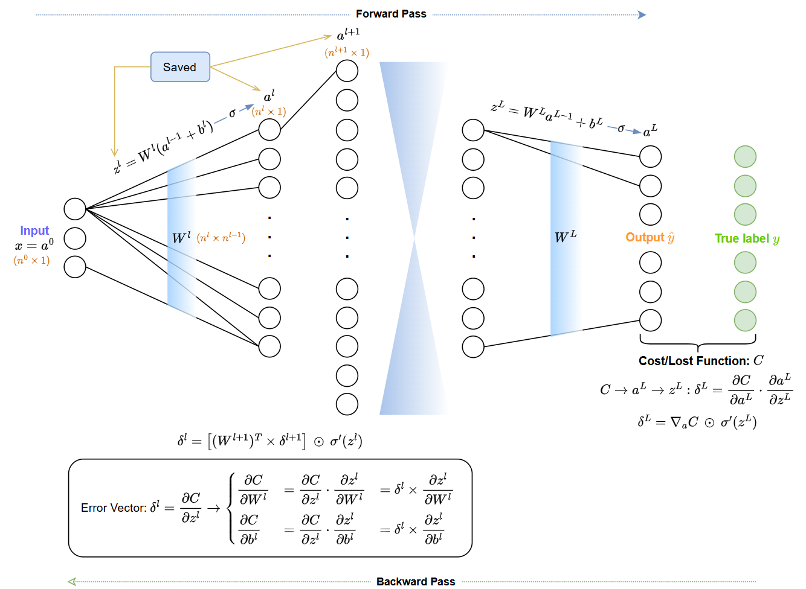
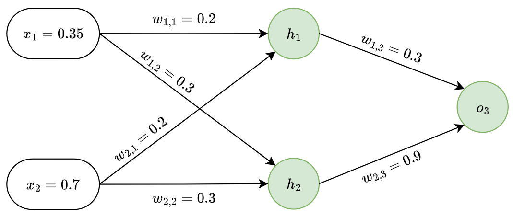

# I. Introduction
## 1. Backpropagation
- Backpropagation, hay Lan truyền ngược (Backward Propagation of Errors - Lan truyền ngược của lỗi), là một thuật toán nền tảng và quan trọng bậc nhất trong lĩnh vực học máy và đặc biệt là học sâu (Deep Learning).
	- Là phương pháp tính toán đạo hàm ngược (Reverse of Differentiation) được áp dụng trong Mạng Neuron.
	- Nó giúp tính toán các đạo hàm cần thiết và từ đó tối ưu hóa các tham số của mô hình.
- Ý tưởng được đề xuất năm 1974 nhưng đến tận 1986 mới trở nên phổ biến và trở thành một phương pháp quan trọng trong việc huấn luyện các mạng Neural nhân tạo.

## 2. Mục tiêu cốt lõi
- Là *tính toán gradient (đạo hàm riêng)* - hàm mất mát (Loss Function) theo từng trọng số (weight) và độ lệch (bias).
	- Gradient chỉ ra "hướng" và "mức độ" điều chỉnh các tham số của mạng để giảm thiểu lỗi - "học" từ dữ liệu.
	- Áp dụng **quy tắc chuỗi (Chain Rule)** trong giải tích một cách lặp đi lặp lại, lan truyền tín hiệu lỗi từ output ngược trở lại input.

## 3. Bối cảnh
Để dễ hiểu Backpropagation, cần nắm các khái niệm căn bản sau:
### 3.1 Kiến trúc mạng Neuron
- Bao gồm nhiều lớp: đầu vào (input), các lớp ẩn (hidden) - thực hiện các phép biến đổi phi tuyến tính và đầu ra (output).
- Mỗi lớp chứa nhiều Neuron hoặc Node.
- **Topology (Cấu trúc liên kết)**: Cách các nơ-ron và lớp được kết nối.
	- Mạng feedforward (như MLP - Multi-Layer Perceptron) là cấu trúc cơ bản nhất, nơi thông tin chỉ chảy theo một hướng.
	- Các cấu trúc khác như Mạng Tích chập (CNN) và Mạng Hồi quy (RNN) có các kiểu kết nối đặc biệt phù hợp cho các loại dữ liệu khác nhau (ảnh, chuỗi).
	- Backpropagation có thể được điều chỉnh cho các cấu trúc này.
- **Liên kết với Backpropagation**: ANN cung cấp cấu trúc tính toán và tập hợp các tham số ($W^l$, $b^l$) mà Backpropagation cần tính đạo hàm cho chúng.

### 3.2 Quá trình Feed Forward Pass
- Là quá trình tính toán một chiều để tạo ra dự đoán của mạng cho một đầu vào cụ thể, dựa trên bộ tham số hiện tại.
- Dữ liệu được đưa qua mạng theo một chiều (input $\to$ ouput), quá trình tính toán bao gồm 2 bước:
	1. **Tính tổng trọng số** (Weighted sum / Pre-activation): ở lớp $l$, ta có:
		- $z^l = W^la^{l-1} + b^l$, trong đó:
			- $a^{l-1}$: vector kích hoạt đầu ra từ lớp trước (size: $n^{l-1} \times 1$);
			- $W^l$  : ma trận trọng số kết nối lớp $l-1$ với lớp $l$ (size: $n^l \times n^{l-1}$);;
			- $b^l$     : vector bias của lớp $l$ (size: $n^{l-1} \times 1$);
			- $z^l$     : vector tổng trọng số của lớp $l$. Mỗi phần tử $z^l_j$ là tổng đầu vào có trọng số cộng bias cho nơ-ron $j$ của lớp $l$.
	2. **Áp dụng hàm kích hoạt**:
		- $a_l = \sigma({z_l})$, trong đó:
			- $\sigma$  : là hàm kích hoạt, được áp dụng element-wise lên vector $z_l$;
			- $a_l$ : bector kích hoạt đầu ra của lớp $l$ (size: $n^l \times 1$), trở thành đầu vào cho lớp $l+1$.
		- Chi tiết: [Activation Functions](../Activation%20Functions/README.md)

### 3.3 Hàm mất mát (Loss function)
- Đo lường sự khác biệt (sai số) giữa đầu ra dự đoán $\hat{y}$ và đầu ra thực tế mong muốn $y$ cho một mẫu dữ liệu.
- Mục tiêu là tối thiểu hóa hàm mất mát (hàm chi phí $C$ ) này và hàm mất mát phải khả vi đối với các tham số mạng.
- **Chi phí trên toàn bộ tập dữ liệu/Mini-batch (Cost C or J)**:
	- Thường là giá trị trung bình của mất mát trên tất cả các mẫu;
	- Việc lấy trung bình giúp giá trị chi phí không phụ thuộc vào kích thước tập dữ liệu;
	- $C = \dfrac{1}{m} \sum_{i=1}^{m}{\mathcal{L}\left(a^L(x^i), y^i\right)}$.

- Lựa chọn hàm mất mát:
	- **Hồi quy** - SSE/MSE:
		- $\mathcal{L} = \dfrac{1}{2} \lVert a^L - y \rVert^2 = \dfrac{1}{2}\sum_{j}{(a^L_j - y_j)^2}$;
		- Hệ số 1/2 để được đạo hàm đẹp.
	- **Binary Classification** - Binary Cross Entropy:
		- $\mathcal{L} = -\left[y\log(a^L) + (1-y)\log(1-a^L)\right]$.
		- Với $a^L$ là output của Sigmoid
    - **Multi-class Classification** - Categorical Cross Entropy:
	    - $\mathcal{L} = -\sum_{j=1}^{K}{y_j\log(a^L_j)}$.
	    - Với $y$ là vector one-hot và $a^L$ là output của Softmax.

- Mục đích: cung cấp một điểm số duy nhất để tối ưu hóa, mục tiêu việc huấn luyện là tìm bộ tham số ($W, b$) sao cho hàm mất mát này tối thiểu.

### 3.4 Gradient Descent
[Gradient Descent](https://github.com/baohuyvanba/Machine-Learning/tree/main/4.%20Gradient%20Descent)
- Là một thuật toán tối ưu hóa lặp, hoạt động như việc đi xuống dốc trên "bề mặt" của hàm chi phí (cost landscape) - thực hiện theo hướng ngược lại với gradient tại điểm hiện tại.
- **Gradient ($\nabla C$)**:
	- Là vector chứa toàn bộ các đạo hàm riêng của hàm Mất mát với từng tham số: ($W^l_{jk}, b^l_j$);
		- $\nabla C = \left[\dfrac{\partial C}{\partial W^1}, \dfrac{\partial C}{\partial b^1}, \dots , \dfrac{\partial C}{\partial W^L}, \dfrac{\partial C}{\partial b^L}\right]$.
	- Vector chỉ hướng tăng của hàm.
- **Cập nhập tham số**: tại mỗi bước lặp:
	- $\theta_\text{new} = \theta_\text{old} - \eta\nabla_\theta(C)$, trong đó:
		- $\theta$: bộ tham số, bao gồm $W$ và $b$;
		- $\eta$: tốc độ học;
		- $\nabla_\theta(C)$: gradient của hàm chi phí tại $\theta_\text{old}$ (*Đây là đầu ra của của thuật toán Backpropagation*).

- Các biến thể Gradient Descent:
	- **Batch Gradient Descent**:
		- Tính gradient trên *toàn bộ tập huấn luyện* trước khi cập nhật;
		- Chính xác nhưng rất chậm với dữ liệu lớn.
	- **Stochastic Gradient Descent (SGD)**:
		- Tính gradient trên *một mẫu duy nhất* được chọn ngẫu nhiên và cập nhật;
		- Rất nhanh cho mỗi cập nhật nhưng bị "noise", hội tụ không ổn định.
	- **Mini-batch Gradient Descent**:
		- Thỏa hiệp giữa hai biến thể trên: tính gradient trung bình trên *một lô nhỏ (mini-batch)* dữ liệu;
		- Phổ biến nhất trong thực tế vì cân bằng giữa tốc độ và độ ổn định.

- Mục đích: tìm bộ tham số $\theta$ ($W, b$) sao cho $C(\theta)$ đạt giá trị cực tiểu (địa phương).
- Backpropagation là công cụ để tính toán $\nabla_\theta(C)$, Gradient Descent sử dụng tham số này cho quá trình "học" của mạng.
### 3.5 Đạo hàm và Quy tắc chuỗi (Chain Rule)
- **Quy tắc Chuỗi tổng quát**:
	- Là *nền tảng toán học* cho phép Backpropagation hoạt động.
	- Mô tả cách tính đạo hàm của một hàm hợp.
	- Nếu $C$ là hàm cuối cùng (hàm chi phí/mất mát), và sự phụ thuộc có dạng: $$C \to a^L \to z^L \to a^{L-1} \to z^{L-1} \to \dots \to W^l, b^l$$thì khi đó, đạo hàm của $C$ đối với tham số $W^l$ ở lớp sâu có thể được tính bằng cách nhân các đạo hàm dọc theo chuỗi này:
    $$\dfrac{\partial C}{\partial W^l} = \dfrac{\partial C}{\partial a^L} \cdot \dfrac{\partial a^L}{\partial z^L} \cdot \dfrac{\partial z^L}{\partial a^{L-1}} \cdot \dfrac{\partial a^{L-1}}{\partial z^{L-1}} \cdots \dfrac{\partial a^l}{\partial z^l} \cdot \dfrac{\partial z^l}{\partial W^l}$$
- **Vai trò của Jacobian**: mặc dù không tính toán tường minh, cần hiểu rằng mỗi "mắt xích" đạo hàm trong chuỗi trên (ví dụ: $\dfrac{\partial z^L}{\partial a^{L-1}}$) thực chất là một ma trận Jacobian.
	- $\dfrac{\partial z^l}{\partial a^{l-1}}$: ma trận Jacobian của hàm $z^l = W^l a^{l-1} + b^{l}$ đối với $a^{l-1}$.
		- Ma trận này tính ra được là: $(W^l)^T$.
	- $\dfrac{\partial a^l}{\partial z^l}$: ma trận Jacobian của hàm đã kích hoạt $a^l = \sigma(z^l)$ (áp dụng element-wise) đối với $z^l$.
		- Ma trận đường chéo với các phần tử trên đường chéo là $\sigma'(z^l_j)$.
	- $\dfrac{\partial z^l}{\partial W^l}$: đạo hàm của $z^l$ trên ma trận $W^l$.
		- Là một tensor phức tạp hơn.
		- Kết quả cuối cùng của việc nhân nó với các đạo hàm khác: $\delta^l(a^{l-1})^T$.
- **Phép nhân trong Backpropagation là quy Tắc Chuỗi Vector hóa**:
	- Tính $\delta^L = \nabla_a(C) \odot \sigma'(z^L)$. Kết hợp:
		- Đạo hàm của hàm chi phí (cost) với $a^L$;
		- Đạo hàm của $a^L$ với $z^L$.
	- Tính $\delta^l = \left[(W^{l+1})^T \times \delta^{l+1} \right] \odot \sigma'(z^l)$
		- $(W^{l+1})^T \times \delta^{l+1}$: đây chính là $\dfrac{\partial z^{l+1}}{\partial a^l}^T \cdot \dfrac{\partial C}{\partial z^{l+1}}$
			- Tính toán ảnh hưởng của lỗi lớp sau $\delta^{l+1}$ lên lớp $l$ thông qua trọng số $W^{l+1}$ - đây là một tích Jacobian-vector.
	    - $\sigma'(z^l)$: đạo hàm của hàm kích hoạt tại lớp $l$ - cụ thể là $\dfrac{\partial a^l}{\partial z^l}$.
	- Tính $\dfrac{\partial C}{\partial W^l} = \delta^l \times (a^{l-1})^T$:
		- Kết hợp lỗi $\delta^l = \dfrac{\partial C}{\partial z^l}$ với $\dfrac{\partial z^l}{\partial W^l} = (a^{l-1})^T$.

- **Mục đích**: cung cấp công cụ toán học để "unpack" *sự phụ thuộc phức tạp* của hàm chi phí vào từng tham số và tính toán gradient một cách hiệu quả theo từng lớp.
- Đây là cơ chế hoạt động cốt lõi của Backpropagation, cho phép lan truyền thông tin lỗi ngược.

# II. Thuật toán Backpropagation
- Backpropagation là một thuật toán được thiết kế để tính toán gradient của hàm chi phí $C$ đối với tất cả các tham số $(W^l, b^l)$.
- Bằng cách áp dụng lặp đi lặp lại **Quy tắc chuỗi (Chain Rule)** theo hướng ngược lại so với quá trình lan truyền xuôi.
## 1. Ý tưởng thuật toán: Lan truyền lỗi ngược ($\delta$)
- Việc tính toán đạo hàm trực tiếp như $\dfrac{\partial C}{\partial W^l}$ (đạo hàm hàm chi phí với trọng số $W$ ở lớp $l$) hoặc $\dfrac{\partial C}{\partial b^l}$ rất phức tạp.
- Backpropagation: *sử dụng khái niệm trung gian* quan trọng - **vector lỗi $\delta_l$** tại mỗi lớp $l$.
- **Định nghĩa** $\delta^l$:
	- Đạo hàm của hàm chi phí cuối cùng $C$ với tổng trọng số (pre-activation) $z^l$.
	- $\delta^l = \dfrac{\partial C}{\partial z^l}$.
- **Tại sao lại lựa chọn trung gian $z^l$**: lựa chọn chiến lược
	- Như đề cập ở trên, $z^l$ được tính dựa trên tham số ($W^l, b^l$) của lớp $l$ và giá trị kích hoạt $a^{l-1}$ lớp trước đó, cụ thể: 
	$$z^l = W^la^{l-1}+b^l$$

	- Khi biết được giá trị $\delta_l = \dfrac{\partial C}{\partial z^l}$ (tức biết được chi phí $C$ nhạy cảm thế nào với $z^l$), và dựa trên quy tắc chuỗi, ta có:
		- $\begin{cases} \dfrac{\partial C}{\partial W^l} &= \dfrac{\partial C}{\partial z^l}\cdot\dfrac{\partial z^l}{\partial W^l} &= \delta^l \times \dfrac{\partial z^l}{\partial W^l} \\[6pt] \dfrac{\partial C}{\partial b^l} &= \dfrac{\partial C}{\partial z^l}\cdot\dfrac{\partial z^l}{\partial b^l} &= \delta^l \times \dfrac{\partial z^l}{\partial b^l} \end{cases}$
		
- **Backpropagation** cung cấp một phương pháp hiệu quả để tính toán $\delta^l$ của các lớp $l$ bằng việc lan truyền ngược từ $\delta^L$ và từ đó tính được các gradient cần thiết như hai công thức chuỗi ở trên.

## 2. Pha lan truyền xuôi (Forward pass)
- Đây tất nhiên là bước quan trọng trước khi thực hiện Backpropagation.
	1. **Đầu vào**: mẫu huấn luyện $x$ (hoặc một mini-batch $X$), xác định $a^0 = x$.
	2. **Lan truyền từng lớp**: qua mỗi lớp $l$ từ lớp $1 \to L$ (lớp output)
		- Tổng trọng số  : $z^l = W^l a^{l-1} + b^l$;
		- Tính kích hoạt : $a^l = \sigma(z^l)$.
	3. **Lưu trữ**:
		- Điều cực kỳ quan trọng;
		- Lưu trữ tất cả các giá trị $z^l, a^l$ tính được ở mỗi lớp, đây là đầu vào cần thiết cho các phép tính trong pha lan truyền ngược.
		- Đặc biệt, $a^L$ là dự đoán cuối cùng dùng để tính chi phí, và $z^l$ cần để tính $\sigma'(z^l)$.

## 3. Pha lan truyền ngược (Backward pass)
- Ngược lại với lan truyền tiến, từ lớp $L \to 1$.
### 3.1 Tính toán lỗi tại Output: $\delta^L$
- **Mục tiêu**: tính $\delta^L = \dfrac{\partial C}{\partial z^L}$
	- Đây là điểm khởi đầu;
	- $C$ được tính trực tiếp từ $a^L$, mà $a^L$ phụ thuộc vào $z^L$.
- **Quy tắc chuỗi**: $C \to a^L \to z^L$
	- $\delta^L = \dfrac{\partial C}{\partial a^L}\cdot\dfrac{\partial a^L}{\partial z^L}$
- Phân tích thành phần:
	- $\dfrac{\partial C}{\partial a^L}$: đạo hàm Hàm mất mát $C$ với vector kích hoạt lớp output $a^L$, giá trị phụ thuộc vào các hàm mất mát khác nhau:
		- **MSE** - $C_0 = \dfrac{1}{2} \lVert a^L - y \rVert^2$ khi đó thì giá trị đạo hàm $\dfrac{\partial C}{\partial a^L} = a^L - y$ (vector).
		- **Cross Entropy** (với Softmax):
			- Đạo hàm kết hợp của Softmax và Cross-Entropy: $\dfrac{\partial C}{\partial z^L} = a^L - y$;
			- Trong trường hợp này, $\delta^L$ được tính trực tiếp là $a^L - y$ mà không cần tính riêng $\dfrac{\partial C}{\partial a^L}$ và $\dfrac{\partial a^L}{\partial z^L}$.
		- Trong trường hợp tổng quát, ta *kí hiệu*: $\nabla_a C$.
	- $\dfrac{\partial a^L}{\partial z^L}$: đạo hàm Hàm kích hoạt $\sigma$ sử dụng tại output $L$, được tính element-wise tại $z^L$, *kí hiệu* $\sigma'(z^L)$
		- Sigmoid: $\sigma'(z^L) = \sigma(z^L)(1-\sigma(z^L)) = a^L(1-a^L)$ (element-wise).
		- ReLU     : $\sigma'(z^L)_j = 1$ nếu $z^L_j > 0$ và bằng $0$ nếu $z^L_j \le 0$.
- **Công thức tổng quát** (không áp dụng cho Cross Entropy - Softmax)
	- $\delta^L = \nabla_a C \hspace{2pt}\odot\hspace{2pt} \sigma'(z^L)$ trong đó:
		- $\nabla_a C$   : vector đạo hàm của chi phí ($C$) đối với kích hoạt lớp output ($a^L$).
		- $\sigma'(z^L)$: vector đạo hàm hàm kích hoạt $\sigma$ tại $z^L$.
		- $\odot$: phép nhân Hadamard, element-wise:
			- Xuất phát từ việc hàm kích hoạt $\sigma$ thường được áp dụng độc lập lên từng phần tử của $z^L$ để tạo ra $a^L$.
			- Do đó, $\dfrac{\partial a^L_j}{\partial z^L_k}$ chỉ khác $0$ khi $j=k$, tạo thành một ma trận Jacobian đường chéo, và việc nhân với Jacobian này tương đương với phép nhân Hadamard.

### 3.2 Lan truyền ngược qua các lớp: $\delta^l$
- **Mục tiêu**: tính giá trị $\delta^l = \dfrac{\partial C}{\partial z^l}$ tại từng lớp $l$ với giá trị $\delta^{l+1}$ đã biết của lớp $l+1$ trước đó.
- **Chuỗi phụ thuộc**: $z^l \to a^l \to z^{l+1} \to C$
	- $z^l \to a^l$ qua công thức $a^l = \sigma(a^l)$;
	- $a^l \to z^{l+1}$ qua công thức $z^{l+1} = W^{l+1}a^l + b^{l+1}$;
	- $z^{l+1} \to C$ qua giá trị $\delta^{l+1} = \dfrac{\partial C}{\partial z^{l+1}}$ đã xác định của lớp trước đó (trong lan truyền ngược).
- Áp dụng quy tắc chuỗi:
	- $\delta^l = \dfrac{\partial C}{\partial z^l} = \dfrac{\partial C}{\partial z^{l+1}} \cdot \dfrac{\partial z^{l+1}}{\partial a^l} \cdot \dfrac{\partial a^l}{\partial z^l}$
- **Phân tích thành phần**:
	- $\delta^{l+1} = \dfrac{\partial C}{\partial z^{l+1}}$ là giá trị đã có từ lớp trước;
	- $\dfrac{\partial z^{l+1}}{\partial a^l}$:
		- Đạo hàm của $z^{l+1} = W^{l+1}a^l + b^{l+1}$ với vector kích hoạt $a^l$;
		- Theo *quy tắc đạo hàm ma trận/vector*, kết quả chính là ma trận chuyển vị $(W^{l+1})^T$ với kích thước $n^l \times n^{l+1}$;
		- Nó cho biết mỗi phần tử trong $z^{l+1}$ thay đổi thế nào khi một phần tử $a^l$ thay đổi, chính là sử dụng Jacobian ngầm.
	- $\dfrac{\partial a^l}{\partial z^l}$:
		- Đạo hàm hàm kích hoạt $\sigma$ tại lớp $l$ với $z^{l}$, ghi là $\sigma'(z^l)$.
- **Công thức tổng hợp**:
	- $\delta^l = \left[ (W^{l+1})^T \times \delta^{l+1} \right] \hspace{2pt}\odot\hspace{2pt} \sigma'(z^l)$, trong đó:
		- $(W^{l+1})^T \times \delta^{l+1}$: phép nhân ma trận $\times$ vector, có thể nói là lấy lỗi $\delta^{l+1}$ "chiếu ngược - propagate" qua trọng số tại đó, xác định trách nhiệm lớp $l$ với lỗi: kết quả là được vector có cùng kích thước $z^l$ và $a^l$.
		- Phép nhân element-wise với đạo hàm hàm kích hoạt tại lớp $l$, điều chỉnh lỗi dựa trên độ nhạy hàm kích hoạt.
			- Có thể hiểu nguyên nhân của Vanishing gradient: đạo hàm $\sigma'(z^l)$ nhỏ nên lỗi qua đây cũng giảm đi (Sigmoid, Tanh).

### 3.3 Tính Gradient tham số
- Gradient tham số bao gồm: $\dfrac{\partial C}{\partial W^l}$ và $\dfrac{\partial C}{\partial b^l}$
- **Mục  tiêu**:
	- Khi đã có Vector lỗi $\delta^l = \dfrac{\partial C}{\partial z^l}$ cho lớp $l$ (khái niệm trung gian);
	- Từ đó tính đạo hàm của Hàm chi phí $C$ với các tham số lớp đó: $\left( \dfrac{\partial C}{\partial W^l}, \dfrac{\partial C}{\partial b^l} \right)$.
- **Tính Gradient cho Bias**:
	- Quy tắc chuỗi: $\dfrac{\partial C}{\partial b^l} = \dfrac{\partial C}{\partial z^l} \cdot \dfrac{\partial z^l}{\partial b^l}$, trong đó:
		- Vector lỗi $\delta^l = \dfrac{\partial C}{\partial z^l}$;
		- Với $z^l = W^la^{l-1}+b^l$ thì đạo hàm $z^l$ với $b^l$ là 1 (tức là $\dfrac{\partial z^l_j}{\partial b^l_k} = 1$ nếu $j=k$ và $0$ nếu $j \neq k$).
			- Về mặt vector, đạo hàm này tương đương với vector đơn vị hoặc phép cộng trực tiếp.
	- Khi đó, đạo hàm (gradient) cần tìm chính là giá trị của vector lỗi $\delta^l$ - khá hợp lí vì Bias được cộng trực tiếp vào $z^l$.
- **Tính Gradient cho Trọng số**:
	- Quy tắc chuỗi: $\dfrac{\partial C}{\partial W^l} = \dfrac{\partial C}{\partial z^l} \cdot \dfrac{\partial z^l}{\partial W^l}$, trong đó:
		- Vector lỗi $\delta^l = \dfrac{\partial C}{\partial z^l}$;
		- Với $z^l = W^la^{l-1}+b^l$ thì đạo hàm $z^l$ với $W^l$:
			- Xét phần tử $W^l_{jk}$ - nối neural $k$ lớp $l-1$ với neural $j$ lớp $l$, chỉ ảnh hưởng đến giá trị $z^l_j$.
			- Cụ thể, $\dfrac{\partial z^l_j}{\partial W^l_{jk}} = a^{l-1}_k$ (giá trị kích hoạt của neural $k$ ở lớp $l-1$)
			- Khi sắp xếp các đạo hàm riêng này thành ma trận Gradient $\dfrac{\partial C}{\partial W^l}$ là phép tích ngoài (*outer product*) giữa vector lỗi $\delta^l$ và vector chuyển vị của kích hoạt lớp trước $(a^{l-1})^T$.
		- **Kết quả**: $\dfrac{\partial C}{\partial W^l} = \delta^l \times (a^{l-1})^T$.
		- Về kích thước, $\delta^l$ kích thước ($n^l \times 1$) và $(a^{l-1})^T$ kích thước ($1 \times n^{l-1}$) $\to$ ma trận Gradient ($n^l\times n^{l-1}$) phù hợp với $W^l$.
		- Nhận xét: Gradient của chi phí đối với một trọng số $W^l_{jk}$  phụ thuộc 2 yếu tố:
			1. Lỗi $\delta^l_j$ tại neural đích $j$: mức độ neural đích cần thay đổi $z^l_j$ để giảm chi phí.
			2. Giá trị kích hoạt $a^{l-1}_k$ từ neural trước đó $k$:
				- Mức độ tín hiệu đã đi qua kết nối này trong pha forward pass.
				- Nếu nơ-ron nguồn không kích hoạt ($a^{l-1}_k$ gần 0), thì việc thay đổi trọng số $W^l_{jk}$ sẽ ít ảnh hưởng đến $z^l_j$ và do đó ít ảnh hưởng đến chi phí (gradient nhỏ) - nguyên lý Hebbian.

## 4. Cập nhập Trọng số và Bias
- Sau khi hoàn tất pha lan truyền ngược, ta có được các ma trận/vector Gradient, bao gồm: $\dfrac{\partial C}{\partial W^l}$ và $\dfrac{\partial C}{\partial b^l}$.
- Cuối cùng, sử dụng các kết quả này để cập nhập trọng số thông qua thuật toán Gradient Descent (hoặc các biến thể).
	- $\begin{cases} W^l_\text{new} &= W^l_\text{old} &- &\eta\dfrac{\partial C}{\partial W^l} \\[4pt] b^l_\text{new} &= b^l_\text{old} &- &\eta\dfrac{\partial C}{\partial b^l} \end{cases}$
- Quá trình từ Forward pass $\to$ Tính Cost $\to$ Backward pass $\to$ Cập nhật Tham số được lặp lại nhiều lần.
## 5. Minh họa
- Minh hoạ một phần quá trình của thuật toán Backpropagation (gồm cả Forward Pass và Backward Pass)

# III. Thực thi và Tối ưu hóa
- **Vấn đề với Ma trận Jacobian**:
	- Việc tính toán và lưu trữ ma trận Jacobian (ví dụ $\dfrac{\partial y}{\partial x}$ cho toàn bộ mạng / một lớp lớn) là cực kỳ tốn kém về bộ nhớ.
	- Ví dụ: một lớp tuyến tính với $N=64, M=D=4096$ cần Jacobian có kích thước ($NM \times ND$), tương đương hơn $68$ tỷ giá trị, chiếm $256$GB bộ nhớ chỉ cho một ma trận.
- **Tính toán Gradient Ngầm và Vector hóa**:
	- Backpropagation tránh được vấn đề trên bằng cách không tạo ra ma trận Jacobian đầy đủ một cách tường minh.
	- Thực tế, nó tính toán trực tiếp các tích cần thiết (Jacobian-vector product hoặc matrix-Jacobian product).
	- Ví dụ:
		- Việc tính $\delta^l$ từ $\delta^{l+1}$ thực chất là tính tích:
			- $(W^{l+1})^T \times \delta^{l+1}$;
			- Tương đương với việc nhân ma trận Jacobian $\dfrac{\partial z^{l+1}}{\partial a^l}^T$ với vector lỗi $\delta^{l+1}$ và không cần ma trận Jacobian.
		- Tương tự, việc tính $\dfrac{\partial C}{\partial W^l} = \delta^l \times (a^{l-1})^T$ là kết quả cuối cùng, không cần Jacobian trung gian $\dfrac{\partial z^l}{\partial W^l}$.
	- Các phép toán này thường được thực hiện hiệu quả bằng các thư viện đại số tuyến tính tối ưu (như BLAS), tận dụng **vector hóa** và tính toán song song trên GPU.
- **Ví dụ: Lớp Tuyến Tính (Linear Layer)**
	- Với lớp $y = f(x, w) = xw$, quá trình backpropagation cho thấy có thể suy ra trực tiếp công thức cập nhật gradient mà không cần Jacobian $\dfrac{\partial y}{\partial x}$ hay $\dfrac{\partial y}{\partial w}$:
	    - Gradient đầu vào (lan truyền ngược lỗi): $\dfrac{\partial L}{\partial x} = \dfrac{\partial L}{\partial y} \times W^T$;
	    - Gradient trọng số: $\dfrac{\partial L}{\partial w} = X^T \times \dfrac{\partial L}{\partial y}$
		    - Đây là những phép nhân ma trận tiêu chuẩn, hiệu quả hơn nhiều so với việc tạo Jacobian khổng lồ.
		    - $\dfrac{\partial L}{\partial y}$ là gradient nhận được từ lớp sau.

# IV. Ví dụ minh hoạ
- Cho một mạng Neural đơn giản (sử dụng hàm kích hoạt Sigmoid), với các trọng số ban đầu và đầu vào được thiết lập như hình bên dưới, và đầu ra mong muốn $y=0.5$:

## 1. Lan truyền tiến
- Ta có giá trị: $a^0 = \begin{bmatrix} 0.35 \\ 0.7\end{bmatrix}$;

- Ma trận trọng số $W^1$ liền kết lớp $0$ với lớp $1$ là: $W^l = \begin{bmatrix} 0.2 & 0.3 \\ 0.2 & 0.3 \end{bmatrix}$
- Khi đó, ta tính được **vector tổng trọng số**:

$$z^1 = W^1a^0 + b_1 = \begin{bmatrix} 0.2 & 0.3 \\ 0.2 & 0.3 \end{bmatrix} \times \begin{bmatrix} 0.35 \\ 0.7\end{bmatrix} = \begin{bmatrix} 0.2*\times 0.35 + 0.3\times 0.35 \\ 0.2\times 0.7 + 0.3\times 0.7\end{bmatrix} = \begin{bmatrix} 0.21 \\ 0.315\end{bmatrix}$$

- Áp dụng hàm kích hoạt, ta được **giá trị kích hoạt**:
  $$a^1 = \sigma(a^1) = \begin{bmatrix} \sigma(0.21) \\ \sigma(0.315)\end{bmatrix} \approx \begin{bmatrix} 0.56 \\ 0.59\end{bmatrix}$$
- Tương tự, ta tính giá trị ở lớp tiếp theo:
  $$z^2 = W^2a^1 + b_2 = \begin{bmatrix} 0.3 & 0.9 \end{bmatrix} \times \begin{bmatrix} 0.56 \\ 0.59\end{bmatrix} = \begin{bmatrix} 0.3*\times 0.56 + 0.9\times 0.59 \end{bmatrix} = \begin{bmatrix} 0.702 \end{bmatrix}$$
  và hàm kích hoạt:
  $$a^2 = \sigma(z^2) = \begin{bmatrix} 0.67 \end{bmatrix}$$
- Vậy đầu ra được xác định: $a^2 = a^L = \hat{y} = 0.67$
- **Giá trị hàm mất mát/chi phí** được xác định trong trường hợp bài toán này: 
  $$C = \mathcal{L} = \dfrac{1}{2}(y - a^L)^2$$

## 2. Lan truyền ngược
- **Mục tiêu**: tính các đạo hàm (gradients) của hàm mất mát theo trọng số và cập nhật các trọng số để giảm sai số.
- **Vector sai số** tại lớp đầu ra $$\delta^L = \nabla_a C \odot \sigma'(z^L) = (y-a^L)\sigma(z^L)(1-\sigma{(z^L)}) = -0.0376$$
- **Lan truyền sai số về các lớp ẩn**:
  $$\delta^l = \left[ (W^{l+1})^T \times \delta^{l+1} \right] \hspace{2pt}\odot\hspace{2pt} \sigma'(z^l)$$
- Khi đó, ta được các giá trị:
  $$\begin{align} \delta^1 &= \left[ (W^{2})^T \times \delta^2 \right] \odot \sigma'(z^1) \\ &= -0.0376\times\begin{bmatrix} 0.3 \\ 0.9 \end{bmatrix} \odot \begin{bmatrix} \sigma'(z^1_1) \\ \sigma'(z^1_2) \end{bmatrix} \\ &= \begin{bmatrix} -0.01128 \\ -0.03384 \end{bmatrix} \odot \begin{bmatrix} 0.2464 \\ 0.2419 \end{bmatrix} \\ &= \begin{bmatrix} -0.00278 \\ -0.00818 \end{bmatrix} \text{(element-wise)} \end{align}$$

## 3. Tính Gradient và Cập nhập trọng số
- Từ vector sai số được xác định ở bước trên, ta xác định:
### 3.1 Gradient theo trong số $W^l$
$$\dfrac{\partial C}{\partial W^l} = \delta^l \times (a^{l-1})^T$$
- Đối với $W^2$, đây cũng chính là $W^L$:
	- Các giá trị đã xác định: $a^1 = \begin{bmatrix} 0.56 \\ 0.59 \end{bmatrix}$; và $\delta^2 = \delta^L = -0.0376$;
	
	- Khi đó ta tính được: $\dfrac{\partial C}{\partial W^2} = \delta^2\times(a^{2-1})^T = -0.0376 \begin{bmatrix} 0.56 & 0.59 \end{bmatrix} = \begin{bmatrix} -0.021056 & -0.022184 \end{bmatrix}$.
- Đối với $W^1$:
	- Các giá trị đã xác định: $a^0 = \begin{bmatrix} 0.35 \\ 0.7 \end{bmatrix}$; và $\delta^1 = \begin{bmatrix} -0.00278 \\ -0.00818 \end{bmatrix}$;
	
	- Khi đó ta tính được: $\dfrac{\partial C}{\partial W^1} = \delta^1\times(a^{1-1})^T = \begin{bmatrix} -0.00278 \\ -0.00818 \end{bmatrix} \times \begin{bmatrix} 0.35 & 0.7 \end{bmatrix} = \begin{bmatrix} -0.000973 & -0.001946 \\ -0.002863 & -0.005726 \end{bmatrix}$

### 3.2 Cập nhập trọng số dựa theo Gradient
- Thuật toán Gradient Descent (do việc xác định hàm mất mát):
  $$W^l_\text{new} = W^l_\text{old} + \eta \dfrac{\partial C}{\partial W^l}$$
- Đối với $W_2$:
	- Giá trị ma trận trọng số:
      $$W^2_\text{new} = \begin{bmatrix}0.3 & 0.9\end{bmatrix} + \eta \begin{bmatrix} -0.021056 & -0.022184 \end{bmatrix} = \begin{bmatrix} 0.278944 & 0.877816 \end{bmatrix} \hspace{5pt}(\eta = 1)$$
	- Khi đó, ta xác định được hai giá trị trọng số mới: $w_{1,3} = 0.278944$ và $w_{2,3} = 0.877816$.
- Đối với $W_1$:
	- Giá trị ma trận trọng số:
	  $$W^1_\text{new} = \begin{bmatrix} 0.2 & 0.3 \\ 0.2 & 0.3 \end{bmatrix} + \eta\begin{bmatrix} -0.000973 & -0.001946 \\ -0.002863 & -0.005726 \end{bmatrix} = \begin{bmatrix} 0.199027 & 0.298054 \\ 0.197137 & 0.294274 \end{bmatrix}$$
	- Khi đó ta có các giá trị trọng số mới: $w_{1,1} = 0.199027, w_{1,2} = 0.298054, w_{2,1} = 0.197137, w_{2,2} = 0.294274$.
- ... Từ các trọng số được xác định, đầu ra lúc này là: $a^L = 0.659$.

## 4. Tổng kết
- **Lan truyền tiến**: tính toán các giá trị trung gian qua các lớp bằng công thức ma trận:
    - $z^l = W^la^{l−1} + b^l$;
    - $a^l = \sigma(z^l)$;
- **Lan truyền ngược**:
    - Tính vector sai số ở lớp đầu ra ($L$):  
        - $\delta^L = (y - a^L) \odot \sigma'(z^L)$;
    - Lan truyền sai số về lớp ẩn:
        - $\delta^l = ((W^{l+1})^T \delta^{l+1}) \odot \sigma'(z^l)$;
    - Tính gradient cho trọng số và bias:
        - $\dfrac{\partial C}{\partial W^l} = \delta^l (a^{l-1})^T$ và $\dfrac{\partial C}{\partial b^l} = \delta^l$.
    - Cập nhật trọng số và bias với tốc độ học $\eta$.

# V. Stochastic Gradient Descent và Mini-batch
- **Bối cảnh**:
	- Tính toán gradient trên toàn bộ tập dữ liệu (Batch Gradient Descent) rất tốn kém và chậm, đặc biệt với dữ liệu lớn.
- **Hoạt động**:
	- Thay vì toàn bộ dữ liệu, SGD chia dữ liệu thành các lô nhỏ ngẫu nhiên gọi là **mini-batch** (ví dụ: 32, 64, 128 mẫu).
	- Ở mỗi bước, thuật toán chỉ tính gradient trung bình trên một mini-batch và cập nhật tham số.
- **Ưu điểm**:
	- Nhanh hơn nhiều so với Batch GD cho mỗi lần cập nhật;
	- Nhiễu trong gradient (do chỉ dùng một phần dữ liệu) giúp thuật toán thoát khỏi các điểm cực tiểu địa phương nông.
- **Nhược điểm**:
	- Quá trình hội tụ có thể "noise" hơn, không đi thẳng đến cực tiểu;
	- Cần chọn kích thước mini-batch và tốc độ học phù hợp.
# VI. Thách thức và các biến thể
## 1. Thách thức
- **Vanishing Gradients**:
	- Trong các mạng rất sâu, khi lan truyền ngược, gradient có thể trở nên cực kỳ nhỏ (gần 0) qua nhiều lớp;
	- Do việc nhân liên tiếp các giá trị nhỏ (ví dụ, đạo hàm của Sigmoid/Tanh luôn $< 1$, đặc biệt $< 0.25$ cho Sigmoid);
	- Kết quả là các lớp gần đầu vào học rất chậm hoặc không học được gì cả.
- **Exploding Gradients**:
	- Ngược lại, gradient có thể trở nên rất lớn, dẫn đến cập nhật tham số quá mạnh;
	- Làm mất ổn định quá trình học, thậm chí gây ra giá trị NaN (Not a Number).
- **Overfitting (Quá Khớp)**:
	- Mạng học quá tốt trên dữ liệu huấn luyện (ghi nhớ thay vì học quy luật tổng quát);
	- Dẫn đến hiệu suất kém trên dữ liệu mới chưa thấy.
## 2. Các biến thể
- **Hàm Kích Hoạt ReLU (Rectified Linear Unit)**:
	- $\text{ReLU}(z) = \max(0, z)$;
	- Đạo hàm là $0$ hoặc $1$, giúp giảm vấn đề vanishing gradient.
- **Batch Normalization**:
	- Chuẩn hóa đầu vào của mỗi lớp (trước hàm kích hoạt) để có $\text{mean} = 0$, $\text{variance} = 1$ trong mỗi mini-batch.
	- Ổn định quá trình học, giảm sự phụ thuộc vào khởi tạo trọng số, và có tác dụng điều chuẩn (regularization).
- **Khởi tạo trọng số thông minh**:
	- Ví dụ như Xavier/Glorot, He initialization;
	- Giúp giữ cho phương sai của tín hiệu không đổi khi đi qua các lớp.
- **Gradient Clipping**:
	- Giới hạn độ lớn tối đa của gradient để tránh exploding gradient.
- **Weight Decay (L2 Regularization)**:
	- Thêm một thành phần vào hàm mất mát phạt các trọng số lớn ($\lambda\times\sum{w^2}$), giúp tránh overfitting.
- **Momentum**:
	- Thêm một phần của vector cập nhật trước đó vào lần cập nhật hiện tại, giúp GD vượt qua các vùng phẳng và giảm dao động.
	- $\begin{cases}v = \beta\times v - \eta\times\text{gradient} \\[4pt] w = w + v\end{cases}$
- **Nesterov Accelerated Gradient (NAG)**:
	- Biến thể của Momentum, tính gradient tại "vị trí dự đoán" thay vì vị trí hiện tại, thường hội tụ nhanh hơn.
- **AdaGrad, RMSprop, Adam**:
	- Các thuật toán tối ưu thích ứng (adaptive learning rate), tự động điều chỉnh tốc độ học cho từng tham số dựa trên lịch sử gradient của nó.
	- Adam thường được coi là lựa chọn mặc định hiệu quả cho nhiều bài toán.
# VII. Nhận xét
- **Hebbian Learning Analogy**:
	- Việc cập nhật trọng số $\dfrac{\partial C}{\partial W^l} = \delta^l \times (a^{l-1})^T$ có sự tương đồng với nguyên lý Hebbian: kết nối giữa hai nơ-ron được tăng cường nếu chúng cùng kích hoạt.
	- Ở đây, trọng số $W^l$ thay đổi mạnh nhất khi cả nơ-ron lớp trước $a^{l-1}$ và "nhu cầu thay đổi" $\delta^l} của nơ-ron lớp sau đều lớn.
		- Nếu mạng đang "nhìn thấy số 2" (một số nơ-ron $a^{l-1}$ kích hoạt mạnh) và "mong muốn kích hoạt nơ-ron số 2 ở lớp sau" ($\delta^l$ lớn cho nơ-ron đó), các kết nối tương ứng sẽ được tăng cường.
- **Backpropagation as Dependency Decomposition**:
	- Thuật toán thực chất là một cách áp dụng quy tắc chuỗi một cách có hệ thống;
	- Nhằm phân rã sự phụ thuộc phức tạp của hàm mất mát $C$ vào từng trọng số/bias nhỏ nhất trong mạng, thông qua các biến trung gian là $z^l$ và $a^l$.
- **Kết Luận**:
	- Backpropagation là một thuật toán thanh lịch và mạnh mẽ, cho phép tính toán hiệu quả gradient của hàm mất mát trong các mạng nơ-ron phức tạp.
	- Bằng cách kết hợp với các thuật toán tối ưu hóa như Gradient Descent, nó trở thành nền tảng cho việc huấn luyện các mô hình học sâu hiện đại.
	- Mặc dù có những thách thức như vanishing/exploding gradients, nhiều kỹ thuật đã được phát triển để khắc phục, làm cho Backpropagation và các biến thể của nó tiếp tục là công cụ không thể thiếu trong lĩnh vực trí tuệ nhân tạo. 
	- Hiểu rõ cả khía cạnh toán học (quy tắc chuỗi, đạo hàm) và trực giác (lan truyền lỗi ngược, cập nhật dựa trên đóng góp) của Backpropagation là chìa khóa để làm việc hiệu quả với mạng nơ-ron.

# Tham khảo
  - https://nguyentruonglong.net/giai-thich-chi-tiet-thuat-toan-backpropagation.html
  - https://www.3blue1brown.com/lessons/backpropagation
  - https://www.3blue1brown.com/lessons/backpropagation-calculus
  - https://nttuan8.com/bai-4-backpropagation/
  - https://cs231n.stanford.edu/handouts/linear-backprop.pdf
  - https://cs231n.stanford.edu/handouts/derivatives.pdf
  - http://neuralnetworksanddeeplearning.com/chap2.html