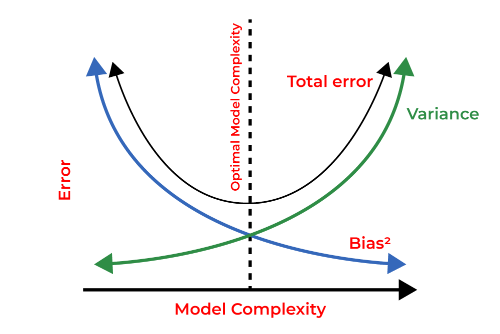

# I. Vì sao sử dụng Regularization
## 1. Định nghĩa và Mục tiêu
- Regularization:
	- Tập hợp các kĩ thuật sử dụng trong ML;
	- Nhằm mục đích chính là ngăn chặn hiện tượng Overfitting và cải thiện khả năng tổng quát hóa của mô hình.
- Ovefitting: khi mô hình học quá tốt dữ liệu huấn liệu (gồm nhiễu và ngoại lai) dẫn đến dự đoán kém hiệu quả trên thực tế.
- Regularization giúp tạo ra mô hình đơn giản, ít phức tạp hơn bằng các thiết lập việc "phạt" các tham số quá lớn.
## 2. Overfitting và Underfitting

### 2.1 Overfitting (Quá khớp):
- **Định nghĩa**:
	- Mô hình học "thuộc lòng" dữ liệu huấn luyện, bao gồm cả các chi tiết nhiễu không liên quan đến xu hướng tổng thể.
	- Trở nên quá phức tạp, có **phương sai cao (high variance)**.
- **Hậu quả**:
	- Mô hình hoạt động rất tốt trên tập huấn luyện (train error thấp);
	- Nhưng lại rất tệ trên tập dữ liệu mới (test error cao), *mất đi khả năng tổng quát hóa*.
- **Nguyên nhân**:
	- Mô hình quá phức tạp so với lượng dữ liệu (ví dụ: dùng đa thức bậc quá cao cho dữ liệu đơn giản);
	- Dữ liệu huấn luyện chứa nhiều nhiễu hoặc outliers, lượng dữ liệu huấn luyện quá nhỏ.

### 2.2 Underfitting (Chưa khớp)
- **Định nghĩa**:
	- Mô hình quá đơn giản, không đủ khả năng nắm bắt được các quy luật và cấu trúc cơ bản trong dữ liệu huấn luyện.
	- Mô hình có **độ lệch cao (high bias)**.
- **Hậu quả**:
	- Hoạt động kém trên cả tập huấn luyện và tập dữ liệu mới (cả train error và test error đều cao).
- **Nguyên nhân**:
	- Mô hình quá đơn giản (ví dụ: dùng mô hình tuyến tính cho dữ liệu phi tuyến), thiếu các đặc trưng quan trọng.

## 3. Bias-Variance Tradeoff
- Mô tả mối quan hệ nghịch đảo giữa Bias (độ lệch) và Variance (phương sai) của mô hình.
- **Bias**:
	- Sai số do các giả định hóa sai lầm trong thuật toán học;
	- High bias (Underfitting): mô hình *không nằm bắt quan hệ thực sự* giữa đặc trưng và đầu ra.
- **Variance**:
	- Sai số do sự nhạy cảm quá mức với các biến động nhỏ trong tập huấn luyện;
	- High variance (Overfitting): mô hình *học cả nhiễu* và không tổng quát hóa tốt.
- **Tradeoff**:
	- Là việc đánh đổi khi giảm Bias $\leftrightarrow$ tăng Variance và ngược lại;
	- Regularization là một *công cụ quan trọng để quản lí sự đánh đổi này*, chủ yếu bằng cách *giảm Variance* (độ phức tạp) mà *tăng nhẹ Bias* (độ chệch).
	- Đồ thị "Total error" cho thấy lỗi tổng thể là sự kết hợp của Bias^2 và Variance, và tồn tại một độ phức tạp mô hình tối ưu (Optimal Model Complexity) nơi lỗi tổng thể là nhỏ nhất.
	- Mục tiêu: tìm điểm cân bằng tối ưu (*Optimal Model Complexity*) để tổng lỗi:
      $$\text{Total Error} = \text{Bias}^2 + \text{Variance} + \text{Irreducible Error}$$
      là nhỏ nhất.
      

# II. Nguyên tắc hoạt động
## 1. Chỉnh sửa hàm mất mát
- Cốt lõi là *thay đổi cách mô hình được huấn luyện* bằng cách thay đổi hàm mất mát gốc (Original Loss).
- Bằng việc thêm vào đó một thành phần phạt (Penalty term).

## 2. Các thành phần chính
- Hàm mất mát được điều chỉnh (Regularized loss function) có dạng tổng quát như sau:
  $$\begin{matrix}\text{Regularized Loss = } = \text{Original Loss} + \lambda \cdot \text{Regularization Term} \\[6pt] J_{\text{reg}} = J(w) + \lambda R(w) \end{matrix}$$
  trong đó:
	- $J(w)$ : hàm mất mát gốc với bộ trọng số $w$;
	- $R(w)$ : regularization term, đo lường độ phức tạp của mô hình,/dựa trên độ lớn của các tham số $w$;
	- $\lambda \ge 0$ : siêu tham số điều chỉnh mức độ của Regularization term,
		- $\lambda = 0$ : hàm dạng gốc;
		- $\lambda$ lớn, mô hình bị ép phải đơn giản hơn - hi sinh một phần độ chính xác.

- Mục tiêu bây giờ bao gồm 2 công việc:
	- Tối thiểu hóa sai số trên tập huấn luyện ($J(w)$);
	- Phải giữ cho các tham số mô hình ($w$) nhỏ - tối thiểu hóa $R(w)$, tạo ra mô hình đơn giản và tổng quát hóa tốt hơn.

# III. Các kĩ thuật Regularization phổ biến
## 1. L1 Regularization (Lasso Regression)
- **Công thức** LASSO (Least Absolute Shrinkage and Selection Operator) Regression, tổng tuyệt đối các trọng số:
  $$R(w) =\lVert w \rVert_1=\sum{|w_i|}$$
  trong đó: $\lVert w\rVert_1$ là L1 norm của vector trọng số $w$.
- Hàm mất mát:
  $$J_\text{Lasso} = J + λ \sum{|w_i|}$$

- **Phương pháp**: phạt trên tổng giá trị tuyệt đối các trọng số.
- **Đặc điểm**:
	- Tạo ra *sự thưa thớt* (Sparsity): ép trọng số của các đặc trưng ít quan trọng về chính xác bằng $0$ - mô hình sparse;
	- Lựa chọn đặc trưng (Feature selection):
		- Do đặc tính làm trọng số về $0$, nên nó hoạt động như một cơ chế tự động lựa chọn các đặc trưng quan trọng nhất của mô hình.
		- Hữu ích cho bài toán khi thực sự chỉ có số ít đặc trưng thực sự ảnh hưởng đến kết quả.
- **Đánh giá**:
	- Ưu điểm:
		- Lựa chọn đặc trưng tự động, hữu ích dữ liệu nhiều chiều và có nhiều đặc trưng không liên quan;
		- Mô hình đơn giản, dễ diễn giải;
		- Giảm phương sai, chống overfitting.
	- Nhược điểm:
		- Với các đặc trưng liên quan cao, chọn ngẫu nhiên dẫn đến thiên vị lựa chọn (selection bias), không ổn định.
		- Xử lí đa cộng tuyến không tốt so với L2;
		- Hàm L1 norm không khả vi tại $0$, cần kĩ thuật tối ưu phức tạp hơn;
		- Nhạy cảm với tỉ lệ (scale) đặc trưng, bị ảnh hưởng bởi outliers.
## 2. L2 Regularization (Ridge Regression / Weight Decay)
- **Công thức** tổng bình phương các trọng số:
  $$R(w) = \lVert w \rVert_2^2 = \sum w_i^2$$
  trong đó $\lVert w\rVert_2^2$ là L2 norm.
- **Phương pháp**: phạt các trọng số dựa trên tổng các bình phương, co lại gần $0$, phạt các trọng số lớn nặng hơn so với L1.
- **Đặc điểm**:
	- Giữ *trọng số nhỏ và cân bằng*: không ép trọng số về $0$ nhưng giữ cho chúng nhỏ và phân tán đều hơn, ngăn không cho trọng số trở nên quá lớn;
	- Ridge giữ lại tất cả các đặc trưng trong mô hình nhưng giảm tầm ảnh hưởng của chúng.
	- Không tạo Sparsity (như L1), giữ lại các đặc trưng với trọng số nhỏ;
	- **Weight Decay**: trong mạng neuron, có thể gọi L2 là Weight Decay. Nó làm giảm giá trị trọng số mỗi bước lặp của GD:
      $$w = w - \eta(\nabla J + \lambda w)$$
	- Hàm $R(w)$ mượt và khả vi, dễ dàng tối ưu hóa.
- **Ví dụ**:
	- Trong dự đoán giá nhà, L2 đảm bảo rằng tất cả các đặc trưng (diện tích, số phòng, tuổi nhà, vị trí) đều đóng góp cân bằng vào dự đoán, tránh việc một đặc trưng (ví dụ: hồ bơi trong một trường hợp ngoại lệ) chiếm ưu thế quá mức.
	- Ở mô hình MLP, khi $\lambda$ tăng, đường biên phân lớp trở nên mượt mà và ít phức tạp hơn, giảm overfitting.
- **Đánh giá**:
	- Ưu điểm:
		- Hiệu quả với đa cộng tuyến (multicollinearity), giúp ổn định hóa các ước lượng này;
		- Hàm mất mát lồi và có đạo hàm mượt, dễ tối ưu;
		- Giảm phương sai, cải thiện tổng quát hóa.
	- Nhược điểm:
		- Không thực hiện lựa chọn đặc trưng;
		- Đưa vào độ chệch (bias) cho các ước lượng trọng số.
- **Ứng dụng**: Dự báo kinh tế, chẩn đoán y tế, dự đoán doanh số, mô hình khí hậu, quản lý rủi ro.

## 3. Elastic Net Regularization
- **Công thức** là sự kết hợp của L1 và L2 với tham số $\alpha$:
  $$R(w) = \alpha\sum{|w_i|} + (1-\alpha)\sum{w_i^2}$$
  hoặc có thể được ghi lại thành:
  $$R(w) = \alpha\left[ \text{l1\_ratio} \times \sum{|w_i|} + \dfrac{1 - \text{l1\_ratio}}{2}\sum{w_i^2} \right]$$
  hệ số $1/2$ được thêm vào để tiện tính toán đạo hàm; hoặc có thể sử dụng hai siêu tham số riêng biệt $\lambda_1$ và $\lambda_2$. 
- Hàm mất mát:
  $$J_{\text{Elastic}} = J + R(w)$$
  trong đó, tham số $\alpha$ để cân bằng giữa L1 và L2:
	- $\alpha = 0$: Ridge (L2);
	- $\alpha = 1$: Lasso (L1);
	- $0 < \alpha < 1$: kết hợp.
- **Cơ chế**:
	- Vừa co rút trọng số (shrinkage), vừa có thể ép một số trọng số về 0 (feature selection);
	- Xử lý nhóm đặc trưng tương quan tốt hơn Lasso.
- **Đặc điểm**: thừa hưởng ưu điểm của cả hai:
	- Có thể thực hiện lựa chọn đặc trưng (như L1);
	- Đồng thời xử lý tốt các đặc trưng tương quan cao (như L2).
- **Đánh giá**:
	- Ưu điểm:
		- Hoạt động tốt khi có nhiều đặc trưng và các đặc trưng có tương quan cao với nhau;
		- Kết hợp được lựa chọn đặc trưng và xử lý đa cộng tuyến;
		- Ổn định hơn Lasso khi số lượng đặc trưng lớn hơn số lượng mẫu ($p > n$).
	- Nhược điểm:
		- Có tới hai tham số cần phải điều chỉnh làm cho quá trình tối ưu hóa trở nên phức tạp.
## 4. Tikhonov Regularization
- Đây là một dạng tổng quát hơn mà Ridge Regression là một trường hợp đặc biệt.
- Nó sử dụng $\lVert \lceil{w}\lVert^2$ làm thành phần phạt, trong đó $\lceil$ là ma trận Tikhonov.
- Khi $\lceil$ là ma trận đơn vị nhân với một hệ số: $\lceil = \sqrt{\lambda \times \text{I}}$, nó trở thành Ridge Regression.

## 5. So sánh các kĩ thuật

| Đặc điểm               | Lasso Regression (L1)                  | Ridge Regression (L2)                     | Elastic Net Regression (L1+L2)                               |
| ---------------------- | -------------------------------------- | ----------------------------------------- | ------------------------------------------------------------ |
| **Loại hình phạt**     | L1: $\sum{\|w_i\|}$                    | L2: $\sum{w_i^2}$                         | Kết hợp L1 và L2                                             |
| **Ảnh hưởng lên W**    | Co về 0, có thể bằng 0.                | Co về gần 0, hiếm khi bằng 0.             | Co về 0, có thể bằng 0.                                      |
| **Lựa chọn Đặc trưng** | Có (tạo mô hình thưa)                  | Không                                     | Có                                                           |
| **Đa cộng tuyến**      | Chọn 1 bỏ còn lại                      | Xử lý tốt (ổn định hóa)                   | Xử lý tốt (hiệu ứng nhóm)                                    |
| **Siêu tham số**       | $\lambda$                              | $\lambda$                                 | $\alpha$ và $\text{l1\_ratio}$ (hoặc $\lambda_1, \lambda_2$) |
| **Bias-Variance**      | Tăng bias, giảm variance               | Tăng bias (ít hơn L1), giảm variance      | Cân bằng bias-variance.                                      |
| **Mạnh nhất khi**      | Nhiều ĐT không liên quan, cần chọn lọc | Tất cả ĐT có thể liên quan, đa cộng tuyến | Nhiều ĐT tương quan, cần cả hai                              |
| **Ưu điểm**            | Chọn lọc ĐT, mô hình dễ diễn giải      | Ổn định, xử lý đa cộng tuyến              | Linh hoạt, hiệu ứng nhóm, ổn định                            |
| **Nhược điểm**         | Không ổn định với ĐT tương quan        | Không chọn lọc ĐT                         | Phức tạp hơn (2 siêu tham số)                                |
| **Ví dụ**              | Loại bỏ màu nhà khỏi dự đoán giá       | Giảm ảnh hưởng các ĐT nhưng giữ lại hết   | Giữ/loại bỏ cả nhóm ĐT tương quan                            |

# IV. Các kỹ thuật liên quan và Phương pháp đánh giá
## 1. Validation và Cross-Validation (Xác thực và Xác thực chéo)
- **Vai trò**:
	- Cực kỳ quan trọng để đánh giá hiệu suất thực sự của mô hình;
	- Giúp lựa chọn các siêu tham số (như $\lambda$ trong Regularization, bậc đa thức,...);
	- Thực hiện một cách khách quan mà *không dùng đến tập test*.
- **Validation Set**:
	- Một phần nhỏ từ tập huấn luyện ban đầu để tạo thành tập xác thực (validation set).
	- Mô hình được huấn luyện trên phần còn lại.
- **k-fold Cross-Validation**:
	- Chia tập huấn luyện thành $k$ phần (folds) bằng nhau.
	- Lặp lại $k $lần, mỗi lần giữ lại một phần làm validation set và huấn luyện trên $k-1$ phần còn lại.
	- Kết quả cuối cùng là trung bình của $k$ lần chạy.
	- Đảm bảo rằng mọi điểm dữ liệu đều được dùng để huấn luyện và xác thực.
- **Leave-One-Out**:
	- Trường hợp đặc biệt của k-fold khi $k$ bằng số lượng mẫu dữ liệu.
- **Ứng dụng**:
	- Dùng để chọn giá trị $\lambda$ tối ưu, chọn giá trị cho validation error thấp nhất.

## 2. Early Stopping (Dừng sớm)
- **Nguyên tắc**:
	- Theo dõi cả Train error và Validation error sau mỗi epoch;
	- Khi Validation error bắt đầu tăng lên - dấu hiệu của overfitting bắt đầu: dừng quá trình huấn luyện lại;
	- Mô hình cuối cùng được chọn là mô hình tại thời điểm validation error thấp nhất.
- Một hình thức Regularization vì nó ngăn mô hình tiếp tục học và trở nên quá phức tạp, giữ cho trọng số không quá lớn.

# V. Đánh giá
## 1. Lựa chọn các kĩ thuật Regularization
- **L1 (Lasso)**:
    - Nghi ngờ rằng chỉ một phần nhỏ trong số các đặc trưng là thực sự quan trọng.
    - Thực hiện lựa chọn đặc trưng tự động để làm mô hình đơn giản và dễ diễn giải hơn.
- **L2 (Ridge)**:
    - Tin rằng hầu hết các đặc trưng đều có đóng góp vào kết quả, dù ít hay nhiều.
    - Muốn một mô hình ổn định hơn, đặc biệt khi có hiện tượng đa cộng tuyến.
    - Không cần loại bỏ đặc trưng hoàn toàn.
- **Elastic Net**:
    - Muốn sự kết hợp của cả hai:
	    - Lựa chọn đặc trưng;
	    - Xử lý tốt các nhóm đặc trưng tương quan.
    - Không chắc chắn nên chọn L1 hay L2.

## 2. Kết luận
- Regularization - thêm một thành phần phạt vào hàm mất mát dựa trên độ lớn của các tham số mô hình.
- Các kỹ thuật như L1 (Lasso), L2 (Ridge/Weight Decay), và Elastic Net.
- Giúp kiểm soát độ phức tạp của mô hình, ngăn chặn hiệu quả hiện tượng overfitting.
- Cải thiện khả năng tổng quát hóa của mô hình, tăng tính ổn định, khả năng diễn giải và tự động lựa chọn đặc trưng.