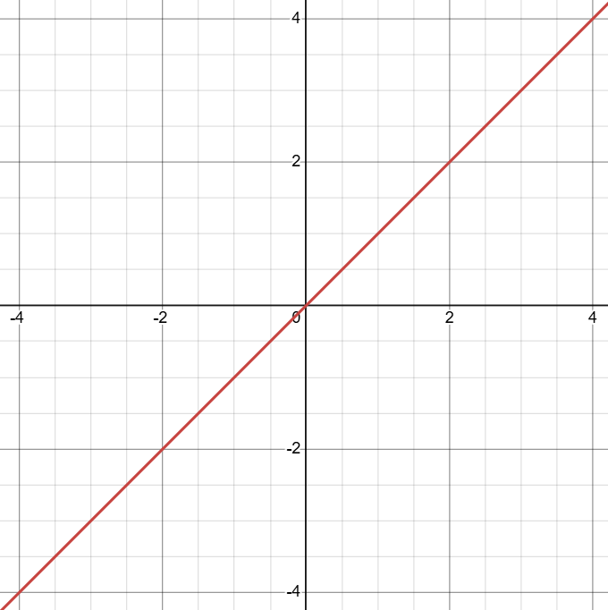
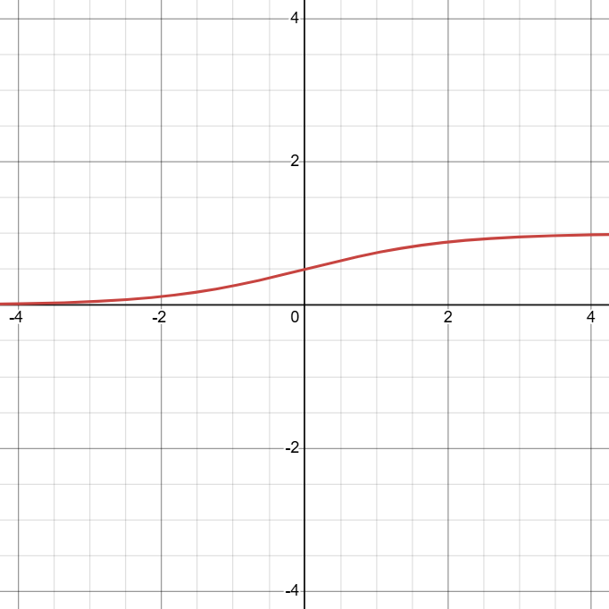
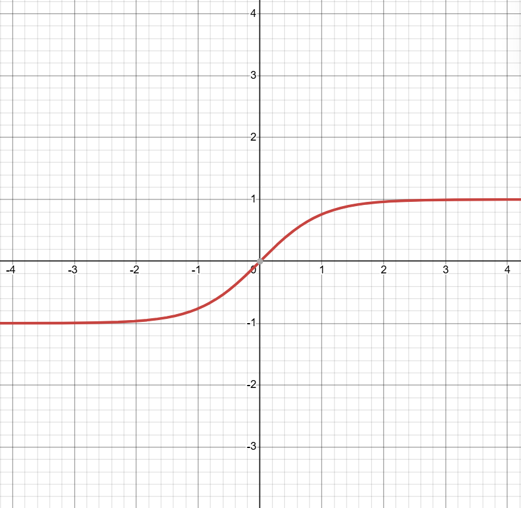
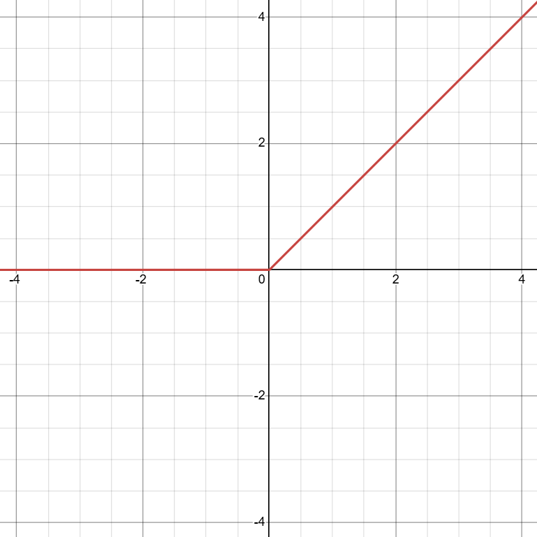
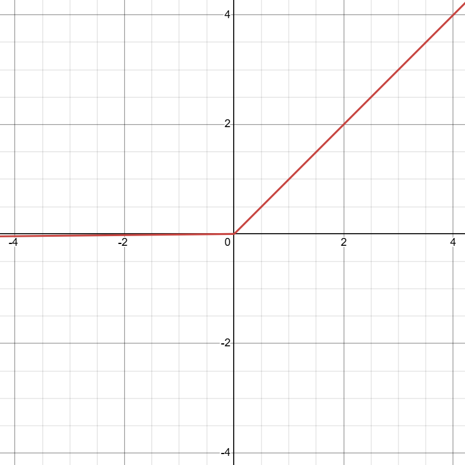
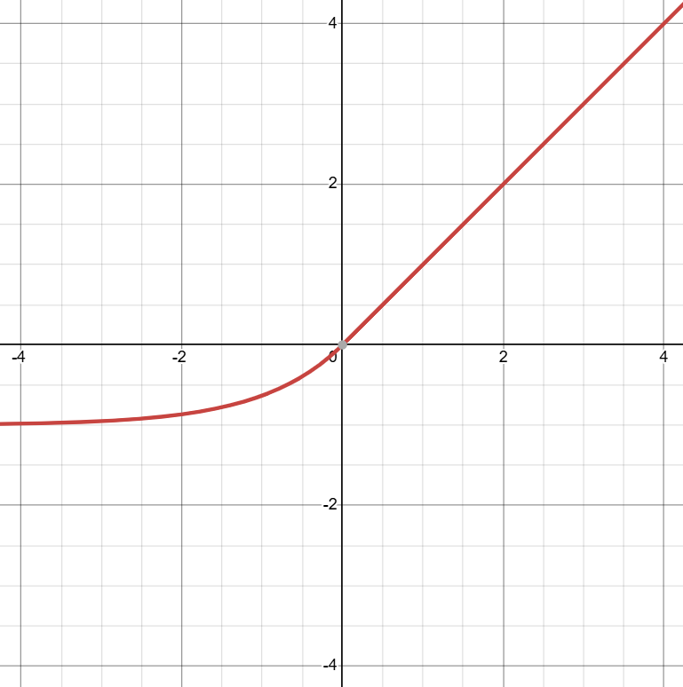
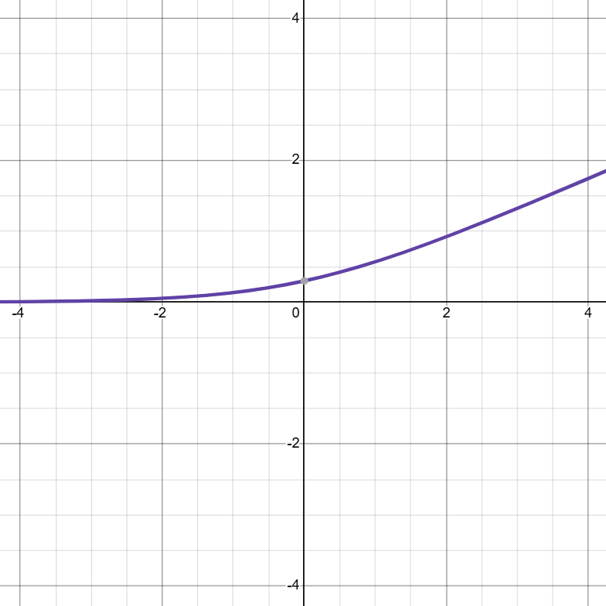

# I. Introduction
- Dựa trên kiến trúc sinh học và hoạt động của não bộ con người, mạng Neuron nhân tạo (ANN) đã được xây dựng và phát triển để mô phỏng lại khả năng đó.
- Các mạng bao gồm các lớp (Layers) chứa các đơn vị tính toán gọi là Neuron: nhận tín hiệu đầu vào, xử lí và đưa đầu ra.

- **Hàm kích hoạt (Activation Function)**:
	- Là một *thành phần toán học* quan trọng được *áp dụng cho đầu ra* của mỗi nơ-ron (hoặc một tập hợp nơ-ron).
	- Quyết định xem nơ-ron đó có nên được "kích hoạt" hay không - *có nên truyền tín hiệu đi tiếp hay không*.
	- Về cơ bản, hàm kích hoạt:
		- Nhận tổng trọng số của các đầu vào cộng với một giá trị độ lệch (bias);
		- Biến đổi giá trị đó thành đầu ra của nơ-ron.

- Vai trò chính và quan trọng nhất của hàm kích hoạt là **đưa tính phi tuyến (non-linearity)** vào mô hình mạng nơ-ron.
	- Tính phi tuyến nghĩa là mối quan hệ giữa đầu vào và đầu ra *không phải là một đường thẳng đơn giản*.
	- Không có tính phi tuyến:
		- Một mạng nơ-ron sâu $\Leftrightarrow$ một mạng nơ-ron đơn lớp;
		- Nhiều phép biến đổi tuyến tính có thể được rút gọn thành một phép biến đổi tuyến tính duy nhất.
	- Các hàm kích hoạt phi tuyến đưa tính phi tuyến vào mạng.
	- Cho phép mạng *học các mối quan hệ phức tạp và phi tuyến* trong dữ liệu, điều mà các mô hình tuyến tính không thể.
	- Nhờ tính phi tuyến, mạng nơ-ron có thể giải quyết các tác vụ phức tạp như nhận dạng hình ảnh và xử lý ngôn ngữ.

# II. Vai trò hàm kích hoạt
## 1. Tính phi tuyến
- Như đã đề cập ở trên, nếu không có hàm kích hoạt phi tuyến, một mạng nơ-ron, dù có bao nhiêu lớp đi nữa, về cơ bản chỉ thực hiện các phép biến đổi tuyến tính.
- Khi đó toàn bộ mạng chỉ như một mô hình tuyến tính đơn lớp (hồi quy tuyến tính / logistic).

- Xét mạng 2 lớp *không có hàm kích hoạt*:
    - Lớp ẩn 1:
	    - $h_1 = W_1x + b_1$;
    - Lớp Output:
	    - $\text{output} = W_2h_1 + b_2 = W_2(W_1x + b_1) + b_2 = (W_2W_1)x + (W_2b_1 + b_2)$;
    - Đặt $W = W_2W_1$ và $b = W_2b_1 + b_2$:
	    - Ta có: $\text{output} = Wx + b$;
	    - Vẫn chỉ là một phép biến đổi tuyến tính từ $x \to \text{output}$.

- Dữ liệu trong thế giới thực thường rất phức tạp và không thể phân tách hoặc mô hình hóa bằng một đường thẳng hay một siêu phẳng (mô hình tuyến tính).
- Các hàm kích hoạt phi tuyến *cho phép mạng nơ-ron học các mối quan hệ phức tạp*, các đường biên quyết định cong (curved decision boundaries), và biểu diễn các hàm phức tạp hơn nhiều.
- Là cốt lõi để giải quyết các bài toán như nhận dạng hình ảnh, xử lý ngôn ngữ tự nhiên, ...

## 2. Giới hạn giá trị Output
- Một số hàm kích hoạt (Sigmoid, Tanh, Softmax) có khả năng "ép" (squash) đầu ra của nơ-ron vào một khoảng giá trị nhất định (ví dụ: khoảng $[0,1]$, hoặc $[-1, 1]$).
- Điều này rất hữu ích, đặc biệt là ở lớp output:
    - **Biến đổi output thành xác suất** trong bài toán phân loại (Sigmoid cho nhị phân, Softmax cho đa lớp).
    - **Ngăn chặn giá trị đầu ra trở nên quá lớn** (dương hoặc âm vô cùng) trong quá trình huấn luyện:
	    - Ổn định quá trình học;
	    - Tránh các vấn đề tính toán như tràn số (numerical overflow) hoặc giá trị NaN (Not a Number).

# III. Tiến trình phát triển
## 1.Giai đoạn đầu (Sigmoid và Tanh)
- Sigmoid / Tanh:
	- Là những hàm phi tuyến được sử dụng phổ biến ban đầu;
	- Kấy cảm hứng từ hoạt động của nơ-ron sinh học.
- Có dạng "S", mượt và có đạo hàm trên toàn miền xác định.
- Tuy nhiên, chúng gặp phải vấn đề:
	- Bão hòa (saturation) $\to$ *hiện tượng vanishing gradient*.
	- Đầu vào quá lớn / nhỏ $\to$ đạo hàm của các hàm này tiến về 0 $\to$ gradient trở nên rất nhỏ khi lan truyền ngược.
	- Không học được gì.

## 2. Cuộc cách mạng ReLU (2010-2012)
- Hàm ReLU (Rectified Linear Unit) được giới thiệu và nhanh chóng trở nên phổ biến (sau thành công AlexNet năm 2012).
- ReLU *giải quyết hiệu quả vấn đề vanishing gradient* cho các giá trị đầu vào dương và có chi phí tính toán rất thấp.
- Tuy nhiên, ReLU lại gặp vấn đề *"chết ReLU" (dying ReLU)*:
	- Khi các nơ-ron có đầu vào âm liên tục sẽ luôn có đầu ra bằng 0 và gradient bằng 0;
	- Ngừng học hoàn toàn.

## 3. Giải quyết các vấn đề của ReLU
- Nhiều biến thể của ReLU ra đời để khắc phục nhược điểm của nó:
	- Leaky ReLU, PReLU (Parametric ReLU), RReLU (Randomized ReLU), ELU (Exponential Linear Unit), SELU (Scaled ELU).
	- Các hàm này cố gắng *giữ lại lợi ích của ReLU* trong khi *cho phép một lượng nhỏ gradient hoặc giá trị khác 0 đi qua* khi đầu vào âm.

## 4. Xu hướng hiện đại (Hàm thích ứng/học được)
- Các hàm kích hoạt có tham số có thể học được trong quá trình huấn luyện (ví dụ: PReLU, Swish, Mish);
- Các hàm phức tạp hơn được thiết kế dựa trên tìm kiếm tự động hoặc các nguyên lý toán học khác (ví dụ: GELU, KAF).
- Cho phép mạng *tự điều chỉnh hình dạng của hàm kích hoạt* để phù hợp nhất với dữ liệu và kiến trúc cụ thể.

# IV. Các đặc tính quan trọng
- **Tính phi tuyến** (Non-linear):
	- Bắt buộc, đặc tính quan trọng; nếu không nó chỉ như là một mô hình tuyến tính đơn.
- **Miền giá trị** (Range):
	- Khoảng giá trị đầu ra có hàm;
		- Bị chặn (Bounded): Sigmoid với $[0,1]$
		- Không chặn (Unbouded): ReLU với $[0, \infty]$.
- **Tính khả vi** (Differentiability):
	- Cần có đạo hàm (ít nhất trên hầu hết miền xác định);
	- Do thuật toán lan truyền ngược (Backpropagation) hoạt động dựa trên việc đi ngược gradient (Gradient Descent);
	- Do đó, các hàm mượt (Smooth) thường được ưu chuộng hơn.
- **Tính đơn điệu** (Monotonicity):
	- Hàm đơn điệu (luôn tăng hoặc luôn giảm);
	- Một số hàm mới như Mish không đơn điệu.
- **Tâm 0** (Zero-centered):
	- Đầu ra của hàm có trung bình quanh 0 hay không.
		- Hàm có tâm 0 (như Tanh) thường giúp quá trình học hội tụ nhanh hơn;
		- Hàm không có tâm 0 (như Sigmoid, ReLU).
- **Hiện tượng bão hòa** (Saturation):
	- Hàm có bị "bão hòa" (đạo hàm tiến về 0) khi đầu vào lớn/nhỏ hay không.
	- Từ đó gây ra vanishing gradient (ví dụ: Sigmoid, Tanh).
	- ReLU không bão hòa ở miền dương.
- **Chi phí tính toán** (Computational Cost):
	- Hàm có phức tạp để tính toán hay không.
		- Phép toán như mũ (exponential) trong Sigmoid, Tanh, ELU tốn kém hơn;
		- Phép toán đơn giản như max(0, x) của ReLU.
- **Vấn đề "chết"** (Dying Problem):
	- Hàm có thể khiến nơ-ron ngừng học hoàn toàn hay không (ví dụ: Dying ReLU).
- **Tham số** (Parametric/Adaptive):
	- Hàm có chứa tham số có thể học được hay không.

# V. Một số hàm kích hoạt phổ biến
## 1. Hàm tuyến tính (Linear/Identity function)
- **Công thức**: $f(x) = x \in [-\infty, +\infty]$, là đường thẳng qua gốc tọa độ

    
- **Đạo hàm**: f'(x) = 1    
- **Đánh giá**:
	- Đơn giản.
	- Không đưa tính phi tuyến vào mạng. Nếu tất cả các lớp đều dùng hàm này, mạng sẽ tương đương một lớp tuyến tính.
- **Trường hợp sử dụng**:
	- Thường chỉ dùng ở lớp output cho các bài toán hồi quy (regression) nơi cần dự đoán một giá trị liên tục bất kỳ.
	- Không dùng cho lớp ẩn.

## 2. Hàm Sigmoid (Logistic function)
- **Công thức**: $\sigma(x) = \dfrac{1}{1 + e^{-x}} \textcolor{lightgreen}{\in (0,1)}$ 

- Đồ thị có hình chữ "S" mượt, đi từ $0$ đến $1$ cắt tung độ tại $y = 0.5$.
- **Đạo hàm**:
	- $\sigma'(x) = \sigma(x)(1-\sigma(x))$;
	- Đạo hàm có giá trị lớn nhất là $0.25$ tại $x=0$ và tiến về $0$ khi $|x|$ tăng.
- **Đánh giá**:
	- Ưu điểm:
	    - Đầu ra bị chặn trong khoảng (0, 1), phù hợp để biểu diễn xác suất;
	    - Mượt và có đạo hàm tại mọi điểm.
    - Nhược điểm:
	    - Vanishing Gradient: bão hòa ở hai đầu $\to$ đạo hàm rất nhỏ $\to$ khó khăn cho việc huấn luyện;
	    - Không có tâm 0 (Not Zero-centered): đầu ra luôn dương $\to$ làm chậm quá trình hội tụ;
	    - Chi phí tính toán cao.
- **Trường hợp sử dụng**:
    - Lớp output của bài toán *phân loại nhị phân* (binary classification);
    - Trong các cơ chế cổng (gate) của mạng LSTM, GRU (do tính chất ép giá trị về (0,1));
    - Ít được dùng cho các lớp ẩn trong mạng sâu hiện đại do vấn đề vanishing gradient.

## 3. Hàm Tanh (Hyperbolic Tangent function)
- **Công thức**: $\tanh(x) = \dfrac{e^x - e^{-x}}{e^x + e^{-x}} = 2\sigma(2x) - 1 \textcolor{lightgreen}{\in (-1, 1)}$

- Đồ thị có hình chữ "S" tương tự Sigmoid nhưng đối xứng qua gốc tọa độ.    
- **Đạo hàm**:
	- $\tanh'(x) = 1 - \tanh^2(x)$.
	- Đạo hàm có giá trị lớn nhất là $1$ tại $x=0$ và tiến về $0$ khi $|x|$ tăng.
- **Đánh giá**:
	- Ưu điểm:
	    - Có tâm 0 (Zero-centered): đầu ra có giá trị trung bình quanh 0 $\to$ giúp hội tụ nhanh hơn Sigmoid.
	    - Mượt và có đạo hàm tại mọi điểm.
	- Nhược điểm:
	    - Vanishing Gradient: bị bão hòa ở hai đầu;
	    - Chi phí tính toán tốn kém do phép tính mũ.
- **Trường hợp sử dụng**:
    - Thường được ưu tiên hơn Sigmoid cho các lớp ẩn trong các mạng nơ-ron truyền thống và mạng hồi tiếp (RNN), LSTM, GRU.
    - Ít phổ biến hơn ReLU trong các mạng CNN sâu hiện đại.

## 4. ReLU (Rectified Linear Unit)
- **Công thức**: $f(x) = \max(0, x) \textcolor{lightgreen}{\in [0, +\infty)}$

- Đồ thị bằng $0$ khi $x < 0$, và là đường thẳng $y=x$ khi $x \ge 0$. Có điểm "gãy" tại $x=0$.
- **Đạo hàm**:
	- $f'(x) = \begin{cases} 0 &, x<0 \\ 1 &, x > 0 \end{cases}$
	- Đạo hàm không xác định tại $x=0$ (trong thực tế thường gán bằng 0 hoặc 1).
- **Đánh giá**:
	- Ưu điểm:
	    - Hiệu quả tính toán nhanh, chỉ cần một phép so sánh.
	    - Tránh Vanishing Gradient (ở miền dương), không bị bão hòa khi đầu vào dương.
	    - Tính thưa (Sparsity): Có thể làm cho một số nơ-ron có đầu ra bằng $0$, tạo ra biểu diễn thưa, có thể hiệu quả hơn.
	- Nhược điểm:
	    - Không có tâm $0$;
	    - Dying ReLU: nếu một nơ-ron ReLU nhận đầu vào luôn âm, nó sẽ luôn có đầu ra bằng $0$ và gradient bằng $0$, nơ-ron đó sẽ "chết" và không bao giờ học được nữa.
	    - Đầu ra không bị chặn: có thể dẫn đến giá trị kích hoạt rất lớn (exploding activation), mặc dù ít gặp hơn exploding gradient.
- **Trường hợp sử dụng**:
    - *Lựa chọn mặc định và phổ biến nhất* cho lớp ẩn trong hầu hết các loại mạng nơ-ron hiện đại, đặc biệt là CNN và MLP.

## 5. Leaky ReLU
- **Công thức**: $f(x) = \max(\alpha x, x) \in (-\infty, +\infty)$ với $\alpha$ là một hằng số nhỏ, dương (thường là $0.01$).

- Đồ thị tương tự ReLU nhưng có một độ dốc nhỏ ($\alpha$) ở phần âm thay vì bằng 0.
- **Đạo hàm**:
	- $f'(x) = \begin{cases} \alpha &, x<0 \\ 1 &, x > 0 \end{cases}$
- **Đánh giá**:
	- Ưu điểm:
	    - Giải quyết Dying ReLU: cho phép một gradient nhỏ khác $0$ đi qua khi đầu vào âm, giúp nơ-ron có cơ hội phục hồi;
	    - Hiệu quả tính toán rất nhanh.
	- Nhược điểm:
	    - Kết quả không phải lúc nào cũng ổn định hoặc tốt hơn ReLU;
	    - Cần chọn giá trị $\alpha$.
- **Trường hợp sử dụng**:
    - Một sự thay thế cho ReLU khi gặp vấn đề Dying ReLU.
    - Đôi khi mang lại hiệu quả tốt hơn ReLU, nhưng không phải luôn luôn.

## 6. Hàm ELU (Exponential Linear Unit)
- **Công thức**: $f(x) = \begin{cases} x &, x>0 \\ \alpha(e^x-1) &, x<0 \end{cases} \textcolor{lightgreen}{\in (-\alpha, +\infty)}$, là một hằng số dương (thường là 1).

- Đồ thị giống ReLU ở phần dương. Ở phần âm, hàm tiến về $-\alpha$ một cách mượt mà.
- **Đạo hàm**:
	- $f'(x) = \begin{cases} 1 &, x>0 \\ \alpha e^x = f(x) + \alpha &, x<0 \end{cases}$
- **Đánh giá**:
	- Ưu điểm:
	    - Giải quyết Dying ReLU;
	    - Gần tâm 0 hơn ReLU: giá trị trung bình đầu ra có xu hướng gần 0 hơn, giúp tăng tốc độ học.
	    - Mượt ở phần âm, giúp ổn định hơn.
	    - Có thể tạo ra độ bền (robustness) với nhiễu do bão hòa ở giá trị âm.
	- Nhược điểm:
	    - Chi phí tính toán tốn kém do phép tính mũ.
- **Trường hợp sử dụng**:
    - Một lựa chọn thay thế cho ReLU, đặc biệt khi cần các đặc tính như đầu ra gần tâm $0$ và độ mượt.
    - Thường hoạt động tốt trong thực tế.

## 7. Hàm Softmax
- **Công thức**: $\text{Softmax}(x_i) = \dfrac{e^x_i}{\sum_{j}{e^x_j}}$ cho vector đầu vào $x = (x_1, ..., x_n)$. Tính toán cho từng phần tử $x_i$.
- Không có đồ thị 2D đơn giản vì nó hoạt động trên vector.
- **Miền giá trị**: Mỗi phần tử đầu ra nằm trong khoảng (0, 1) và tổng tất cả các phần tử đầu ra bằng 1.
- **Đạo hàm**: Phức tạp hơn, liên quan đến ma trận Jacobian.
- **Đánh giá**:
	- Ưu điểm:
	    - Tạo ra phân phối xác suất trên $K$ lớp;
	    - Lý tưởng cho bài toán phân loại đa lớp.
	- Nhược điểm:
	    - Chỉ phù hợp cho lớp output.
	    - Nhạy cảm với các giá trị đầu vào rất lớn (có thể trừ đi $\max(x)$ trước khi tính $\exp$ để ổn định).
- **Trường hợp sử dụng**:
    - Lớp output của bài toán *phân loại đa lớp* (multi-class classification).

## 8. Hàm Softplus
- **Công thức**: $f(x) = \log(1 + e^x) \textcolor{lightgreen}{\in (0, +\infty)}$.

- Đồ thị là một phiên bản mượt của ReLU, luôn dương.
- **Đạo hàm**:
	- $f'(x) = \dfrac{1}{1 + e^{-x}} = \sigma(x)$ (chính là hàm Sigmoid).
- **Đánh giá**:
	- Ưu điểm:
	    - Mượt tại mọi điểm (không có điểm "gãy" như ReLU).
	    - Luôn dương.
	- Nhược điểm:
	    - Chi phí tính toán cao do $\log$ và $\exp$.
	    - Không có tâm $0$.
	    - Đạo hàm là Sigmoid nên vẫn có thể bị vanishing gradient (ít nghiêm trọng hơn khi Sigmoid làm hàm kích hoạt)
- **Trường hợp sử dụng**:
    - Ít phổ biến hơn ReLU làm hàm kích hoạt chính.
    - Đôi khi được dùng trong các mạng xác suất hoặc khi cần đảm bảo đầu ra luôn dương và mượt.
    - Có liên quan đến hàm ReLU: ReLU($x$) $\approx$ Softplus($x$) khi $x$ lớn.

# VI. Các Hàm Kích Hoạt Nâng cao và Xu hướng
- Ngoài các hàm phổ biến trên, nghiên cứu về hàm kích hoạt vẫn tiếp tục phát triển:

## 1. Biến thể của ReLU
- **PReLU (Parametric ReLU)**:
	- $f(x) = \max(\alpha x, x)$;
	- Nhưng $\alpha$ là một *tham số học được* cho mỗi kênh hoặc mỗi nơ-ron, thay vì là hằng số cố định.
- **RReLU (Randomized ReLU)**:
	- $\alpha$ được lấy ngẫu nhiên từ một phân phối trong quá trình huấn luyện;
	- Cố định (thường là giá trị trung bình) trong quá trình kiểm thử.
- **ReLU6**:
	- $f(x) = \min(\max(0, x), 6)$.
	- Giới hạn giá trị tối đa của ReLU là 6, hữu ích cho tính toán trên thiết bị di động với độ chính xác thấp.

## 2, BBiến thể của ELU
- **SELU (Scaled ELU)**:
	- Một biến thể của ELU với các giá trị $\alpha$ và $\lambda$ (hệ số nhân) cụ thể, có khả năng tự chuẩn hóa (self-normalizing);
	- Giúp giữ giá trị kích hoạt có trung bình $0$ và phương sai $1$ qua các lớp, loại bỏ nhu cầu dùng Batch Normalization.
- **CELU (Continuously Differentiable ELU)**:
	- Điều chỉnh phần âm để đạo hàm liên tục tại $x=0$.
- **PDELU (Parametric Deformable ELU)**:
	- Có thêm tham số học được để điều chỉnh hình dạng hàm linh hoạt hơn.

## 3. Các hàm thích ứng/học được (Adaptive/Learned)
- **Swish**:
	- $f(x) = x \times \sigma(\beta x)$.
	- $\beta$ có thể là hằng số (thường là $1$) hoặc tham số học được.
	- Hoạt động tốt hơn ReLU trên nhiều benchmark, nhưng tốn kém hơn.
- **Mish**:
	- $f(x) = x \times \tanh(\text{Softplus}(x))$.
	- Một hàm mượt, không đơn điệu, phức tạp hơn nhưng cho kết quả tốt trên nhiều bài toán.
- **APL (Adaptive Piecewise Linear)**:
	- Biểu diễn hàm kích hoạt dưới dạng tổng của các hàm tuyến tính từng khúc có thể học được.
- **KAF (Kernel Activation Functions)**:
	- Sử dụng phương pháp xấp xỉ kernel để học hàm kích hoạt một cách phi tham số.

## 4. Các hàm khác
- **Maxout**:
	- Đầu ra là giá trị lớn nhất của một tập hợp các hàm tuyến tính.
	- Là một dạng tổng quát hóa của ReLU và Leaky ReLU. Tăng số lượng tham số.
- **PAU (Padé Activation Units)**:
	- Sử dụng xấp xỉ Padé (tỷ lệ của đa thức) để học các hàm kích hoạt linh hoạt.

# VII. Lựa chọn Hàm Kích Hoạt
## 1. Lựa chọn
- Không có hàm kích hoạt nào là tốt nhất cho mọi trường hợp. Việc lựa chọn phụ thuộc vào nhiều yếu tố:

- **Loại bài toán**:
    - **Hồi quy (Regression)**: Thường dùng hàm Tuyến tính (Linear) ở lớp output.
    - **Phân loại nhị phân (Binary Classification)**: Dùng Sigmoid ở lớp output.
    - **Phân loại đa lớp (Multi-class Classification)**: Dùng Softmax ở lớp output.
- **Vị trí lớp**:
    - **Lớp ẩn (Hidden Layers)**:
	    - ReLU thường là lựa chọn khởi đầu tốt do hiệu quả và hiệu năng mạnh mẽ.
	    - Nếu gặp Dying ReLU, có thể thử Leaky ReLU, PReLU, ELU, Swish, Mish.
	    - SELU có thể hữu ích nếu muốn thử mạng tự chuẩn hóa.
	    - Tanh đôi khi vẫn dùng trong RNN/LSTM. Sigmoid hầu như không dùng.
- **Kiến trúc mạng**: Mạng sâu hơn có thể nhạy cảm hơn với vanishing gradient, ưu tiên các hàm như ReLU và biến thể.
- **Dữ liệu**: Đặc tính của dữ liệu có thể ảnh hưởng đến lựa chọn.
- **Hiệu năng và tốc độ huấn luyện**: ReLU nhanh nhất. Các hàm có exp (ELU, Swish, Mish...) chậm hơn.
- **Thực nghiệm**: Cách tốt nhất thường là thử nghiệm một vài hàm kích hoạt khác nhau trên tập validation để xem hàm nào hoạt động tốt nhất cho bài toán cụ thể.

## 2. Khuyến nghị
- Bắt đầu với **ReLU** cho các lớp ẩn.
- Nếu hiệu năng chưa tốt hoặc nghi ngờ Dying ReLU, thử **Leaky ReLU, PReLU, ELU, GELU, Swish, Mish**.
- Sử dụng hàm phù hợp ở lớp output:
	- Linear cho hồi quy;
	- Sigmoid cho phân loại nhị phân;
	- Softmax cho đa lớp.
- Tránh dùng Sigmoid và Tanh cho các lớp ẩn của mạng rất sâu.
- Xem xét các hàm mới như Swish, Mish, GELU, PAU vì chúng thường cho kết quả tốt.

# VIII. Kết luận
- Hàm kích hoạt là một thành phần không thể thiếu trong mạng nơ-ron hiện đại, đóng vai trò then chốt trong việc đưa tính phi tuyến vào mô hình, cho phép học các biểu diễn phức tạp.
- Từ các hàm kinh điển như Sigmoid và Tanh đến ReLU và các biến thể tiên tiến hơn, mỗi hàm đều có ưu, nhược điểm và trường hợp sử dụng riêng.
- Hiểu rõ đặc tính của các hàm kích hoạt khác nhau và cách lựa chọn chúng một cách phù hợp là kỹ năng quan trọng để xây dựng các mô hình học sâu hiệu quả.